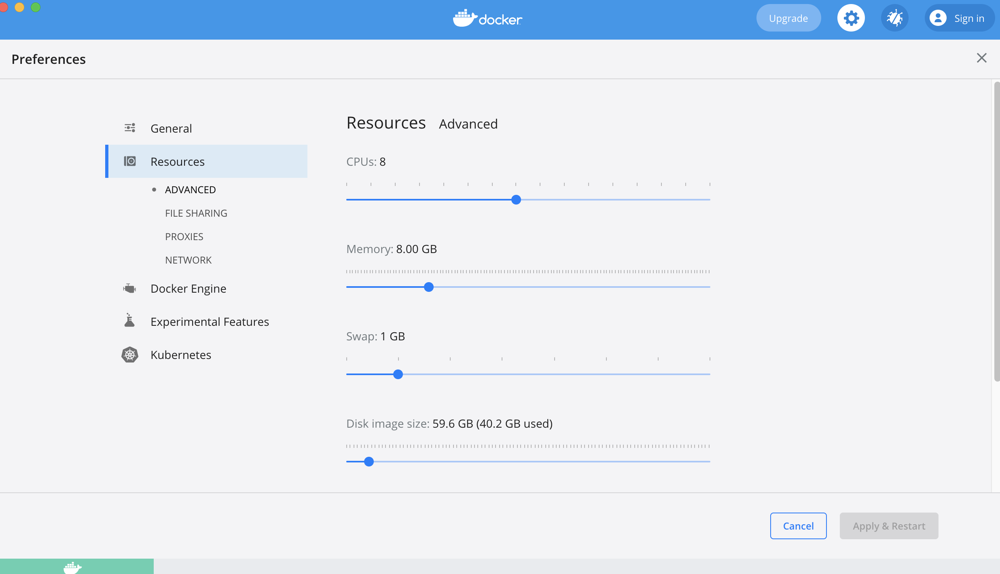
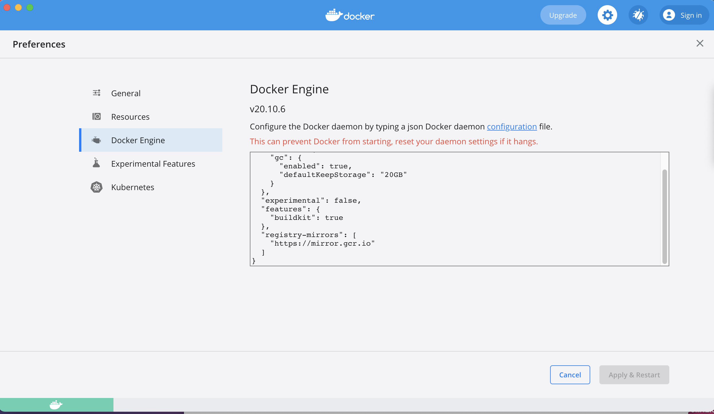

# Setting up your workstation for CNP development

## Installing command line essentials on Linux

As a CNP operator developer you need the following executables available in
the `PATH` environment variable:

- Go 1.17+ compiler
- GNU Make
- [Kind](https://kind.sigs.k8s.io/) v0.11.x or greater
- [golangci-lint](https://github.com/golangci/golangci-lint)
- [goreleaser](https://goreleaser.com/)

In addition, check you have these already installed:

- jq, make, coreutils, findutils, git, gpg, gnu-getopt, gnu-sed, gnu-tar, pandoc, zlib

## Installing command line essentials on MacOS

On Mac OS X, you can install the above components with [brew](https://brew.sh/):

``` bash
brew install go kind golangci/tap/golangci-lint goreleaser
```

>**⚠️ Note:**
>If "kind" is already installed, make sure you have the latest version:
>
>``` bash
>brew upgrade kind
>```

Now please install the other packages:

``` bash
brew install jq make coreutils findutils git gpg gnu-getopt gnu-sed gnu-tar pandoc zlib
```

Once all packages have been installed, you might need to add the following lines to the profile of your shell (eg `~/.bash_profile`):

``` bash
# Homebrew settings
export PATH="/usr/local/opt/gettext/bin:$PATH"
export PATH="/usr/local/opt/coreutils/libexec/gnubin:$PATH"
export PATH="/usr/local/opt/findutils/libexec/gnubin:$PATH"
export PATH="/usr/local/opt/gnu-getopt/bin:$PATH"
export PATH="/usr/local/opt/gnu-sed/libexec/gnubin:$PATH"
export PATH="/usr/local/opt/gnu-tar/libexec/gnubin:$PATH"
export MANPATH="/usr/local/opt/coreutils/libexec/gnuman:$MANPATH"
export MANPATH="/usr/local/opt/findutils/libexec/gnuman:$MANPATH"
export MANPATH="/usr/local/opt/gnu-getopt/share/man:$MANPATH"
export MANPATH="/usr/local/opt/gnu-sed/libexec/gnuman:$MANPATH"
export MANPATH="/usr/local/opt/gnu-tar/libexec/gnuman:$MANPATH"
export LDFLAGS="-L/usr/local/opt/zlib/lib $LDFLAGS"
export LDFLAGS="-L/usr/local/opt/gettext/lib $LDFLAGS"
export LDFLAGS="-L/usr/local/opt/readline/lib $LDFLAGS"
export CPPFLAGS="-I/usr/local/opt/zlib/include $CPPFLAGS"
export CPPFLAGS="-I/usr/local/opt/gettext/include $CPPFLAGS"
export CPPFLAGS="-I/usr/local/opt/readline/include $CPPFLAGS"
export PKG_CONFIG_PATH="/usr/local/opt/readline/lib/pkgconfig"
# GPGv2 backward compatibility
export GPG_AGENT_INFO=~/.gnupg/S.gpg-agent::1
export GPG_TTY=$(tty)
```

You also need to set:

```
export GOPATH="${HOME}/go"
```

### Setting your docker engine

Please allow a reasonable amount of memory for Docker.
For instance, this is the configuration on the machine of a CNP developer
("Preferences->Resources of your Docker desktop app"):



In order to execute the `setup-cluster.sh`, you also need to add this in "Preferences->Docker Engine":

```
{
  "registry-mirrors": [
    "https://mirror.gcr.io"
  ]
}
```


