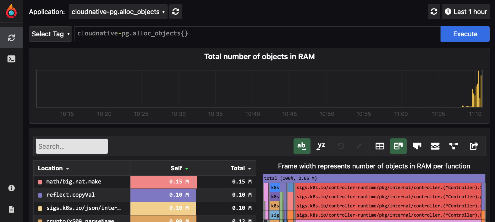

# Running E2E tests on your environment

[Continuous Integration](https://cloud.google.com/architecture/devops/devops-tech-continuous-integration)
and [Continous Testing](https://cloud.google.com/architecture/devops/devops-tech-test-automation)
are two fundamental capabilities and cultural principles on which CloudNativePG
has been built.

As a result, we have built a solid and portable way to run End-To-End tests on
CloudNativePG. For example, we need to make sure that every commit does not
break the existing behaviour of the operator, for **all supported versions of
PostgreSQL** on **all supported versions of Kubernetes**.

This framework is made up by two important components:

- a local and disposable Kubernetes cluster built with `kind` (default) or
  `k3d` on which to run the E2E tests
- a set of E2E tests to be run on an existing Kubernetes cluster
  (including the one above)

## The local Kubernetes cluster for testing

The [`hack/setup-cluster.sh`](../../hack/setup-cluster.sh) bash script is
responsible for creating a local Kubernetes cluster to be used for both
development and testing purposes.

> **IMPORTANT:** Make sure you have followed the instructions included in
> ["Setting up your development environment for CloudNativePG"](../development_environment/README.md).


You can create a new Kubernetes cluster with:

```console
hack/setup-cluster.sh <OPTIONAL_FLAGS> create
```

You can also build the operator image and load it in the local Kubernetes
cluster. For example, to load the operator image you can run:

```console
hack/setup-cluster.sh load
```

To deploy the operator:

```console
hack/setup-cluster.sh deploy
```

To cleanup everything:

```console
hack/setup-cluster.sh destroy
```

All flags have corresponding environment variables labeled `(Env:...` in the table below.

| Flags | Usage                                                                                                                         |
|-------|-------------------------------------------------------------------------------------------------------------------------------|
| -r\   |--registry                       | Enable local registry. (Env: `ENABLE_REGISTRY`)                                                                               |
| -e\   |--engine <CLUSTER_ENGINE>        | Use the provided ENGINE to run the cluster. Available options are 'kind' and 'k3d'. Default 'kind'. (Env: `CLUSTER_ENGINE`)   |
| -k\   |--k8s-version <K8S_VERSION>      | Use the specified Kubernetes full version number (e.g., `-k v1.26.0`). (Env: `K8S_VERSION`)                                   |
| -n\   |--nodes <NODES>                  | Create a cluster with the required number of nodes. Used only during "create" command. Default: 3 (Env: `NODES`)              |


> **NOTE:** if you want to use custom engine and registry settings, please make
> sure that they are consistent through all invocations either via command line
> options or by defining the respective environment variables

## Profiling tools

In addition to deploying and destroying the operator, `hack/setup-cluster.sh`
can also load two powerful profiling / debugging tools: *pprof* and *pyroscope*.

Issuing the following command once the operator is deployed:

``` console
hack/setup-cluster.sh pyroscope
```

will create a deployment, and add two services on ports 6060 and 4040
respectively, in the same namespace as the operator:

``` console
kubectl get svc -n cnpg-system        

NAME                   TYPE        CLUSTER-IP     EXTERNAL-IP   PORT(S)    AGE
cnpg-pprof             ClusterIP   10.96.17.58    <none>        6060/TCP   9m41s
cnpg-webhook-service   ClusterIP   10.96.64.74    <none>        443/TCP    10m
pyroscope              ClusterIP   10.96.187.86   <none>        4040/TCP   9m41s
```

You can find more information on the various endpoints that come included with
the `pprof` server in the
[operator conf document](../../docs/src/operator_conf.md#pprof-http-server).

[Pyroscope](https://pyroscope.io/) offers a very functional web app out of the
box.
To use it, you will need first to do port-forwarding for the `pyroscope`
service:

```console
kubectl port-forward -n cnpg-system svc/pyroscope 4040
```

Then you can open the local pyroscope page at [localhost:4040](http://localhost:4040), and you should see a display like so:



It is a great tool to interactively monitor memory and CPU usage.

## E2E tests suite

E2E testing is performed by running the
[`hack/e2e/run-e2e.sh`](../../../hack/e2e/run-e2e.sh) bash script, making sure
you have a Kubernetes cluster and `kubectl` is configured to point to it
(this should be the default when you are running tests locally as per the
instructions in the above section).

The script can be configured through the following environment variables:

* `CONTROLLER_IMG`: the controller image to deploy on K8s
* `POSTGRES_IMG`: the PostgreSQL image used by default in the clusters
* `E2E_PRE_ROLLING_UPDATE_IMG`: test a rolling upgrade from this version to the
  latest minor
* `E2E_DEFAULT_STORAGE_CLASS`: default storage class, depending on the provider
* `AZURE_STORAGE_ACCOUNT`: Azure storage account to test backup and restore, using Barman Cloud on Azure 
   blob storage
* `AZURE_STORAGE_KEY`: Azure storage key to test backup and restore, using Barman Cloud on Azure
  blob storage
* `FEATURE_TYPE`: Feature type key to run e2e based on feature labels.Ex: smoke, basic, security... details
  can be fetched from labels file [`tests/labels.go`](../../../tests/labels.go)

If the `CONTROLLER_IMG` is in a private registry, you'll also need to define
the following variables to create a pull secret:

* `DOCKER_SERVER`: the registry containing the image
* `DOCKER_USERNAME`: the registry username
* `DOCKER_PASSWORD`: the registry password

Additionally, you can specify a DockerHub mirror to be used by
specifying the following variable

* `DOCKER_REGISTRY_MIRROR`: DockerHub mirror URL (i.e. https://mirror.gcr.io)

To run E2E testing you can also use:

|                    kind                        |                     k3d                         |
|------------------------------------------------|-------------------------------------------------|
| `TEST_UPGRADE_TO_V1=false make e2e-test-kind`  | `TEST_UPGRADE_TO_V1=false make e2e-test-k3d`    |


### Wrapper scripts for E2E testing

There are currently two available scripts that wrap setup of the cluster and
execution of tests. One is for `kind` and one is for `k3d`. They simply embed
`hack/setup-cluster.sh` and `hack/e2e/run-e2e.sh` to create a local Kubernetes
cluster and then run E2E tests on it.

### Using feature type test selection/filter

All the current test cases are labelled with features. Which can be selected
by exporting value `FEATURE_TYPE` and running any script. By default, if test level is not
exported, it will select all medium test cases from the feature type provided.

| Currently Available Feature Types |
|-----------------------------------|
| `disruptive`                      |
| `performance`                     |
| `upgrade`                         |
| `smoke`                           |
| `basic`                           |
| `service-connectivity`            |
| `self-healing`                    |
| `backup-restore`                  |
| `snapshot`                        |
| `operator`                        |
| `observability`                   |
| `replication`                     |
| `plugin`                          |
| `postgres-configuration`          |
| `pod-scheduling`                  |
| `cluster-metadata`                |
| `recovery`                        |
| `importing-databases`             |
| `storage`                         |
| `security`                        |
| `maintenance`                     |

ex:
```shell
export FEATURE_TYPE=smoke,basic,service-connectivity
```
This will run smoke, basic and service connectivity e2e.
One or many can be passed as value with comma separation without spaces.

#### On kind

You can test the operator locally on `kind` with:

```shell
run-e2e-kind.sh
```

It will take care of creating a `kind` cluster and run the tests on it.

We have also provided a shortcut to this script in the main `Makefile`:

```shell
make e2e-test-kind
```

#### On k3d

You can test the operator locally on `k3d` with:

``` bash
run-e2e-k3d.sh
```

> **NOTE:** error messages, like the example below, that will be shown during
> cluster creation are **NOT** an issue:

```
Error response from daemon: manifest for rancher/k3s:v1.20.0-k3s5 not found: manifest unknown: manifest unknown
```

The script will take care of creating a K3d cluster and then run the tests on it.

We have also provided a shortcut to this script in the main `Makefile`:

```shell
make e2e-test-k3d
```

#### Environment variables

In addition to the environment variables for the script,
the following ones can be defined:

* `PRESERVE_CLUSTER`: true to prevent the script from destroying the Kubernetes cluster.
  Default: `false`
* `PRESERVE_NAMESPACES`: space separated list of namespace to be kept after
  the tests. Only useful if specified with `PRESERVE_CLUSTER=true`
* `K8S_VERSION`: the version of K8s to run. Default: `v1.26.0`
* `KIND_VERSION`: the version of `kind`. Defaults to the latest release
* `BUILD_IMAGE`: true to build the Dockerfile and load it on kind,
  false to get the image from a registry. Default: `false`
* `LOG_DIR`: the directory where the container logs are exported. Default:
  `_logs/` directory in the project root

`run-e2e-kind.sh` forces `E2E_DEFAULT_STORAGE_CLASS=standard` while
`run-e2e-k3d.sh` forces `E2E_DEFAULT_STORAGE_CLASS=local-path`

Both scripts use the `setup-cluster.sh` script, in order to initialize the cluster
choosing between `kind` or K3d engine.

### Running E2E tests on a fork of the repository

Additionally, if you fork the repository and want to run the tests on your fork, you can do so with the `/test` command.

`/test` is used to trigger a run of the end-to-end tests in the GitHub Actions. Only users who have `write` permission
to the repository can use this command. The format of `/test`

      `/test options`

Options supported are:

- test_level (level or tl for short)  
  The priority of test to run, If test level is set, all tests with that priority and higher will
  be triggered. Default value for the test level is 4. Available values are:
  - 0: highest
  - 1: high
  - 2: medium
  - 3: low
  - 4: lowest

- depth (d for short)   
  The type of test to run. Default value is `main`, available values
  are:
  - push
  - main
  - pull_request
  - schedule
- feature_type (type or ft for short)  
  The label for the end-to-end test to be run, empty value means all labels. Default value is empty, available
  type are: [listed above in the feature types section](https://github.com/cloudnative-pg/cloudnative-pg/tree/main/contribute/e2e_testing_environment#using-feature-type-test-selectionfilter)
- log_level (ll for short)    
  Defines the log value for cloudNativePG operator, which will be specified as the value for `--log-value` in the 
  operator command.
  Default value is info and available values are: `error, warning, info, debug, trace`
- build_plugin (plugin or bp for short)  
  Whether to run the build cnpg plugin job in the end-to-end test. Available values are true and false and default value
  is false.

Example:
1. Trigger an e2e test to run all test cases with `highest` test level, we want to cover most kubernetes and postgres 
metrics

  ```
     /test -tl=0 d=schedule
  ```
2. Run smoke and upgrade test for the pull request
  ```
     /test type=smoke,upgrade
  ```
