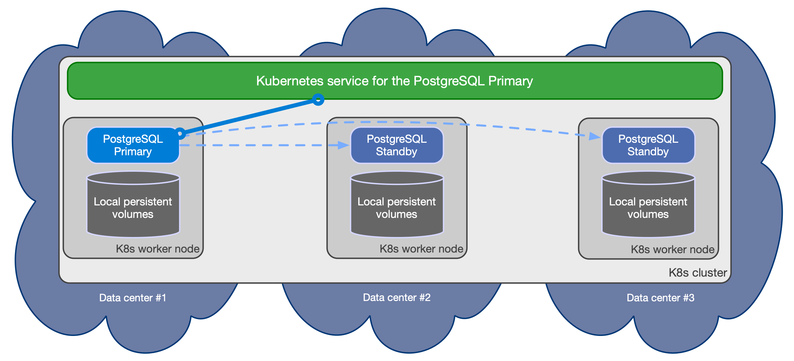
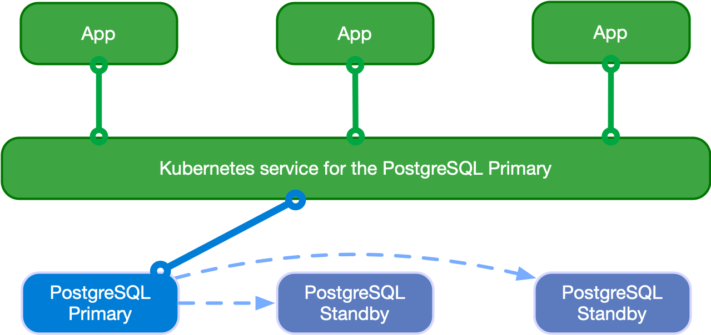
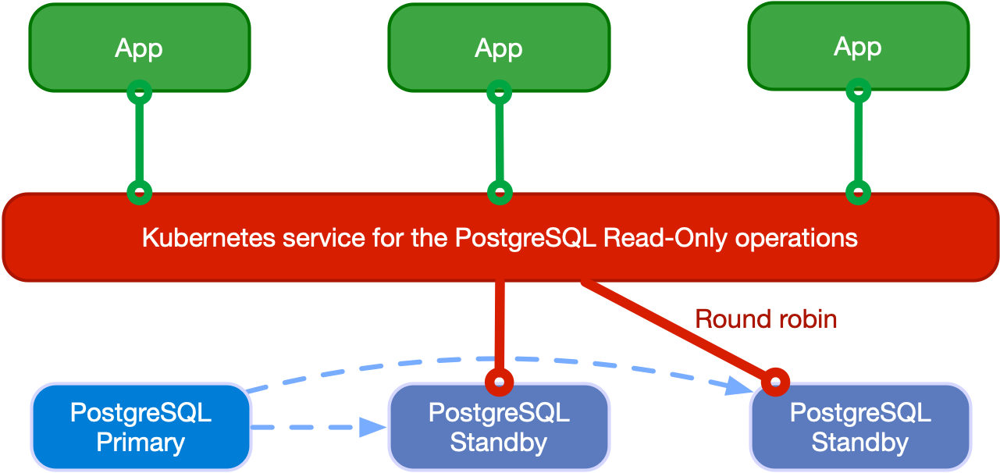

# Architecture
<!-- SPDX-License-Identifier: CC-BY-4.0 -->

:::tip[Hint]
    For a deeper understanding, we recommend reading our article on the CNCF
    blog post titled ["Recommended Architectures for PostgreSQL in Kubernetes"](https://www.cncf.io/blog/2023/09/29/recommended-architectures-for-postgresql-in-kubernetes/),
    which provides valuable insights into best practices and design
    considerations for PostgreSQL deployments in Kubernetes.
:::

This documentation page provides an overview of the key architectural
considerations for implementing a robust business continuity strategy when
deploying PostgreSQL in Kubernetes. These considerations include:

- **[Deployments in _stretched_](#multi-availability-zone-kubernetes-clusters)
  vs. [_non-stretched_ clusters](#single-availability-zone-kubernetes-clusters)**:
  Evaluating the differences between deploying in stretched clusters (across 3
  or more availability zones) versus non-stretched clusters (within a single
  availability zone).
- [**Reservation of `postgres` worker nodes**](#reserving-nodes-for-postgresql-workloads): Isolating PostgreSQL workloads by
  dedicating specific worker nodes to `postgres` tasks, ensuring optimal
  performance and minimizing interference from other workloads.
- [**PostgreSQL architectures within a single Kubernetes cluster**](#postgresql-architecture):
  Designing effective PostgreSQL deployments within a single Kubernetes cluster
  to meet high availability and performance requirements.
- [**PostgreSQL architectures across Kubernetes clusters for disaster recovery**](#deployments-across-kubernetes-clusters):
  Planning and implementing PostgreSQL architectures that span multiple
  Kubernetes clusters to provide comprehensive disaster recovery capabilities.

## Synchronizing the state

PostgreSQL is a database management system and, as such, it needs to be treated
as a **stateful workload** in Kubernetes. While stateless applications
mainly use traffic redirection to achieve High Availability (HA) and
Disaster Recovery (DR), in the case of a database, state must be replicated in
multiple locations, preferably in a continuous and instantaneous way, by
adopting either of the following two strategies:

- *storage-level replication*, normally persistent volumes
- *application-level replication*, in this specific case PostgreSQL

CloudNativePG relies on application-level replication, for a simple reason: the
PostgreSQL database management system comes with robust and reliable
built-in **physical replication** capabilities based on **Write Ahead Log (WAL)
shipping**, which have been used in production by millions of users all over
the world for over a decade.

PostgreSQL supports both asynchronous and synchronous streaming replication
over the network, as well as asynchronous file-based log shipping (normally
used as a fallback option, for example, to store WAL files in an object store).
Replicas are usually called *standby servers* and can also be used for
read-only workloads, thanks to the *Hot Standby* feature.

:::info[Important]
    **We recommend against storage-level replication with PostgreSQL**, although
    CloudNativePG allows you to adopt that strategy. For more information, please refer
    to the talk given by Chris Milsted and Gabriele Bartolini at KubeCon NA 2022 entitled
    ["Data On Kubernetes, Deploying And Running PostgreSQL And Patterns For Databases In a Kubernetes Cluster"](https://www.youtube.com/watch?v=99uSJXkKpeI&ab_channel=CNCF%5BCloudNativeComputingFoundation%5D)
    where this topic was covered in detail.
:::

## Kubernetes architecture

Kubernetes natively provides the possibility to span separate physical
locations - also known as data centers, failure zones, or more frequently
**availability zones** - connected to each other via redundant, low-latency,
private network connectivity.

Being a distributed system, the recommended minimum number of availability
zones for a Kubernetes cluster is three (3), in order to make the control
plane resilient to the failure of a single zone.
For details, please refer to
["Running in multiple zones"](https://kubernetes.io/docs/setup/best-practices/multiple-zones/).
This means that **each data center is active at any time** and can run workloads
simultaneously.

:::note
    Most of the public Cloud Providers' managed Kubernetes services already
    provide 3 or more availability zones in each region.
:::

### Multi-availability zone Kubernetes clusters

The multi-availability zone Kubernetes architecture with three (3) or more
zones is the one that we recommend for PostgreSQL usage.
This scenario is typical of Kubernetes services managed by Cloud Providers.


Such an architecture enables the CloudNativePG operator to control the full
lifecycle of a `Cluster` resource across the zones within a single Kubernetes
cluster, by treating all the availability zones as active: this includes, among
other operations,
[scheduling](scheduling.md) the workloads in a declarative manner (based on
affinity rules, tolerations and node selectors), automated failover,
self-healing, and updates. All will work seamlessly across the zones in a single
Kubernetes cluster.

Please refer to the ["PostgreSQL architecture"](#postgresql-architecture)
section below for details on how you can design your PostgreSQL clusters within
the same Kubernetes cluster through shared-nothing deployments at the storage,
worker node, and availability zone levels.

Additionally, you can leverage [Kubernetes clusters](#deployments-across-kubernetes-clusters)
to deploy distributed PostgreSQL topologies hosting "passive"
[PostgreSQL replica clusters](replica_cluster.md) in different regions and
managing them via declarative configuration. This setup is ideal for disaster
recovery (DR), read-only operations, or cross-region availability.

:::info[Important]
    Each operator deployment can only manage operations within its local
    Kubernetes cluster. For operations across Kubernetes clusters, such as
    controlled switchover or unexpected failover, coordination must be handled
    manually (through GitOps, for example) or by using a higher-level cluster
    management tool.
:::


### Single availability zone Kubernetes clusters

If your Kubernetes cluster has only one availability zone, CloudNativePG still
provides you with a lot of features to improve HA and DR outcomes for your
PostgreSQL databases, pushing the single point of failure (SPoF) to the level
of the zone as much as possible - i.e. the zone must have an outage before your
CloudNativePG clusters suffer a failure.

This scenario is typical of self-managed on-premise Kubernetes clusters, where
only one data center is available.

Single availability zone Kubernetes clusters are the only viable option when
only **two data centers** are available within reach of a low-latency
connection (typically in the same metropolitan area). Having only two zones
prevents the creation of a multi-availability zone Kubernetes cluster, which
requires a minimum of three zones. As a result, users must create two separate
Kubernetes clusters in an active/passive configuration, with the second cluster
primarily used for Disaster Recovery (see
the [replica cluster feature](replica_cluster.md)).


:::tip[Hint]
    If you are at an early stage of your Kubernetes journey, please share this
    document with your infrastructure team. The two data centers setup might
    be simply the result of a "lift-and-shift" transition to Kubernetes
    from a traditional bare-metal or VM based infrastructure, and the benefits
    that Kubernetes offers in a 3+ zone scenario might not have been known,
    or addressed at the time the infrastructure architecture was designed.
    Ultimately, a third physical location connected to the other two might
    represent a valid option to consider for organization, as it reduces the
    overall costs of the infrastructure by moving the day-to-day complexity
    from the application level down to the physical infrastructure level.
:::

Please refer to the ["PostgreSQL architecture"](#postgresql-architecture)
section below for details on how you can design your PostgreSQL clusters within
your single availability zone Kubernetes cluster through shared-nothing
deployments at the storage and worker node levels only. For HA, in such a
scenario it becomes even more important that the PostgreSQL instances be
located on different worker nodes and do not share the same storage.

For DR, you can push the SPoF above the single zone, by using additional
[Kubernetes clusters](#deployments-across-kubernetes-clusters) to define a
distributed topology hosting "passive" [PostgreSQL replica clusters](replica_cluster.md).
As with other Kubernetes workloads in this scenario, promotion of a Kubernetes
cluster as primary must be done manually.

Through the [replica cluster feature](replica_cluster.md), you can define a
distributed PostgreSQL topology and coordinate a controlled switchover between
data centers by first demoting the primary cluster and then promoting the
replica cluster, without the need to re-clone the former primary. While failover
is now fully declarative, automated failover across Kubernetes clusters is not
within CloudNativePG's scope, as the operator can only function within a single
Kubernetes cluster.

:::info[Important]
    CloudNativePG provides all the necessary primitives and probes to
    coordinate PostgreSQL active/passive topologies across different Kubernetes
    clusters through a higher-level operator or management tool.
:::

### Reserving nodes for PostgreSQL workloads

Whether you're operating in a multi-availability zone environment or, more
critically, within a single availability zone, we strongly recommend isolating
PostgreSQL workloads by dedicating specific worker nodes exclusively to
`postgres` in production. A Kubernetes worker node dedicated to running
PostgreSQL workloads is referred to as a **Postgres node** or `postgres` node.
This approach ensures optimal performance and resource allocation for your
database operations.

:::tip[Hint]
    As a general rule of thumb, deploy Postgres nodes in multiples of
    three—ideally with one node per availability zone. Three nodes is
    an optimal number because it ensures that a PostgreSQL cluster with three
    instances (one primary and two standby replicas) is distributed across
    different nodes, enhancing fault tolerance and availability.
:::

In Kubernetes, this can be achieved using node labels and taints in a
declarative manner, aligning with Infrastructure as Code (IaC) practices:
labels ensure that a node is capable of running `postgres` workloads, while
taints help prevent any non-`postgres` workloads from being scheduled on that
node.

:::info[Important]
    This methodology is the most straightforward way to ensure that PostgreSQL
    workloads are isolated from other workloads in terms of both computing
    resources and, when using locally attached disks, storage. While different
    PostgreSQL clusters may share the same node, you can take this a step further
    by using labels and taints to ensure that a node is dedicated to a single
    instance of a specific `Cluster`.
:::

#### Proposed node label

CloudNativePG recommends using the `node-role.kubernetes.io/postgres` label.
Since this is a reserved label (`*.kubernetes.io`), it can only be applied
after a worker node is created.

To assign the `postgres` label to a node, use the following command:

```sh
kubectl label node <NODE-NAME> node-role.kubernetes.io/postgres=
```

To ensure that a `Cluster` resource is scheduled on a `postgres` node, you must
correctly configure the `.spec.affinity.nodeSelector` stanza in your manifests.
Here’s an example:

```yaml
spec:
  # <snip>
  affinity:
    # <snip>
    nodeSelector:
      node-role.kubernetes.io/postgres: ""
```

#### Proposed node taint

CloudNativePG recommends using the `node-role.kubernetes.io/postgres` taint.

To assign the `postgres` taint to a node, use the following command:

```sh
kubectl taint node <NODE-NAME> node-role.kubernetes.io/postgres=:NoSchedule
```

To ensure that a `Cluster` resource is scheduled on a node with a `postgres` taint, you must correctly configure the `.spec.affinity.tolerations` stanza in your manifests.
Here’s an example:

```yaml
spec:
  # <snip>
  affinity:
    # <snip>
    tolerations:
    - key: node-role.kubernetes.io/postgres
      operator: Exists
      effect: NoSchedule
```

## PostgreSQL architecture

CloudNativePG supports clusters based on asynchronous and synchronous
streaming replication to manage multiple hot standby replicas within the same
Kubernetes cluster, with the following specifications:

* One primary, with optional multiple hot standby replicas for HA
* Available services for applications:
    * `-rw`: applications connect only to the primary instance of the cluster
    * `-ro`: applications connect only to hot standby replicas for
      read-only-workloads (optional)
    * `-r`: applications connect to any of the instances for read-only
      workloads (optional)

* Shared-nothing architecture recommended for better resilience of the PostgreSQL cluster:
    * PostgreSQL instances should reside on different Kubernetes worker nodes
      and share only the network - as a result, instances should not share
      the storage and preferably use local volumes attached to the node they
      run on
    * PostgreSQL instances should reside in different availability zones
      within the same Kubernetes cluster / region

:::info[Important]
    You can configure the above services through the `managed.services` section
    in the `Cluster` configuration. This can be done by reducing the number of
    services and selecting the type (default is `ClusterIP`). For more details,
    please refer to the ["Service Management" section](service_management.md)
    below.
:::

The below diagram provides a simplistic view of the recommended shared-nothing
architecture for a PostgreSQL cluster spanning across 3 different availability
zones, running on separate nodes, each with dedicated local storage for
PostgreSQL data.



CloudNativePG automatically takes care of updating the above services if
the topology of the cluster changes. For example, in case of failover, it
automatically updates the `-rw` service to point to the promoted primary,
making sure that traffic from the applications is seamlessly redirected.

:::note[Replication]
    Please refer to the ["Replication" section](replication.md) for more
    information about how CloudNativePG relies on PostgreSQL replication,
    including synchronous settings.
:::

:::note[Connecting from an application]
    Please refer to the ["Connecting from an application" section](applications.md) for
    information about how to connect to CloudNativePG from a stateless
    application within the same Kubernetes cluster.
:::

:::note[Connection Pooling]
    Please refer to the ["Connection Pooling" section](connection_pooling.md) for
    information about how to take advantage of PgBouncer as a connection pooler,
    and create an access layer between your applications and the PostgreSQL clusters.
:::

### Read-write workloads

Applications can decide to connect to the PostgreSQL instance elected as
*current primary* by the Kubernetes operator, as depicted in the following
diagram:



Applications can use the `-rw` suffix service.

In case of temporary or permanent unavailability of the primary, for High
Availability purposes CloudNativePG will trigger a failover, pointing the `-rw`
service to another instance of the cluster.

### Read-only workloads

:::info[Important]
    Applications must be aware of the limitations that
    [Hot Standby](https://www.postgresql.org/docs/current/hot-standby.html)
    presents and familiar with the way PostgreSQL operates when dealing with
    these workloads.
:::

Applications can access hot standby replicas through the `-ro` service made available
by the operator. This service enables the application to offload read-only queries from the
primary node.

The following diagram shows the architecture:



Applications can also access any PostgreSQL instance through the
`-r` service.

## Deployments across Kubernetes clusters

:::info
    CloudNativePG supports deploying PostgreSQL across multiple Kubernetes
    clusters through a feature that allows you to define a distributed PostgreSQL
    topology using replica clusters, as described in this section.
:::

In a distributed PostgreSQL cluster there can only be a single PostgreSQL
instance acting as a primary at all times. This means that applications can
only write inside a single Kubernetes cluster, at any time.

However, for business continuity objectives it is fundamental to:

- reduce global **recovery point objectives** ([RPO](before_you_start.md#rpo))
  by storing PostgreSQL backup data in multiple locations, regions and possibly
  using different providers (Disaster Recovery)
- reduce global **recovery time objectives** ([RTO](before_you_start.md#rto))
  by taking advantage of PostgreSQL replication beyond the primary Kubernetes
  cluster (High Availability)

In order to address the above concerns, CloudNativePG introduces the concept of
a PostgreSQL Topology that is distributed across different Kubernetes clusters
and is made up of a primary PostgreSQL cluster and one or more PostgreSQL
replica clusters.
This feature is called **distributed PostgreSQL topology with replica clusters**,
and it enables multi-cluster deployments in private, public, hybrid, and
multi-cloud contexts.

A replica cluster is a separate `Cluster` resource that is in continuous
recovery, replicating from another source, either via WAL shipping from a WAL
archive or via streaming replication from a primary or a standby (cascading).

The diagram below depicts a PostgreSQL cluster spanning over two different
Kubernetes clusters, where the primary cluster is in the first Kubernetes
cluster and the replica cluster is in the second. The second Kubernetes cluster
acts as the company's disaster recovery cluster, ready to be activated in case
of disaster and unavailability of the first one.


A replica cluster can have the same architecture as the primary cluster.
Instead of a primary instance, a replica cluster has a **designated primary**
instance, which is a standby server with an arbitrary number of cascading
standby servers in streaming replication (symmetric architecture).

The designated primary can be promoted at any time, transforming the replica
cluster into a primary cluster capable of accepting write connections.
This is typically triggered by:

- **Human decision:** You choose to make the other PostgreSQL cluster (or the
  entire Kubernetes cluster) the primary. To avoid data loss and ensure that
  the former primary can follow without being re-cloned (especially with large
  data sets), you first demote the current primary, then promote the designated
  primary using the API provided by CloudNativePG.
- **Unexpected failure:** If the entire Kubernetes cluster fails, you might
  experience data loss, but you need to fail over to the other Kubernetes
  cluster by promoting the PostgreSQL replica cluster.

:::warning
    CloudNativePG cannot perform any cross-cluster automated failover, as it
    does not have authority beyond a single Kubernetes cluster. Such operations
    must be performed manually or delegated to a multi-cluster/federated
    cluster-aware authority.
:::

:::info[Important]
    CloudNativePG allows you to control the distributed topology via
    declarative configuration, enabling you to automate these procedures as part of
    your Infrastructure as Code (IaC) process, including GitOps.
:::

In the example above, the designated primary receives WAL updates via streaming
replication (`primary_conninfo`). As a fallback, it can retrieve WAL segments
from an object store using file-based WAL shipping—for instance, with the
Barman Cloud plugin through `restore_command` and `barman-cloud-wal-restore`.

CloudNativePG allows you to define topologies with multiple replica clusters.
You can also define replica clusters with a lower number of replicas, and then
increase this number when the cluster is promoted to primary.

:::note[Replica clusters]
    Please refer to the ["Replica Clusters" section](replica_cluster.md) for
    more detailed information on how physical replica clusters operate and how to
    define a distributed topology with read-only clusters across different
    Kubernetes clusters. This approach can significantly enhance your global
    disaster recovery and high availability (HA) strategy.
:::