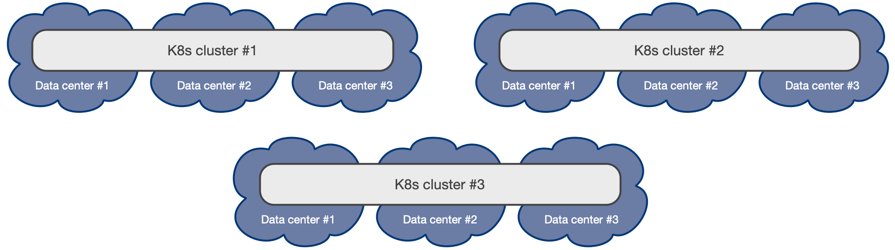

# Architecture

Consider these aspects of the architecture
when deploying PostgreSQL in Kubernetes.

!!! Important
    We encourage you to read our article on the CNCF blog,
    [Recommended Architectures for PostgreSQL in Kubernetes](https://www.cncf.io/blog/2023/09/29/recommended-architectures-for-postgresql-in-kubernetes/).

!!! Important
    If you're deploying PostgreSQL in a self-managed Kubernetes environment,
    when you start planning your journey to the cloud native world, 
    read [Kubernetes architecture](#kubernetes-architecture).

## Synchronizing the state

PostgreSQL is a database management system. As such, it needs to be treated
as a *stateful workload* in Kubernetes. Stateless applications
mainly use traffic redirection to achieve high availability (HA) and
disaster recovery (DR). For a database, state must be replicated in
multiple locations, preferably in a continuous and instantaneous way, by
adopting either of the following strategies:

* Storage-level replication, normally persistent volumes
* Application-level replication, in this specific case, PostgreSQL

CloudNativePG relies on application-level replication because the
PostgreSQL database management system comes with robust and reliable
built-in physical replication capabilities based on write ahead log (WAL)
shipping. These features have been used in production by millions of users around
the world for over a decade.

PostgreSQL supports both asynchronous and synchronous streaming replication
over the network, as well as asynchronous file-based log shipping. (File-based log shipping isnormally
used as a fallback option, for example, to store WAL files in an object store.)
Replicas are usually called *standby servers* and can also be used for
read-only workloads, thanks to the *hot standby* feature.

!!! Important
    We recommend against storage-level replication with PostgreSQL, although
    CloudNativePG allows you to adopt that strategy. For more information, see
    the talk given by Chris Milsted and Gabriele Bartolini at KubeCon NA 2022,
    [Data On Kubernetes, Deploying And Running PostgreSQL And Patterns For Databases In a Kubernetes Cluster](https://www.youtube.com/watch?v=99uSJXkKpeI&ab_channel=CNCF%5BCloudNativeComputingFoundation%5D).

## Kubernetes architecture

Kubernetes natively provides the possibility to span separate physical
locations, also known as data centers, failure zones, or more frequently
*availability zones*. These locations are connected to each other by way of redundant, low-latency,
private network connectivity.

Being a distributed system, the recommended minimum number of availability
zones for a Kubernetes cluster is three, to make the control
plane resilient to the failure of a single zone.
For details, see
[Running in multiple zones](https://kubernetes.io/docs/setup/best-practices/multiple-zones/) in the Kubernetes documentation.
With a distributed system, each data center is active at any time and can run workloads
simultaneously.

!!! Note
    Most of the managed Kubernetes services offered by public cloud providers already
    provide three or more availability zones in each region.

### Multi-availability zone Kubernetes clusters

For PostgreSQL usage, we recommend the multi-availability zone Kubernetes architecture 
with three or more zones.
This scenario is typical of Kubernetes services managed by cloud providers.

Such an architecture enables the CloudNativePG operator to control the full
lifecycle of a `Cluster` resource across the zones in a single Kubernetes
cluster by treating all the availability zones as active. This includes, among
other operations,
[scheduling](scheduling.md) the workloads in a declarative manner (based on
affinity rules, tolerations and node selectors), automated failover,
self-healing, and updates. All of these operations work seamlessly across the zones in a single
Kubernetes cluster.

See [PostgreSQL architecture](#postgresql-architecture)
for details about how you can design your PostgreSQL clusters in
the same Kubernetes cluster through shared-nothing deployments at the storage,
worker node, and availability zone levels.

Moreover, you can take advantage of additional [Kubernetes clusters](#deployments-across-kubernetes-clusters),
by using them to host "passive" PostgreSQL replica clusters. Use this approach
primarily for DR, read-only operations, or cross-region availability,
although, in this case, you must perform failovers and promotions manually.

### Single-availability-zone Kubernetes clusters

If your Kubernetes cluster has only one availability zone, CloudNativePG still
provides you with a lot of features to improve HA and DR outcomes for your
PostgreSQL databases. It pushes the single point of failure (SPoF) to the level
of the zone as much as possible. That is, the zone must have an outage before your
CloudNativePG clusters have a failure.

This scenario is typical of self-managed on-premises Kubernetes clusters, where
only one data center is available.

Single-availability-zone Kubernetes is the only viable option
where just two data centers are available within reach of a low latency
connection, normally in the same metropolitan area. Having only two zones
precludes users from creating a multi-availability-zone Kubernetes cluster, 
as the minimum number of
three zones isn't reached. It forces them to create two different Kubernetes
clusters in an active/passive configuration. The second cluster is used
primarily for disaster recovery.

!!! Hint
    If you're at an early stage of your Kubernetes journey, share this
    document with your infrastructure team. The setup with two data centers might
    be the result of a "lift-and-shift" transition to Kubernetes
    from a traditional bare-metal or VM-based infrastructure. The benefits
    that Kubernetes offers in a scenario with three or more zones might not have been known
    or addressed when the infrastructure architecture was designed.
    Ultimately, a third physical location connected to the other two might
    represent a valid option for an organization to consider, as it reduces the
    overall costs of the infrastructure by moving the day-to-day complexity
    from the application level down to the physical infrastructure level.

See [PostgreSQL architecture](#postgresql-architecture)
for details about how you can design your PostgreSQL clusters in
your single-availability-zone Kubernetes cluster through shared-nothing
deployments at the storage and worker node levels only. For HA, in such a
scenario it becomes even more important for the PostgreSQL instances to be
located on different worker nodes and that they don't share the same storage.

For DR, you can push the SPoF above the single zone by
using additional
[Kubernetes clusters](#deployments-across-kubernetes-clusters) to
host "passive" PostgreSQL replica clusters. As with other Kubernetes workloads in
this scenario, you must promote a Kubernetes cluster as primary
manually. Currently, no automated failover across Kubernetes clusters
is available for PostgreSQL with CloudNativePG, as the operator
can work only in a single Kubernetes cluster.

## PostgreSQL architecture

CloudNativePG supports clusters based on asynchronous and synchronous
streaming replication to manage multiple hot-standby replicas in the same
Kubernetes cluster, with the following specifications:

* One primary, with optional multiple hot-standby replicas for HA
* Available services for applications:
    * `-rw` – Applications connect only to the primary instance of the cluster.
    * `-ro` — Applications connect only to hot-standby replicas for read-only workloads.
    * `-r` — Applications connect to any of the instances for read-only workloads.
* Shared-nothing architecture recommended for better resilience of the PostgreSQL cluster:
    * PostgreSQL instances must reside on different Kubernetes worker nodes
      and share only the network. As a result, instances can't share
      the storage and preferably use local volumes attached to the node they
      run on.
    * PostgreSQL instances must reside in different availability zones
      in the same Kubernetes cluster or region.

The diagram provides a simplified view of the recommended shared-nothing
architecture for a PostgreSQL cluster spanning three different availability
zones, running on separate nodes, each with dedicated local storage for
PostgreSQL data.

CloudNativePG updates the available services if
the topology of the cluster changes. For example, in case of failover, it
updates the `-rw` service to point to the promoted primary,
making sure that traffic from the applications is seamlessly redirected.

!!! Seealso "Replication"
    See [Replication](replication.md) for more
    information about how CloudNativePG relies on PostgreSQL replication,
    including synchronous settings.

!!! Seealso "Connecting from an application"
    See [Connecting from an application](applications.md) for
    information about how to connect to CloudNativePG from a stateless
    application in the same Kubernetes cluster.

!!! Seealso "Connection pooling"
    See [Connection pooling](connection_pooling.md) for
    information about how to take advantage of PgBouncer as a connection pooler
    and create an access layer between your applications and the PostgreSQL clusters.

### Read-write workloads

Applications can decide to connect to the PostgreSQL instance elected as
current primary by the Kubernetes operator, as depicted in the
diagram.

Applications can use the `-rw` suffix service.

In case of temporary or permanent unavailability of the primary, for high
availability purposes, CloudNativePG triggers a failover, pointing the `-rw`
service to another instance of the cluster.

### Read-only workloads

!!! Important
    Application developers must be aware of the limitations that
    [hot standby](https://www.postgresql.org/docs/current/hot-standby.html)
    presents and be familiar with the way PostgreSQL operates when dealing with
    these workloads.

Applications can access hot-standby replicas through the `-ro` service made available
by the operator. This service enables the application to offload read-only queries from the
primary node.

The following diagram shows the architecture.

Applications can also access any PostgreSQL instance through the
`-r` service.

## Deployments across Kubernetes clusters

CloudNativePG supports deploying PostgreSQL across multiple
Kubernetes clusters through a feature called *replica cluster*.

In a distributed PostgreSQL cluster, there can be only a single PostgreSQL
instance acting as a primary at all times. This means that applications can 
write only inside a single Kubernetes cluster at any time.

However, for business continuity objectives, it's fundamental to:

- Reduce global recovery point objectives (RPO) by storing PostgreSQL backup data
  in multiple locations and regions and possibly using different providers
  (disaster recovery)
- Reduce globalrecovery time objectives (RTO) by taking advantage of PostgreSQL
  replication beyond the primary Kubernetes cluster (high availability)

To address these concerns, CloudNativePG introduces the
concept of a *PostgreSQL replica cluster*. Replica clusters are the
CloudNativePG way to enable multi-cluster deployments in private, public,
hybrid, and multi-cloud contexts.

A replica cluster is a separate `Cluster` resource:

-  Having either `pg_basebackup` or full `recovery` as the `bootstrap`
   option from a defined external source cluster
-  Having the `replica.enabled` option set to `true`
-  Replicating from a defined external cluster identified by `replica.source`,
   normally located outside the Kubernetes cluster
-  Replaying WAL information received from the recovery object store
   (using PostgreSQL's `restore_command` parameter), by way of streaming
   replication (using PostgreSQL's `primary_conninfo` parameter), or by any of
   the two (in case both the `barmanObjectStore` and `connectionParameters`
   are defined in the external cluster)
5. Accepting only read connections, as supported by PostgreSQL's hot standby

!!! Seealso
    See [Bootstrap](bootstrap.md) for more information
    about cloning a PostgreSQL cluster from another one (defined in the
    `externalClusters` section).

The diagram depicts a PostgreSQL cluster spanning two different
Kubernetes clusters, where the primary cluster is in the first Kubernetes
cluster and the replica cluster is in the second. The second Kubernetes cluster
acts as the company's disaster recovery cluster, ready to be activated in case
of disaster and unavailability of the first one.

A replica cluster can have the same architecture as the primary cluster. In
place of the primary instance, a replica cluster has a *designated primary*
instance, which is a standby server with an arbitrary number of cascading
standby servers in streaming replication (symmetric architecture).

The designated primary can be promoted at any time, making the replica cluster
a primary cluster capable of accepting write connections.

!!! Warning
    CloudNativePG currently doesn't perform any cross-cluster switchover
    or failover. You must perform such an operation manually
    or delegate it to a multi-cluster/federated cluster-aware authority.
    Each PostgreSQL cluster is independent the others.

The designated primary in the example is fed by way of WAL streaming
(`primary_conninfo`), with a fallback option for file-based WAL shipping through
the `restore_command` and `barman-cloud-wal-restore`.

CloudNativePG allows you to define multiple replica clusters.
You can also define replica clusters with a lower number of replicas and then
increase this number when the cluster is promoted to primary.

!!! Seealso "Replica clusters"
    See [Replica clusters](replica_cluster.md) for more
    information about how physical replica clusters work and how you can configure
    read-only clusters in different Kubernetes clusters to improve your global
    disaster recovery and HA strategy.
