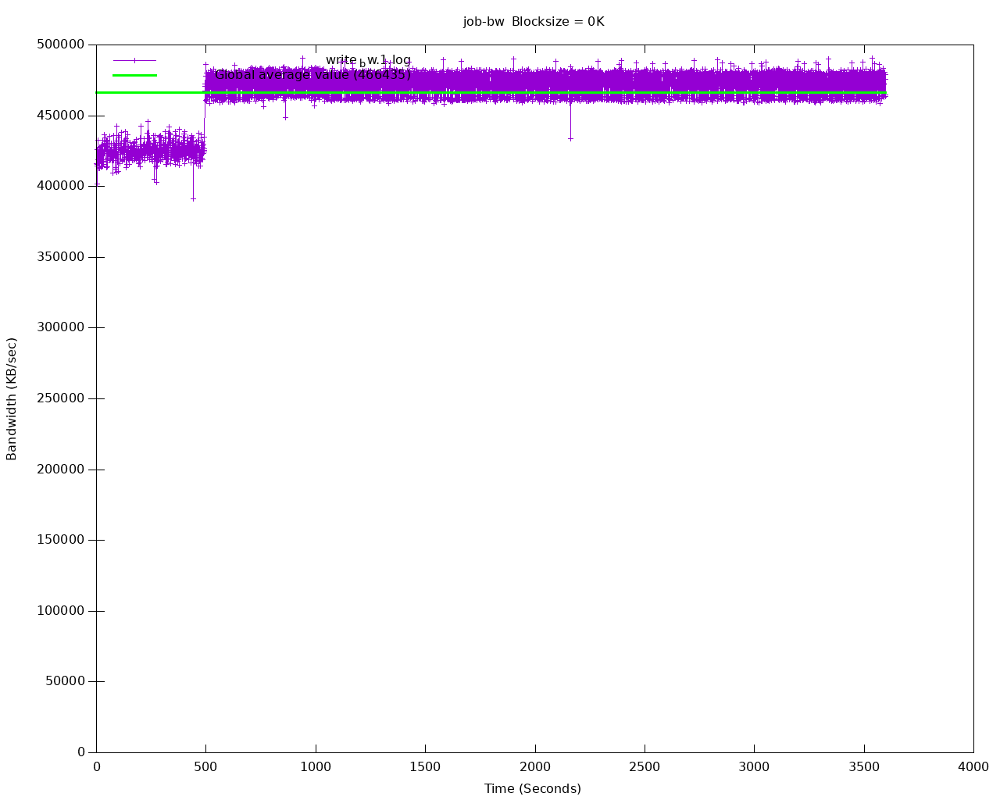

# Benchmarking

The CNPG kubectl plugin provides an easy way for benchmarking a PostgreSQL deployment in Kubernetes using CloudNativePG.

Benchmarking is focused on two aspects:

- the **database**, by relying on [pgbench](https://www.postgresql.org/docs/current/pgbench.html)
- the **storage**, by relying on [fio](https://fio.readthedocs.io/en/latest/fio_doc.html)

!!! IMPORTANT
    `pgbench` and `fio` must be run in a staging or pre-production environment.
    Do not use these plugins in a production environment, as it might have
    catastrophic consequences on your databases and the other
    workloads/applications that run in the same shared environment.

### pgbench

The `kubectl` CNPG plugin command `pgbench` executes a user-defined `pgbench` job
against an existing Postgres Cluster.

Through the `--dry-run` flag you can generate the manifest of the job for later
modification/execution.

A common command structure with `pgbench` is the following:

```shell
kubectl cnpg pgbench \
  -n <namespace> <cluster-name> \
  --job-name <pgbench-job> \
  --db-name <db-name> \
  -- <pgbench options>
```

!!! IMPORTANT
    Please refer to the [`pgbench` documentation](https://www.postgresql.org/docs/current/pgbench.html)
    for information about the specific options to be used in your jobs.

This example creates a job that initializes a `Cluster` named
`cluster-example` in the `pgbench` namespace for `pgbench` purposes,
using a scale factor of 1000:

```shell
kubectl cnpg pgbench \
   -n pgbench cluster-example \
   --job-name pgbench-job \
   -- --initialize - --scale 1000
```

The following example creates a job executing `pgbench` against a `Cluster`
named `cluster-example` in the `pgbench` namespace:

```shell
kubectl cnpg pgbench \
   -n pgbench cluster-example \
   --job-name pgbench-job \
   -- --time 30 --client 1 --jobs 1
```

The next example runs `pgbench` against an existing database by using the
`--db-name` flag and the `pgbench` namespace:

```shell
kubectl cnpg pgbench \
  -n pgbench cluster-example \
  --db-name pgbench \
  --job-name pgbench-job \
  -- --time 30 --client 1 --jobs 1
```

If you want to run a `pgbench` job on a specific worker node, you can use
the `--node-selector` option. Suppose you want to run the previous job on a
node having the `workload=pgbench` label, you can run:

```shell
kubectl cnpg pgbench \
  -n pgbench cluster-example \
  --db-name pgbench \
  --job-name pgbench-job \
  --node-selector workload=pgbench \
  -- --time 30 --client 1 --jobs 1
```

The job status can be fetched by running:
```
kubectl get job/pgbench-job -n <namespace>

NAME       COMPLETIONS   DURATION   AGE
job-name   1/1           15s        41s
```

Once the job is completed the results can be gathered by executing:
```
kubectl logs job/pgbench-job -n <namespace>
```

### fio

The kubectl CNPG plugin command `fio` executes a fio job with default values
and read operations.
Through the `--dry-run` flag you can generate the manifest of the job for later
modification/execution.

!!! Note
    The kubectl plugin command `fio` will create a deployment with predefined
    fio job values using a ConfigMap. If you want to provide custom job values, we
    recommend generating a manifest using the `--dry-run` flag and providing your
    custom job values in the generated ConfigMap.

Example of default usage:

```shell
kubectl cnpg fio <fio-name>
```
Example with custom values:

```shell
kubectl cnpg fio <fio-name> \
  -n <namespace>  \
  --storageClass <name> \
  --pvcSize <size>
```

Example of how to run the `fio` command against a `StorageClass` named
`standard` and `pvcSize: 2Gi` in the `fio` namespace:

```shell
kubectl cnpg fio fio-job \
  -n fio  \
  --storageClass standard \
  --pvcSize 2Gi
```

The deployment status can be fetched by running:
```shell
kubectl get deployment/fio-job -n fio

NAME          READY   UP-TO-DATE   AVAILABLE   AGE
fio-job        1/1     1            1           14s

```

After running kubectl plugin command `fio`.

It will:

1. Create a PVC
1. Create a ConfigMap representing the configuration of a fio job
1. Create a fio deployment composed by a single Pod, which will run fio on
   the PVC, create graphs after completing the benchmark and start serving the
   generated files with a webserver. We use the
   [`fio-tools`](https://github.com/wallnerryan/fio-tools`) image for that.

The Pod created by the deployment will be ready when it starts serving the
results. You can forward the port of the pod created by the deployment

```
kubectl port-forward -n <namespace> deployment/<fio-name> 8000
```

and then use a browser and connect to `http://localhost:8000/` to get the data.

The default 8k block size has been chosen to emulate a PostgreSQL workload.
Disks that cap the amount of available IOPS can show very different throughput
values when changing this parameter.

Below is an example diagram of sequential writes on a local disk
mounted on a dedicated Kubernetes node
(1 hour benchmark):



After all testing is done, fio deployment and resources can be deleted by:
```shell
kubectl cnpg fio <fio-job-name> --dry-run | kubectl delete -f -
```
make sure use the same name which was used to create the fio deployment and add namespace if applicable.
