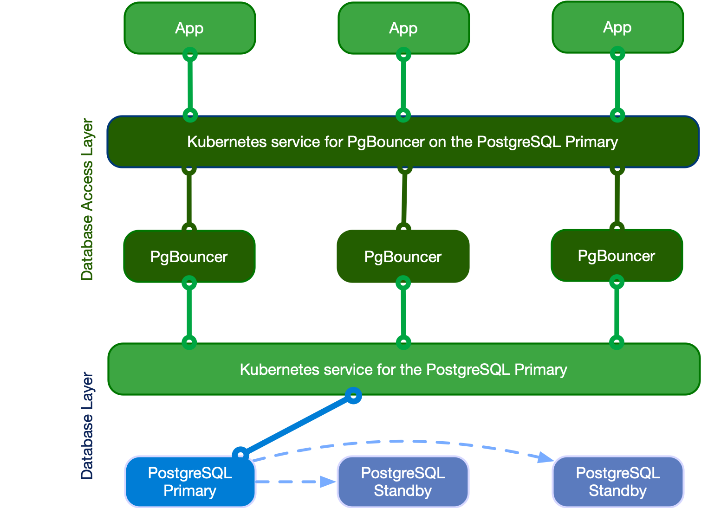

# Connection pooling
<!-- SPDX-License-Identifier: CC-BY-4.0 -->

CloudNativePG provides native support for connection pooling with
[PgBouncer](https://www.pgbouncer.org/), one of the most popular open source
connection poolers for PostgreSQL, through the `Pooler` custom resource definition (CRD).

In brief, a pooler in CloudNativePG is a deployment of PgBouncer pods that sits
between your applications and a PostgreSQL service, for example, the `rw`
service. It creates a separate, scalable, configurable, and highly available
database access layer.

:::warning
    CloudNativePG requires the `auth_dbname` feature in PgBouncer.
    Make sure to use a PgBouncer container image version **1.19 or higher**.
:::

## Architecture

The following diagram highlights how introducing a database access layer based
on PgBouncer changes the architecture of CloudNativePG. Instead of directly
connecting to the PostgreSQL primary service, applications can connect to the
equivalent service for PgBouncer. This ability enables reuse of existing
connections for faster performance and better resource management on the
PostgreSQL side.



## Quick start

This example helps to show how CloudNativePG implements a PgBouncer
pooler:

```yaml
apiVersion: postgresql.cnpg.io/v1
kind: Pooler
metadata:
  name: pooler-example-rw
spec:
  cluster:
    name: cluster-example

  instances: 3
  type: rw
  pgbouncer:
    poolMode: session
    parameters:
      max_client_conn: "1000"
      default_pool_size: "10"
```

:::info[Important]
    The pooler name can't be the same as any cluster name in the same namespace.
:::

This example creates a `Pooler` resource called `pooler-example-rw` 
that's strictly associated with the Postgres `Cluster` resource called
`cluster-example`. It points to the primary, identified by the read/write
service (`rw`, therefore `cluster-example-rw`).

The `Pooler` resource must live in the same namespace as the Postgres cluster.
It consists of a Kubernetes deployment of 3 pods running the
[latest stable image of PgBouncer](https://ghcr.io/cloudnative-pg/pgbouncer),
configured with the [`session` pooling mode](https://www.pgbouncer.org/config.html#pool-mode)
and accepting up to 1000 connections each. The default pool size is 10
user/database pairs toward PostgreSQL.

:::info[Important]
    The `Pooler` resource sets only the `*` fallback database in PgBouncer. This setting means that
    that all parameters in the connection strings passed from the client are
    relayed to the PostgreSQL server. For details, see ["Section [databases]"
    in the PgBouncer documentation](https://www.pgbouncer.org/config.html#section-databases).
:::

CloudNativePG also creates a secret with the same name as the pooler containing
the configuration files used with PgBouncer.

:::note[API reference]
    For details, see [`PgBouncerSpec`](cloudnative-pg.v1.md#pgbouncerspec)
    in the API reference.
:::

## Pooler resource lifecycle

`Pooler` resources aren't cluster-managed resources. You create poolers
manually when they're needed. You can also deploy multiple poolers per
PostgreSQL cluster.

The key point to understand is that the lifecycles of the `Cluster` and
`Pooler` resources are independent. Deleting a cluster does not automatically
remove its poolers, and deleting a pooler does not affect the cluster.

:::info
    Once you are familiar with how poolers work, you have complete flexibility
    in designing your architecture. You can run clusters without poolers, clusters
    with a single pooler, or clusters with multiple poolers (for example, one per
    application).
:::

:::info[Important]
    When the operator itself is upgraded, pooler pods will also undergo a
    rolling upgrade. This ensures that the instance manager inside the pooler
    pods is upgraded consistently.
:::

## Security

Any PgBouncer pooler is transparently integrated with CloudNativePG support for
in-transit encryption by way of TLS connections, both on the client
(application) and server (PostgreSQL) side of the pool.

Specifically, PgBouncer reuses the certificates of the PostgreSQL server. It
also uses TLS client certificate authentication to connect to the PostgreSQL
server to run the `auth_query` for clients' password authentication (see
[Authentication](#authentication)).

Containers run as the pgbouncer system user, and access to the `pgbouncer`
database is allowed only by way of local connections, through peer authentication.

### Certificates

By default, a PgBouncer pooler uses the same certificates that are used by the
cluster. However, if you provide those certificates, the pooler accepts secrets
with the following formats:

1. Basic Auth
2. TLS
3. Opaque

In the Opaque case, it looks for the following specific keys that need to be used:

* tls.crt
* tls.key

So you can treat this secret as a TLS secret, and start from there.

## Authentication

Password-based authentication is the only supported method for clients of
PgBouncer in CloudNativePG.

Internally, the implementation relies on PgBouncer's `auth_user` and
`auth_query` options. Specifically, the operator:

- Creates a standard user called `cnpg_pooler_pgbouncer` in the PostgreSQL server
- Creates the lookup function in the `postgres` database and grants execution
  privileges to the cnpg_pooler_pgbouncer user (PoLA)
- Issues a TLS certificate for this user
- Sets `cnpg_pooler_pgbouncer` as the `auth_user`
- Configures PgBouncer to use the TLS certificate to authenticate
  `cnpg_pooler_pgbouncer` against the PostgreSQL server
- Removes all the above when it detects that a cluster doesn't have
  any pooler associated to it

:::info[Important]
    If you provide your own certificate secrets, the built-in integration is
    disabled. In that case, you are fully responsible for configuring and
    managing PgBouncer authentication.
:::

To manually integrate the pooler, if you specified your own
secrets, you must run the following queries from inside your cluster.

First, you must create the role:

```sql
CREATE ROLE cnpg_pooler_pgbouncer WITH LOGIN;
```

Then, for each application database, grant the permission for
`cnpg_pooler_pgbouncer` to connect to it:

```sql
GRANT CONNECT ON DATABASE { database name here } TO cnpg_pooler_pgbouncer;
```

Finally, as a *superuser* connect in each application database, and then create
the authentication function inside each of the application databases:

```sql
CREATE OR REPLACE FUNCTION public.user_search(uname TEXT)
  RETURNS TABLE (usename name, passwd text)
  LANGUAGE sql SECURITY DEFINER AS
  'SELECT usename, passwd FROM pg_catalog.pg_shadow WHERE usename=$1;';

REVOKE ALL ON FUNCTION public.user_search(text)
  FROM public;

GRANT EXECUTE ON FUNCTION public.user_search(text)
  TO cnpg_pooler_pgbouncer;
```

!!! Important
    Given that `user_search` is a `SECURITY DEFINER` function, you need to
    create it through a role with `SUPERUSER` privileges, such as the `postgres`
    user.

## Pod templates

You can take advantage of pod templates specification in the `template`
section of a `Pooler` resource. For details, see 
[`PoolerSpec`](cloudnative-pg.v1.md#postgresql-cnpg-io-v1-PoolerSpec) in the API reference.

Using templates, you can configure pods as you like, including fine control
over affinity and anti-affinity rules for pods and nodes. By default,
containers use images from `ghcr.io/cloudnative-pg/pgbouncer`.

This example shows `Pooler` specifying `PodAntiAffinity``:

```yaml
apiVersion: postgresql.cnpg.io/v1
kind: Pooler
metadata:
  name: pooler-example-rw
spec:
  cluster:
    name: cluster-example
  instances: 3
  type: rw

  template:
    metadata:
      labels:
        app: pooler
    spec:
      containers: []
      affinity:
        podAntiAffinity:
          requiredDuringSchedulingIgnoredDuringExecution:
          - labelSelector:
              matchExpressions:
              - key: app
                operator: In
                values:
                - pooler
            topologyKey: "kubernetes.io/hostname"
```

:::note
    Explicitly set `.spec.template.spec.containers` to `[]` when not modified,
    as it's a required field for a `PodSpec`. If `.spec.template.spec.containers`
    isn't set, the Kubernetes api-server returns the following error when trying to
    apply the manifest:`error validating "pooler.yaml": error validating data:
    ValidationError(Pooler.spec.template.spec): missing required field
    "containers"`
:::

This example sets resources and changes the used image:

```yaml
apiVersion: postgresql.cnpg.io/v1
kind: Pooler
metadata:
  name: pooler-example-rw
spec:
  cluster:
    name: cluster-example
  instances: 3
  type: rw

  template:
    metadata:
      labels:
        app: pooler
    spec:
      containers:
        - name: pgbouncer
          image: my-pgbouncer:latest
          resources:
            requests:
              cpu: "0.1"
              memory: 100Mi
            limits:
              cpu: "0.5"
              memory: 500Mi
```

## Service Template

Sometimes, your pooler will require some different labels, annotations, or even change
the type of the service, you can achieve that by using the `serviceTemplate` field:

```yaml
apiVersion: postgresql.cnpg.io/v1
kind: Pooler
metadata:
  name: pooler-example-rw
spec:
  cluster:
    name: cluster-example
  instances: 3
  type: rw
  serviceTemplate:
    metadata:
      labels:
        app: pooler
    spec:
      type: LoadBalancer
  pgbouncer:
    poolMode: session
    parameters:
      max_client_conn: "1000"
      default_pool_size: "10"
```
The operator by default adds a `ServicePort` with the following data:
```
  ports:
  - name: pgbouncer
    port: 5432
    protocol: TCP
    targetPort: pgbouncer
```

:::warning
    Specifying a `ServicePort` with the name `pgbouncer` or the port `5432`  will prevent the default `ServicePort` from being added.
    This because `ServicePort` entries with the same `name` or `port` are not allowed on Kubernetes and result in errors.
:::

## High availability (HA)

Because of Kubernetes' deployments, you can configure your pooler to run on a
single instance or over multiple pods. The exposed service makes sure that your
clients are randomly distributed over the available pods running PgBouncer,
which then manages and reuses connections toward the underlying server (if
using the `rw` service) or servers (if using the `ro` service with multiple
replicas).

:::warning
    If your infrastructure spans multiple availability zones with high latency
    across them, be aware of network hops. Consider, for example, the case of your
    application running in zone 2, connecting to PgBouncer running in zone 3, and
    pointing to the PostgreSQL primary in zone 1.
:::

## PgBouncer configuration options

The operator manages most of the [configuration options for PgBouncer](https://www.pgbouncer.org/config.html),
allowing you to modify only a subset of them.

:::warning
    You are responsible for correctly setting the value of each option, as the
    operator doesn't validate them.
:::

These are the PgBouncer options you can customize, with links to the PgBouncer
documentation for each parameter. Unless stated otherwise, the default values
are the ones directly set by PgBouncer.

- [`auth_type`](https://www.pgbouncer.org/config.html#auth_type)
- [`application_name_add_host`](https://www.pgbouncer.org/config.html#application_name_add_host)
- [`autodb_idle_timeout`](https://www.pgbouncer.org/config.html#autodb_idle_timeout)
- [`cancel_wait_timeout`](https://www.pgbouncer.org/config.html#cancel_wait_timeout)
- [`client_idle_timeout`](https://www.pgbouncer.org/config.html#client_idle_timeout)
- [`client_login_timeout`](https://www.pgbouncer.org/config.html#client_login_timeout)
- [`client_tls_sslmode`](https://www.pgbouncer.org/config.html#client_tls_sslmode)
- [`default_pool_size`](https://www.pgbouncer.org/config.html#default_pool_size)
- [`disable_pqexec`](https://www.pgbouncer.org/config.html#disable_pqexec)
- [`dns_max_ttl`](https://www.pgbouncer.org/config.html#dns_max_ttl)
- [`dns_nxdomain_ttl`](https://www.pgbouncer.org/config.html#dns_nxdomain_ttl)
- [`idle_transaction_timeout`](https://www.pgbouncer.org/config.html#idle_transaction_timeout)
- [`ignore_startup_parameters`](https://www.pgbouncer.org/config.html#ignore_startup_parameters):
  to be appended to `extra_float_digits,options` - required by CloudNativePG
- [`listen_backlog`](https://www.pgbouncer.org/config.html#listen_backlog)
- [`log_connections`](https://www.pgbouncer.org/config.html#log_connections)
- [`log_disconnections`](https://www.pgbouncer.org/config.html#log_disconnections)
- [`log_pooler_errors`](https://www.pgbouncer.org/config.html#log_pooler_errors)
- [`log_stats`](https://www.pgbouncer.org/config.html#log_stats): by default
  disabled (`0`), given that statistics are already collected by the Prometheus
  export as described in the ["Monitoring"](#monitoring) section below
- [`max_client_conn`](https://www.pgbouncer.org/config.html#max_client_conn)
- [`max_db_connections`](https://www.pgbouncer.org/config.html#max_db_connections)
- [`max_packet_size`](https://www.pgbouncer.org/config.html#max_packet_size)
- [`max_prepared_statements`](https://www.pgbouncer.org/config.html#max_prepared_statements)
- [`max_user_connections`](https://www.pgbouncer.org/config.html#max_user_connections)
- [`min_pool_size`](https://www.pgbouncer.org/config.html#min_pool_size)
- [`pkt_buf`](https://www.pgbouncer.org/config.html#pkt_buf)
- [`query_timeout`](https://www.pgbouncer.org/config.html#query_timeout)
- [`query_wait_timeout`](https://www.pgbouncer.org/config.html#query_wait_timeout)
- [`reserve_pool_size`](https://www.pgbouncer.org/config.html#reserve_pool_size)
- [`reserve_pool_timeout`](https://www.pgbouncer.org/config.html#reserve_pool_timeout)
- [`sbuf_loopcnt`](https://www.pgbouncer.org/config.html#sbuf_loopcnt)
- [`server_check_delay`](https://www.pgbouncer.org/config.html#server_check_delay)
- [`server_check_query`](https://www.pgbouncer.org/config.html#server_check_query)
- [`server_connect_timeout`](https://www.pgbouncer.org/config.html#server_connect_timeout)
- [`server_fast_close`](https://www.pgbouncer.org/config.html#server_fast_close)
- [`server_idle_timeout`](https://www.pgbouncer.org/config.html#server_idle_timeout)
- [`server_lifetime`](https://www.pgbouncer.org/config.html#server_lifetime)
- [`server_login_retry`](https://www.pgbouncer.org/config.html#server_login_retry)
- [`server_reset_query`](https://www.pgbouncer.org/config.html#server_reset_query)
- [`server_reset_query_always`](https://www.pgbouncer.org/config.html#server_reset_query_always)
- [`server_round_robin`](https://www.pgbouncer.org/config.html#server_round_robin)
- [`server_tls_ciphers`](https://www.pgbouncer.org/config.html#server_tls_ciphers)
- [`server_tls_protocols`](https://www.pgbouncer.org/config.html#server_tls_protocols)
- [`server_tls_sslmode`](https://www.pgbouncer.org/config.html#server_tls_sslmode)
- [`stats_period`](https://www.pgbouncer.org/config.html#stats_period)
- [`suspend_timeout`](https://www.pgbouncer.org/config.html#suspend_timeout)
- [`tcp_defer_accept`](https://www.pgbouncer.org/config.html#tcp_defer_accept)
- [`tcp_keepalive`](https://www.pgbouncer.org/config.html#tcp_keepalive)
- [`tcp_keepcnt`](https://www.pgbouncer.org/config.html#tcp_keepcnt)
- [`tcp_keepidle`](https://www.pgbouncer.org/config.html#tcp_keepidle)
- [`tcp_keepintvl`](https://www.pgbouncer.org/config.html#tcp_keepintvl)
- [`tcp_user_timeout`](https://www.pgbouncer.org/config.html#tcp_user_timeout)
- [`tcp_socket_buffer`](https://www.pgbouncer.org/config.html#tcp_socket_buffer)
- [`track_extra_parameters`](https://www.pgbouncer.org/config.html#track_extra_parameters)
- [`verbose`](https://www.pgbouncer.org/config.html#verbose)

Customizations of the PgBouncer configuration are written declaratively in the
`.spec.pgbouncer.parameters` map.

The operator reacts to the changes in the pooler specification, and every
PgBouncer instance reloads the updated configuration without disrupting the
service.

:::warning
    Every PgBouncer pod has the same configuration, aligned
    with the parameters in the specification. A mistake in these
    parameters might disrupt the operability of the whole pooler.
    The operator doesn't validate the value of any option.
:::

## Monitoring

The PgBouncer implementation of the `Pooler` comes with a default
Prometheus exporter. It makes available several
metrics having the `cnpg_pgbouncer_` prefix by running:

- `SHOW LISTS` (prefix: `cnpg_pgbouncer_lists`)
- `SHOW POOLS` (prefix: `cnpg_pgbouncer_pools`)
- `SHOW STATS` (prefix: `cnpg_pgbouncer_stats`)

Like the CloudNativePG instance, the exporter runs on port
`9127` of each pod running PgBouncer and also provides metrics related to the
Go runtime (with the prefix `go_*`).

:::info
    You can inspect the exported metrics on a pod running PgBouncer. For instructions, see
    [How to inspect the exported metrics](monitoring.md/#how-to-inspect-the-exported-metrics).
    Make sure that you use the correct IP and the `9127` port.
:::

This example shows the output for `cnpg_pgbouncer` metrics:

```text
# HELP cnpg_pgbouncer_collection_duration_seconds Collection time duration in seconds
# TYPE cnpg_pgbouncer_collection_duration_seconds gauge
cnpg_pgbouncer_collection_duration_seconds{collector="Collect.up"} 0.002338805
# HELP cnpg_pgbouncer_collection_errors_total Total errors occurred accessing PostgreSQL for metrics.
# TYPE cnpg_pgbouncer_collection_errors_total counter
cnpg_pgbouncer_collection_errors_total{collector="sql: Scan error on column index 16, name \"load_balance_hosts\": converting NULL to int is unsupported"} 5
# HELP cnpg_pgbouncer_collections_total Total number of times PostgreSQL was accessed for metrics.
# TYPE cnpg_pgbouncer_collections_total counter
cnpg_pgbouncer_collections_total 5
# HELP cnpg_pgbouncer_last_collection_error 1 if the last collection ended with error, 0 otherwise.
# TYPE cnpg_pgbouncer_last_collection_error gauge
cnpg_pgbouncer_last_collection_error 0
# HELP cnpg_pgbouncer_lists_databases Count of databases.
# TYPE cnpg_pgbouncer_lists_databases gauge
cnpg_pgbouncer_lists_databases 1
# HELP cnpg_pgbouncer_lists_dns_names Count of DNS names in the cache.
# TYPE cnpg_pgbouncer_lists_dns_names gauge
cnpg_pgbouncer_lists_dns_names 0
# HELP cnpg_pgbouncer_lists_dns_pending Not used.
# TYPE cnpg_pgbouncer_lists_dns_pending gauge
cnpg_pgbouncer_lists_dns_pending 0
# HELP cnpg_pgbouncer_lists_dns_queries Count of in-flight DNS queries.
# TYPE cnpg_pgbouncer_lists_dns_queries gauge
cnpg_pgbouncer_lists_dns_queries 0
# HELP cnpg_pgbouncer_lists_dns_zones Count of DNS zones in the cache.
# TYPE cnpg_pgbouncer_lists_dns_zones gauge
cnpg_pgbouncer_lists_dns_zones 0
# HELP cnpg_pgbouncer_lists_free_clients Count of free clients.
# TYPE cnpg_pgbouncer_lists_free_clients gauge
cnpg_pgbouncer_lists_free_clients 49
# HELP cnpg_pgbouncer_lists_free_servers Count of free servers.
# TYPE cnpg_pgbouncer_lists_free_servers gauge
cnpg_pgbouncer_lists_free_servers 0
# HELP cnpg_pgbouncer_lists_login_clients Count of clients in login state.
# TYPE cnpg_pgbouncer_lists_login_clients gauge
cnpg_pgbouncer_lists_login_clients 0
# HELP cnpg_pgbouncer_lists_pools Count of pools.
# TYPE cnpg_pgbouncer_lists_pools gauge
cnpg_pgbouncer_lists_pools 1
# HELP cnpg_pgbouncer_lists_used_clients Count of used clients.
# TYPE cnpg_pgbouncer_lists_used_clients gauge
cnpg_pgbouncer_lists_used_clients 1
# HELP cnpg_pgbouncer_lists_used_servers Count of used servers.
# TYPE cnpg_pgbouncer_lists_used_servers gauge
cnpg_pgbouncer_lists_used_servers 0
# HELP cnpg_pgbouncer_lists_users Count of users.
# TYPE cnpg_pgbouncer_lists_users gauge
cnpg_pgbouncer_lists_users 2
# HELP cnpg_pgbouncer_pools_cl_active Client connections that are linked to server connection and can process queries.
# TYPE cnpg_pgbouncer_pools_cl_active gauge
cnpg_pgbouncer_pools_cl_active{database="pgbouncer",user="pgbouncer"} 1
# HELP cnpg_pgbouncer_pools_cl_active_cancel_req Client connections that have forwarded query cancellations to the server and are waiting for the server response.
# TYPE cnpg_pgbouncer_pools_cl_active_cancel_req gauge
cnpg_pgbouncer_pools_cl_active_cancel_req{database="pgbouncer",user="pgbouncer"} 0
# HELP cnpg_pgbouncer_pools_cl_cancel_req Client connections that have not forwarded query cancellations to the server yet.
# TYPE cnpg_pgbouncer_pools_cl_cancel_req gauge
cnpg_pgbouncer_pools_cl_cancel_req{database="pgbouncer",user="pgbouncer"} 0
# HELP cnpg_pgbouncer_pools_cl_waiting Client connections that have sent queries but have not yet got a server connection.
# TYPE cnpg_pgbouncer_pools_cl_waiting gauge
cnpg_pgbouncer_pools_cl_waiting{database="pgbouncer",user="pgbouncer"} 0
# HELP cnpg_pgbouncer_pools_cl_waiting_cancel_req Client connections that have not forwarded query cancellations to the server yet.
# TYPE cnpg_pgbouncer_pools_cl_waiting_cancel_req gauge
cnpg_pgbouncer_pools_cl_waiting_cancel_req{database="pgbouncer",user="pgbouncer"} 0
# HELP cnpg_pgbouncer_pools_load_balance_hosts Number of hosts not load balancing between hosts
# TYPE cnpg_pgbouncer_pools_load_balance_hosts gauge
cnpg_pgbouncer_pools_load_balance_hosts{database="pgbouncer",user="pgbouncer"} 0
# HELP cnpg_pgbouncer_pools_maxwait How long the first (oldest) client in the queue has waited, in seconds. If this starts increasing, then the current pool of servers does not handle requests quickly enough. The reason may be either an overloaded server or just too small of a pool_size setting.
# TYPE cnpg_pgbouncer_pools_maxwait gauge
cnpg_pgbouncer_pools_maxwait{database="pgbouncer",user="pgbouncer"} 0
# HELP cnpg_pgbouncer_pools_maxwait_us Microsecond part of the maximum waiting time.
# TYPE cnpg_pgbouncer_pools_maxwait_us gauge
cnpg_pgbouncer_pools_maxwait_us{database="pgbouncer",user="pgbouncer"} 0
# HELP cnpg_pgbouncer_pools_pool_mode The pooling mode in use. 1 for session, 2 for transaction, 3 for statement, -1 if unknown
# TYPE cnpg_pgbouncer_pools_pool_mode gauge
cnpg_pgbouncer_pools_pool_mode{database="pgbouncer",user="pgbouncer"} 3
# HELP cnpg_pgbouncer_pools_sv_active Server connections that are linked to a client.
# TYPE cnpg_pgbouncer_pools_sv_active gauge
cnpg_pgbouncer_pools_sv_active{database="pgbouncer",user="pgbouncer"} 0
# HELP cnpg_pgbouncer_pools_sv_active_cancel Server connections that are currently forwarding a cancel request
# TYPE cnpg_pgbouncer_pools_sv_active_cancel gauge
cnpg_pgbouncer_pools_sv_active_cancel{database="pgbouncer",user="pgbouncer"} 0
# HELP cnpg_pgbouncer_pools_sv_idle Server connections that are unused and immediately usable for client queries.
# TYPE cnpg_pgbouncer_pools_sv_idle gauge
cnpg_pgbouncer_pools_sv_idle{database="pgbouncer",user="pgbouncer"} 0
# HELP cnpg_pgbouncer_pools_sv_login Server connections currently in the process of logging in.
# TYPE cnpg_pgbouncer_pools_sv_login gauge
cnpg_pgbouncer_pools_sv_login{database="pgbouncer",user="pgbouncer"} 0
# HELP cnpg_pgbouncer_pools_sv_tested Server connections that are currently running either server_reset_query or server_check_query.
# TYPE cnpg_pgbouncer_pools_sv_tested gauge
cnpg_pgbouncer_pools_sv_tested{database="pgbouncer",user="pgbouncer"} 0
# HELP cnpg_pgbouncer_pools_sv_used Server connections that have been idle for more than server_check_delay, so they need server_check_query to run on them before they can be used again.
# TYPE cnpg_pgbouncer_pools_sv_used gauge
cnpg_pgbouncer_pools_sv_used{database="pgbouncer",user="pgbouncer"} 0
# HELP cnpg_pgbouncer_pools_sv_wait_cancels Servers that normally could become idle, but are waiting to do so until all in-flight cancel requests have completed that were sent to cancel a query on this server.
# TYPE cnpg_pgbouncer_pools_sv_wait_cancels gauge
cnpg_pgbouncer_pools_sv_wait_cancels{database="pgbouncer",user="pgbouncer"} 0
# HELP cnpg_pgbouncer_stats_avg_bind_count Average number of prepared statements readied for execution by clients and forwarded to PostgreSQL by pgbouncer.
# TYPE cnpg_pgbouncer_stats_avg_bind_count gauge
cnpg_pgbouncer_stats_avg_bind_count{database="pgbouncer"} 0
# HELP cnpg_pgbouncer_stats_avg_client_parse_count Average number of prepared statements created by clients.
# TYPE cnpg_pgbouncer_stats_avg_client_parse_count gauge
cnpg_pgbouncer_stats_avg_client_parse_count{database="pgbouncer"} 0
# HELP cnpg_pgbouncer_stats_avg_query_count Average queries per second in last stat period.
# TYPE cnpg_pgbouncer_stats_avg_query_count gauge
cnpg_pgbouncer_stats_avg_query_count{database="pgbouncer"} 0
# HELP cnpg_pgbouncer_stats_avg_query_time Average query duration, in microseconds.
# TYPE cnpg_pgbouncer_stats_avg_query_time gauge
cnpg_pgbouncer_stats_avg_query_time{database="pgbouncer"} 0
# HELP cnpg_pgbouncer_stats_avg_recv Average received (from clients) bytes per second.
# TYPE cnpg_pgbouncer_stats_avg_recv gauge
cnpg_pgbouncer_stats_avg_recv{database="pgbouncer"} 0
# HELP cnpg_pgbouncer_stats_avg_sent Average sent (to clients) bytes per second.
# TYPE cnpg_pgbouncer_stats_avg_sent gauge
cnpg_pgbouncer_stats_avg_sent{database="pgbouncer"} 0
# HELP cnpg_pgbouncer_stats_avg_server_parse_count Average number of prepared statements created by pgbouncer on a server.
# TYPE cnpg_pgbouncer_stats_avg_server_parse_count gauge
cnpg_pgbouncer_stats_avg_server_parse_count{database="pgbouncer"} 0
# HELP cnpg_pgbouncer_stats_avg_wait_time Time spent by clients waiting for a server, in microseconds (average per second).
# TYPE cnpg_pgbouncer_stats_avg_wait_time gauge
cnpg_pgbouncer_stats_avg_wait_time{database="pgbouncer"} 0
# HELP cnpg_pgbouncer_stats_avg_xact_count Average transactions per second in last stat period.
# TYPE cnpg_pgbouncer_stats_avg_xact_count gauge
cnpg_pgbouncer_stats_avg_xact_count{database="pgbouncer"} 0
# HELP cnpg_pgbouncer_stats_avg_xact_time Average transaction duration, in microseconds.
# TYPE cnpg_pgbouncer_stats_avg_xact_time gauge
cnpg_pgbouncer_stats_avg_xact_time{database="pgbouncer"} 0
# HELP cnpg_pgbouncer_stats_total_bind_count Total number of prepared statements readied for execution by clients and forwarded to PostgreSQL by pgbouncer
# TYPE cnpg_pgbouncer_stats_total_bind_count gauge
cnpg_pgbouncer_stats_total_bind_count{database="pgbouncer"} 0
# HELP cnpg_pgbouncer_stats_total_client_parse_count Total number of prepared statements created by clients.
# TYPE cnpg_pgbouncer_stats_total_client_parse_count gauge
cnpg_pgbouncer_stats_total_client_parse_count{database="pgbouncer"} 0
# HELP cnpg_pgbouncer_stats_total_query_count Total number of SQL queries pooled by pgbouncer.
# TYPE cnpg_pgbouncer_stats_total_query_count gauge
cnpg_pgbouncer_stats_total_query_count{database="pgbouncer"} 15
# HELP cnpg_pgbouncer_stats_total_query_time Total number of microseconds spent by pgbouncer when actively connected to PostgreSQL, executing queries.
# TYPE cnpg_pgbouncer_stats_total_query_time gauge
cnpg_pgbouncer_stats_total_query_time{database="pgbouncer"} 0
# HELP cnpg_pgbouncer_stats_total_received Total volume in bytes of network traffic received by pgbouncer.
# TYPE cnpg_pgbouncer_stats_total_received gauge
cnpg_pgbouncer_stats_total_received{database="pgbouncer"} 0
# HELP cnpg_pgbouncer_stats_total_sent Total volume in bytes of network traffic sent by pgbouncer.
# TYPE cnpg_pgbouncer_stats_total_sent gauge
cnpg_pgbouncer_stats_total_sent{database="pgbouncer"} 0
# HELP cnpg_pgbouncer_stats_total_server_parse_count Total number of prepared statements created by pgbouncer on a server.
# TYPE cnpg_pgbouncer_stats_total_server_parse_count gauge
cnpg_pgbouncer_stats_total_server_parse_count{database="pgbouncer"} 0
# HELP cnpg_pgbouncer_stats_total_wait_time Time spent by clients waiting for a server, in microseconds.
# TYPE cnpg_pgbouncer_stats_total_wait_time gauge
cnpg_pgbouncer_stats_total_wait_time{database="pgbouncer"} 0
# HELP cnpg_pgbouncer_stats_total_xact_count Total number of SQL transactions pooled by pgbouncer.
# TYPE cnpg_pgbouncer_stats_total_xact_count gauge
cnpg_pgbouncer_stats_total_xact_count{database="pgbouncer"} 15
# HELP cnpg_pgbouncer_stats_total_xact_time Total number of microseconds spent by pgbouncer when connected to PostgreSQL in a transaction, either idle in transaction or executing queries.
# TYPE cnpg_pgbouncer_stats_total_xact_time gauge
cnpg_pgbouncer_stats_total_xact_time{database="pgbouncer"} 0
```

:::info
    For a better understanding of the metrics please refer to the PgBouncer documentation.
:::

As for clusters, a specific pooler can be monitored using the
[Prometheus operator's](https://github.com/prometheus-operator/prometheus-operator)
[`PodMonitor` resource](https://github.com/prometheus-operator/prometheus-operator/blob/main/Documentation/api-reference/api.md#monitoring.coreos.com/v1.PodMonitor).

You can deploy a `PodMonitor` for a specific pooler using the following basic example, and change it as needed:

```yaml
apiVersion: monitoring.coreos.com/v1
kind: PodMonitor
metadata:
  name: <POOLER_NAME>
spec:
  selector:
    matchLabels:
      cnpg.io/poolerName: <POOLER_NAME>
  podMetricsEndpoints:
  - port: metrics
```

### Deprecation of Automatic `PodMonitor` Creation

!!!warning "Feature Deprecation Notice"
    The `.spec.monitoring.enablePodMonitor` field in the `Pooler` resource is
    now deprecated and will be removed in a future version of the operator.

If you are currently using this feature, we strongly recommend you either
remove or set `.spec.monitoring.enablePodMonitor` to `false` and manually
create a `PodMonitor` resource for your pooler as described above.
This change ensures that you have complete ownership of your monitoring
configuration, preventing it from being managed or overwritten by the operator.

## Logging

Logs are directly sent to standard output, in JSON format, like in the
following example:

```json
{
  "level": "info",
  "ts": SECONDS.MICROSECONDS,
  "msg": "record",
  "pipe": "stderr",
  "record": {
    "timestamp": "YYYY-MM-DD HH:MM:SS.MS UTC",
    "pid": "<PID>",
    "level": "LOG",
    "msg": "kernel file descriptor limit: 1048576 (hard: 1048576); max_client_conn: 100, max expected fd use: 112"
  }
}
```

## Pausing connections

The `Pooler` specification allows you to take advantage of PgBouncer's `PAUSE`
and `RESUME` commands, using only declarative configuration. You can ado this
using the `paused` option, which by default is set to `false`. When set to
`true`, the operator internally invokes the `PAUSE` command in PgBouncer,
which:

1. Closes all active connections toward the PostgreSQL server, after waiting
   for the queries to complete
2. Pauses any new connection coming from the client

When the `paused` option is reset to `false`, the operator invokes the
`RESUME` command in PgBouncer, reopening the taps toward the PostgreSQL
service defined in the `Pooler` resource.

:::note[PAUSE]
    For more information, see
    [`PAUSE` in the PgBouncer documentation](https://www.pgbouncer.org/usage.html#pause-db).
:::

:::info[Important]
    In future versions, the switchover operation will be fully integrated
    with the PgBouncer pooler and take advantage of the `PAUSE`/`RESUME`
    features to reduce the perceived downtime by client applications.
    Currently, you can achieve the same results by setting the `paused`
    attribute to `true`, issuing the switchover command through the
    [`cnpg` plugin](kubectl-plugin.md#promote), and then restoring the `paused`
    attribute to `false`.
:::

## Limitations

### Single PostgreSQL cluster

The current implementation of the pooler is designed to work as part of a
specific CloudNativePG cluster (a service). It isn't currently possible to
create a pooler that spans multiple clusters.

### Controlled configurability

CloudNativePG transparently manages several configuration options that are used
for the PgBouncer layer to communicate with PostgreSQL. Such options aren't
configurable from outside and include TLS certificates, authentication
settings, the `databases` section, and the `users` section. Also, considering
the specific use case for the single PostgreSQL cluster, the adopted criteria
is to explicitly list the options that can be configured by users.

:::note
    The adopted solution likely addresses the majority of
    use cases. It leaves room for the future implementation of a separate
    operator for PgBouncer to complete the gamma with more advanced and customized
    scenarios.
:::
