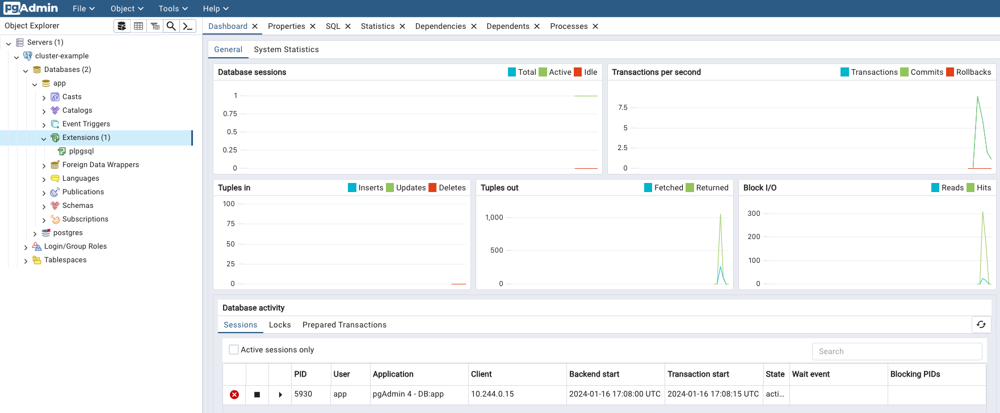

# Kubectl Plugin
<!-- SPDX-License-Identifier: CC-BY-4.0 -->

CloudNativePG provides a plugin for `kubectl` to manage a cluster in Kubernetes.

## Install

You can install the `cnpg` plugin using a variety of methods.

:::note
    For air-gapped systems, installation via package managers, using previously
    downloaded files, may be a good option.
:::

### Via the installation script

```sh
curl -sSfL \
  https://github.com/cloudnative-pg/cloudnative-pg/raw/main/hack/install-cnpg-plugin.sh | \
  sudo sh -s -- -b /usr/local/bin
```

### Using the Debian or RedHat packages

In the
[releases section of the GitHub repository](https://github.com/cloudnative-pg/cloudnative-pg/releases),
you can navigate to any release of interest (pick the same or newer release
than your CloudNativePG operator), and in it you will find an **Assets**
section. In that section are pre-built packages for a variety of systems.
As a result, you can follow standard practices and instructions to install
them in your systems.

#### Debian packages

For example, let's install the 1.28.1 release of the plugin, for an Intel based
64 bit server. First, we download the right `.deb` file.

```sh
wget https://github.com/cloudnative-pg/cloudnative-pg/releases/download/v1.28.1/kubectl-cnpg_1.28.1_linux_x86_64.deb \
  --output-document kube-plugin.deb
```

Then, with superuser privileges, install from the local file using `dpkg`:

```console
$ sudo dpkg -i kube-plugin.deb
Selecting previously unselected package cnpg.
(Reading database ... 6688 files and directories currently installed.)
Preparing to unpack kube-plugin.deb ...
Unpacking cnpg (1.28.1) ...
Setting up cnpg (1.28.1) ...
```

#### RPM packages

As in the example for `.rpm` packages, let's install the 1.28.1 release for an
Intel 64 bit machine. Note the `--output` flag to provide a file name.

```sh
curl -L https://github.com/cloudnative-pg/cloudnative-pg/releases/download/v1.28.1/kubectl-cnpg_1.28.1_linux_x86_64.rpm \
  --output kube-plugin.rpm
```

Then, with superuser privileges, install with `yum`, and you're ready to use:

```console
$ sudo yum --disablerepo=* localinstall kube-plugin.rpm
Failed to set locale, defaulting to C.UTF-8
Dependencies resolved.
====================================================================================================
 Package            Architecture         Version                   Repository                  Size
====================================================================================================
Installing:
 cnpg               x86_64               1.28.1-1                  @commandline                20 M

Transaction Summary
====================================================================================================
Install  1 Package

Total size: 20 M
Installed size: 78 M
Is this ok [y/N]: y
```

### Using the Arch Linux User Repository (AUR) Package

To install the plugin from the [AUR](https://aur.archlinux.org/packages/kubectl-cnpg), follow these steps:

```sh
git clone https://aur.archlinux.org/kubectl-cnpg.git
cd kubectl-cnpg
makepkg -si
```

Or use your favorite AUR-helper, for example [paru](https://github.com/Morganamilo/paru):

```sh
paru -S kubectl-cnpg
```

### Using Krew

If you already have [Krew](https://krew.sigs.k8s.io/) installed, you can simply
run:

```sh
kubectl krew install cnpg
```

When a new version of the plugin is released, you can update the existing
installation with:

```sh
kubectl krew update
kubectl krew upgrade cnpg
```

### Using Homebrew

:::note
    Please note that the Homebrew community manages the availability of the [kubectl-cnpg plugin on Homebrew](https://formulae.brew.sh/formula/kubectl-cnpg).
:::

If you already have [Homebrew](https://brew.sh/) installed, you can simply
run:

```sh
brew install kubectl-cnpg
```

When a new version of the plugin is released, you can update the existing
installation with:

```sh
brew update
brew upgrade kubectl-cnpg
```

:::note
    Auto-completion for the kubectl plugin is already managed by Homebrew.
    There's no need to create the `kubectl_complete-cnpg` script mentioned below.
:::

### Supported Architectures

CloudNativePG Plugin is currently built for the following
operating system and architectures:

- Linux
  - amd64
  - arm 5/6/7
  - arm64
  - s390x
  - ppc64le
- macOS
  - amd64
  - arm64
- Windows
  - 386
  - amd64
  - arm 5/6/7
  - arm64

### Configuring auto-completion

To configure auto-completion for the plugin, a helper shell script needs to be
installed into your current PATH. Assuming the latter contains `/usr/local/bin`,
this can be done with the following commands:

```sh
cat > kubectl_complete-cnpg <<EOF
#!/usr/bin/env sh

# Call the __complete command passing it all arguments
kubectl cnpg __complete "\$@"
EOF

chmod +x kubectl_complete-cnpg

# Important: the following command may require superuser permission
sudo mv kubectl_complete-cnpg /usr/local/bin
```

:::info[Important]
    The name of the script needs to be exactly the one provided since it's used by the kubectl auto-complete process
:::

## Use

Once the plugin is installed and deployed, you can start using it like this:

```sh
kubectl cnpg COMMAND [ARGS...]
```

:::note
    The plugin automatically detects if the standard output channel is connected to a terminal.
    In such cases, it may add ANSI colors to the command output. To disable colors, use the
    `--color=never` option with the command.
:::

### Generation of installation manifests

The `cnpg` plugin can be used to generate the YAML manifest for the
installation of the operator. This option would typically be used if you want
to override some default configurations such as number of replicas,
installation namespace, namespaces to watch, and so on.

For details and available options, run:

```sh
kubectl cnpg install generate --help
```

The main options are:

- `-n`: specifies the namespace in which to install the operator (default:
  `cnpg-system`).
- `--control-plane`: if set to true, the operator deployment will include a
  toleration and affinity for `node-role.kubernetes.io/control-plane`.
- `--replicas`: sets the number of replicas in the deployment.
- `--watch-namespace`: specifies a comma-separated list of namespaces to watch
  (default: all namespaces).
- `--version`: defines the minor version of the operator to be installed, such
  as `1.23`. If a minor version is specified, the plugin installs the latest
  patch version of that minor version. If no version is supplied, the plugin
  installs the latest `MAJOR.MINOR.PATCH` version of the operator.

An example of the `generate` command, which will generate a YAML manifest that
will install the operator, is as follows:

```sh
kubectl cnpg install generate \
  -n king \
  --version 1.23 \
  --replicas 3 \
  --watch-namespace "albert, bb, freddie" \
  > operator.yaml
```

The flags in the above command have the following meaning:
- `-n king` install the CNPG operator into the `king` namespace
- `--version 1.23` install the latest patch version for minor version 1.23
- `--replicas 3` install the operator with 3 replicas
- `--watch-namespace "albert, bb, freddie"` have the operator watch for
  changes in the `albert`, `bb` and `freddie` namespaces only

### Status

The `status` command provides an overview of the current status of your
cluster, including:

- **general information**: name of the cluster, PostgreSQL's system ID, number of
  instances, current timeline and position in the WAL
- **backup**: point of recoverability, and WAL archiving status as returned by
  the `pg_stat_archiver` view from the primary - or designated primary in the
  case of a replica cluster
- **streaming replication**: information taken directly from the `pg_stat_replication`
  view on the primary instance
- **instances**: information about each Postgres instance, taken directly by each
  instance manager; in the case of a standby, the `Current LSN` field corresponds
  to the latest write-ahead log location that has been replayed during recovery
  (replay LSN).

:::info[Important]
    The status information above is taken at different times and at different
    locations, resulting in slightly inconsistent returned values. For example,
    the `Current Write LSN` location in the main header, might be different
    from the `Current LSN` field in the instances status as it is taken at
    two different time intervals.
:::

```sh
kubectl cnpg status sandbox
```

```output
Cluster Summary
Name:                default/sandbox
System ID:           7423474350493388827
PostgreSQL Image:    ghcr.io/cloudnative-pg/postgresql:16.4
Primary instance:    sandbox-1
Primary start time:  2024-10-08 18:31:57 +0000 UTC (uptime 1m14s)
Status:              Cluster in healthy state
Instances:           3
Ready instances:     3
Size:                126M
Current Write LSN:   0/604DE38 (Timeline: 1 - WAL File: 000000010000000000000006)

Continuous Backup status
Not configured

Streaming Replication status
Replication Slots Enabled
Name       Sent LSN   Write LSN  Flush LSN  Replay LSN  Write Lag  Flush Lag  Replay Lag  State      Sync State  Sync Priority  Replication Slot
----       --------   ---------  ---------  ----------  ---------  ---------  ----------  -----      ----------  -------------  ----------------
sandbox-2  0/604DE38  0/604DE38  0/604DE38  0/604DE38   00:00:00   00:00:00   00:00:00    streaming  async       0              active
sandbox-3  0/604DE38  0/604DE38  0/604DE38  0/604DE38   00:00:00   00:00:00   00:00:00    streaming  async       0              active

Instances status
Name       Current LSN  Replication role  Status  QoS         Manager Version  Node
----       -----------  ----------------  ------  ---         ---------------  ----
sandbox-1  0/604DE38    Primary           OK      BestEffort  1.28.1           k8s-eu-worker
sandbox-2  0/604DE38    Standby (async)   OK      BestEffort  1.28.1           k8s-eu-worker2
sandbox-3  0/604DE38    Standby (async)   OK      BestEffort  1.28.1           k8s-eu-worker
```

If you require more detailed status information, use the `--verbose` option (or
`-v` for short). The level of detail increases each time the flag is repeated:

```sh
kubectl cnpg status sandbox --verbose
```

```output
Cluster Summary
Name:                default/sandbox
System ID:           7423474350493388827
PostgreSQL Image:    ghcr.io/cloudnative-pg/postgresql:16.4
Primary instance:    sandbox-1
Primary start time:  2024-10-08 18:31:57 +0000 UTC (uptime 2m4s)
Status:              Cluster in healthy state
Instances:           3
Ready instances:     3
Size:                126M
Current Write LSN:   0/6053720 (Timeline: 1 - WAL File: 000000010000000000000006)

Continuous Backup status
Not configured

Physical backups
No running physical backups found

Streaming Replication status
Replication Slots Enabled
Name       Sent LSN   Write LSN  Flush LSN  Replay LSN  Write Lag  Flush Lag  Replay Lag  State      Sync State  Sync Priority  Replication Slot  Slot Restart LSN  Slot WAL Status  Slot Safe WAL Size
----       --------   ---------  ---------  ----------  ---------  ---------  ----------  -----      ----------  -------------  ----------------  ----------------  ---------------  ------------------
sandbox-2  0/6053720  0/6053720  0/6053720  0/6053720   00:00:00   00:00:00   00:00:00    streaming  async       0              active            0/6053720         reserved         NULL
sandbox-3  0/6053720  0/6053720  0/6053720  0/6053720   00:00:00   00:00:00   00:00:00    streaming  async       0              active            0/6053720         reserved         NULL

Unmanaged Replication Slot Status
No unmanaged replication slots found

Managed roles status
No roles managed

Tablespaces status
No managed tablespaces

Pod Disruption Budgets status
Name             Role     Expected Pods  Current Healthy  Minimum Desired Healthy  Disruptions Allowed
----             ----     -------------  ---------------  -----------------------  -------------------
sandbox          replica  2              2                1                        1
sandbox-primary  primary  1              1                1                        0

Instances status
Name       Current LSN  Replication role  Status  QoS         Manager Version  Node
----       -----------  ----------------  ------  ---         ---------------  ----
sandbox-1  0/6053720    Primary           OK      BestEffort  1.28.1           k8s-eu-worker
sandbox-2  0/6053720    Standby (async)   OK      BestEffort  1.28.1           k8s-eu-worker2
sandbox-3  0/6053720    Standby (async)   OK      BestEffort  1.28.1           k8s-eu-worker
```

With an additional `-v` (e.g. `kubectl cnpg status sandbox -v -v`), you can
also view PostgreSQL configuration, HBA settings, and certificates.

The command also supports output in `yaml` and `json` format.

:::note
    The `status` command executes operations that access the pod filesystem,
    such as `du` to calculate cluster size and `cat` to read configuration files.
    For clusters with large data volumes (e.g., over 1TB), these operations may
    take longer than the default timeout of 10 seconds. You can adjust the timeout
    using the `--timeout` flag (e.g., `kubectl cnpg status sandbox --timeout 45s`).
:::

### Promote

The meaning of this command is to `promote` a pod in the cluster to primary, so you
can start with maintenance work or test a switch-over situation in your cluster:

```sh
kubectl cnpg promote CLUSTER CLUSTER-INSTANCE
```

Or you can use the instance node number to promote:

```sh
kubectl cnpg promote CLUSTER INSTANCE
```

### Certificates

Clusters created using the CloudNativePG operator work with a CA to sign
a TLS authentication certificate.

To get a certificate, you need to provide a name for the secret to store
the credentials, the cluster name, and a user for this certificate:

```sh
kubectl cnpg certificate cluster-cert --cnpg-cluster CLUSTER --cnpg-user USER
```

After the secret it's created, you can get it using `kubectl`:

```sh
kubectl get secret cluster-cert
```

And the content of the same in plain text using the following commands:

```sh
kubectl get secret cluster-cert -o json | jq -r '.data | map(@base64d) | .[]'
```

### Restart

The `kubectl cnpg restart` command can be used in two cases:

- requesting the operator to orchestrate a rollout restart
  for a certain cluster. This is useful to apply
  configuration changes to cluster dependent objects, such as `ConfigMaps`
  containing custom monitoring queries.

- request a single instance restart, either in-place if the instance is
  the cluster's primary or deleting and recreating the pod if
  it is a replica.

```sh
# this command will restart a whole cluster in a rollout fashion
kubectl cnpg restart CLUSTER

# this command will restart a single instance, according to the policy above
kubectl cnpg restart CLUSTER INSTANCE
```

If the in-place restart is requested but the change cannot be applied without
a switchover, the switchover will take precedence over the in-place restart. A
common case for this will be a minor upgrade of PostgreSQL image.

:::note
    If you want ConfigMaps and Secrets to be **automatically** reloaded
    by instances, you can add a label with key `cnpg.io/reload` to it.
:::

### Reload

The `kubectl cnpg reload` command requests the operator to trigger a reconciliation
loop for a certain cluster. This is useful to apply configuration changes
to cluster dependent objects, such as ConfigMaps containing custom monitoring queries.

The following command will reload all configurations for a given cluster:

```sh
kubectl cnpg reload CLUSTER
```

### Maintenance

The `kubectl cnpg maintenance` command helps to modify one or more clusters
across namespaces and set the maintenance window values, it will change
the following fields:

- `.spec.nodeMaintenanceWindow.inProgress`
- `.spec.nodeMaintenanceWindow.reusePVC`

Accepts as argument `set` and `unset` using this to set the
`inProgress` to `true` in case `set`and to `false` in case of `unset`.

By default, `reusePVC` is always set to `false` unless the `--reusePVC` flag is passed.

The plugin will ask for a confirmation with a list of the cluster to modify
and their new values, if this is accepted this action will be applied to
all the cluster in the list.

If you want to set in maintenance all the PostgreSQL in your Kubernetes cluster,
just need to write the following command:

```sh
kubectl cnpg maintenance set --all-namespaces
```

And you'll have the list of all the cluster to update

```output
The following are the new values for the clusters
Namespace  Cluster Name     Maintenance  reusePVC
---------  ------------     -----------  --------
default    cluster-example  true         false
default    pg-backup        true         false
test       cluster-example  true         false
Do you want to proceed? [y/n]: y
```

### Report

The `kubectl cnpg report` command bundles various pieces
of information into a ZIP file.
It aims to provide the needed context to debug problems
with clusters in production.

It has two sub-commands: `operator` and `cluster`.

#### report Operator

The `operator` sub-command requests the operator to provide information
regarding the operator deployment, configuration and events.

:::info[Important]
    All confidential information in Secrets and ConfigMaps is REDACTED.
    The Data map will show the **keys** but the values will be empty.
    The flag `-S` / `--stopRedaction` will defeat the redaction and show the
    values. Use only at your own risk, this will share private data.
:::

:::note
    By default, operator logs are not collected, but you can enable operator
    log collection with the `--logs` flag
:::

:::info[Least-Privilege Support]
    The `report operator` command works with minimal permissions. Only the operator
    deployment is **required** - all other resources are optional and collected on a
    best-effort basis. If you lack permissions for certain resources (e.g., webhooks,
    OLM resources), warnings are logged and report generation continues with available
    data.
:::

The report includes:

- **deployment information** (required): the operator `Deployment`
- **operator pods** (optional): the operator `Pod` information
- **configuration** (optional): `Secrets` and `ConfigMaps` in the operator
  namespace
- **events** (optional): `Events` in the operator namespace
- **webhook configuration** (optional): mutating and validating webhook
  configurations (cluster-scoped)
- **webhook service** (optional): the webhook service
- **OLM resources** (optional): subscriptions, cluster service versions,
  install plans (if OLM is installed)
- **logs** (optional): operator `Pod` logs in JSON-lines format (requires
  `--logs` flag)

:::warning[Minimal permissions]
    Read access (`get`) to the operator deployment in the operator namespace.
    This allows namespace-scoped users to generate basic troubleshooting reports.
:::

:::info[Recommended permissions for full report]
    Add `list` on pods, events; `get` on secrets, configmaps, services
    (namespace-scoped); and `list` on webhook configurations (cluster-scoped).
:::

A user with only namespace-scoped permissions can still generate useful
reports:

```sh
# With only deployment read access
kubectl cnpg report operator -n cnpg-system -f report.zip
```

:::info
    The command will log warnings for inaccessible resources but successfully
    generate a report with the deployment manifest, which is often sufficient for
    basic troubleshooting.
:::

The command will generate a ZIP file containing various manifest in YAML format
(by default, but settable to JSON with the `-o` flag). Use the `-f` flag to
name a result file explicitly. If the `-f` flag is not used, a default
time-stamped filename is created for the zip file.

:::note
    The report plugin obeys `kubectl` conventions, and will look for objects
    constrained by namespace. The CNPG Operator will generally not be installed in
    the same namespace as the clusters. E.g. the default installation namespace is
    cnpg-system.
:::

```sh
kubectl cnpg report operator -n cnpg-system
```

results in

```output
Successfully written report to "report_operator_<TIMESTAMP>.zip" (format: "yaml")
```

With the `-f` flag set:

```sh
kubectl cnpg report operator -n cnpg-system -f reportRedacted.zip
```

Unzipping the file will produce a time-stamped top-level folder to keep the
directory tidy:

```sh
unzip reportRedacted.zip
```

will result in:

```output
Archive:  reportRedacted.zip
   creating: report_operator_<TIMESTAMP>/
   creating: report_operator_<TIMESTAMP>/manifests/
  inflating: report_operator_<TIMESTAMP>/manifests/deployment.yaml
  inflating: report_operator_<TIMESTAMP>/manifests/operator-pod.yaml
  inflating: report_operator_<TIMESTAMP>/manifests/events.yaml
  inflating: report_operator_<TIMESTAMP>/manifests/validating-webhook-configuration.yaml
  inflating: report_operator_<TIMESTAMP>/manifests/mutating-webhook-configuration.yaml
  inflating: report_operator_<TIMESTAMP>/manifests/webhook-service.yaml
  inflating: report_operator_<TIMESTAMP>/manifests/cnpg-ca-secret(secret).yaml
  inflating: report_operator_<TIMESTAMP>/manifests/cnpg-webhook-cert(secret).yaml
```

If you activated the `--logs` option, you'd see an extra subdirectory:

```output
Archive:  report_operator_<TIMESTAMP>.zip
  <snipped …>
  creating: report_operator_<TIMESTAMP>/operator-logs/
  inflating: report_operator_<TIMESTAMP>/operator-logs/cnpg-controller-manager-66fb98dbc5-pxkmh-logs.jsonl
```

:::note
    The plugin will try to get the PREVIOUS operator's logs, which is helpful
    when investigating restarted operators.
    In all cases, it will also try to get the CURRENT operator logs. If current
    and previous logs are available, it will show them both.
:::

```output
====== Beginning of Previous Log =====
2023-03-28T12:56:41.251711811Z {"level":"info","ts":"2023-03-28T12:56:41Z","logger":"setup","msg":"Starting CloudNativePG Operator","version":"1.28.1","build":{"Version":"1.28.1+dev107","Commit":"cc9bab17","Date":"2023-03-28"}}
2023-03-28T12:56:41.251851909Z {"level":"info","ts":"2023-03-28T12:56:41Z","logger":"setup","msg":"Starting pprof HTTP server","addr":"0.0.0.0:6060"}
  <snipped …>

====== End of Previous Log =====
2023-03-28T12:57:09.854306024Z {"level":"info","ts":"2023-03-28T12:57:09Z","logger":"setup","msg":"Starting CloudNativePG Operator","version":"1.28.1","build":{"Version":"1.28.1+dev107","Commit":"cc9bab17","Date":"2023-03-28"}}
2023-03-28T12:57:09.854363943Z {"level":"info","ts":"2023-03-28T12:57:09Z","logger":"setup","msg":"Starting pprof HTTP server","addr":"0.0.0.0:6060"}
```

If the operator hasn't been restarted, you'll still see the `====== Begin …`
and  `====== End …` guards, with no content inside.

You can verify that the confidential information is REDACTED by default:

```sh
cd report_operator_<TIMESTAMP>/manifests/
head cnpg-ca-secret\(secret\).yaml
```

```yaml
data:
  ca.crt: ""
  ca.key: ""
metadata:
  creationTimestamp: "2022-03-22T10:42:28Z"
  managedFields:
  - apiVersion: v1
    fieldsType: FieldsV1
    fieldsV1:
```

With the `-S` (`--stopRedaction`) option activated, secrets are shown:

```sh
kubectl cnpg report operator -n cnpg-system -f reportNonRedacted.zip -S
```

You'll get a reminder that you're about to view confidential information:

```output
WARNING: secret Redaction is OFF. Use it with caution
Successfully written report to "reportNonRedacted.zip" (format: "yaml")
```

```sh
unzip reportNonRedacted.zip
head cnpg-ca-secret\(secret\).yaml
```

```yaml
data:
  ca.crt: LS0tLS1CRUdJTiBD…
  ca.key: LS0tLS1CRUdJTiBF…
metadata:
  creationTimestamp: "2022-03-22T10:42:28Z"
  managedFields:
  - apiVersion: v1
    fieldsType: FieldsV1
```

#### report Cluster

The `cluster` sub-command gathers the following:

- **cluster resources**: the cluster information, same as `kubectl get cluster -o yaml`
- **cluster pods**: pods in the cluster namespace matching the cluster name
- **cluster jobs**: jobs, if any, in the cluster namespace matching the cluster name
- **events**: events in the cluster namespace
- **pod logs**: logs for the cluster Pods (optional, off by default) in JSON-lines format
- **job logs**: logs for the Pods created by jobs (optional, off by default) in JSON-lines format

The `cluster` sub-command accepts the `-f` and `-o` flags, as the `operator` does.
If the `-f` flag is not used, a default timestamped report name will be used.
Note that the cluster information does not contain configuration Secrets / ConfigMaps,
so the `-S` is disabled.

:::note
    By default, cluster logs are not collected, but you can enable cluster
    log collection with the `--logs` flag
:::

Usage:

```sh
kubectl cnpg report cluster CLUSTER [flags]
```

Note that, unlike the `operator` sub-command, for the `cluster` sub-command you
need to provide the cluster name, and very likely the namespace, unless the cluster
is in the default one.

```sh
kubectl cnpg report cluster CLUSTER -f report.zip [-n NAMESPACE]
```

and then:

```sh
unzip report.zip
```

```output
Archive:  report.zip
   creating: report_cluster_example_<TIMESTAMP>/
   creating: report_cluster_example_<TIMESTAMP>/manifests/
  inflating: report_cluster_example_<TIMESTAMP>/manifests/cluster.yaml
  inflating: report_cluster_example_<TIMESTAMP>/manifests/cluster-pods.yaml
  inflating: report_cluster_example_<TIMESTAMP>/manifests/cluster-jobs.yaml
  inflating: report_cluster_example_<TIMESTAMP>/manifests/events.yaml
```

Remember that you can use the `--logs` flag to add the pod and job logs to the ZIP.

```sh
kubectl cnpg report cluster CLUSTER [-n NAMESPACE] --logs
```

will result in:

```output
Successfully written report to "report_cluster_example_<TIMESTAMP>.zip" (format: "yaml")
```

```sh
unzip report_cluster_<TIMESTAMP>.zip
```

```output
Archive:  report_cluster_example_<TIMESTAMP>.zip
   creating: report_cluster_example_<TIMESTAMP>/
   creating: report_cluster_example_<TIMESTAMP>/manifests/
  inflating: report_cluster_example_<TIMESTAMP>/manifests/cluster.yaml
  inflating: report_cluster_example_<TIMESTAMP>/manifests/cluster-pods.yaml
  inflating: report_cluster_example_<TIMESTAMP>/manifests/cluster-jobs.yaml
  inflating: report_cluster_example_<TIMESTAMP>/manifests/events.yaml
   creating: report_cluster_example_<TIMESTAMP>/logs/
  inflating: report_cluster_example_<TIMESTAMP>/logs/cluster-example-full-1.jsonl
   creating: report_cluster_example_<TIMESTAMP>/job-logs/
  inflating: report_cluster_example_<TIMESTAMP>/job-logs/cluster-example-full-1-initdb-qnnvw.jsonl
  inflating: report_cluster_example_<TIMESTAMP>/job-logs/cluster-example-full-2-join-tvj8r.jsonl
```

### Logs

The `kubectl cnpg logs` command allows to follow the logs of a collection
of pods related to CloudNativePG in a single go.

It has at the moment one available sub-command: `cluster`.

#### Cluster logs

The `cluster` sub-command gathers all the pod logs for a cluster in a single
stream or file.
This means that you can get all the pod logs in a single terminal window, with a
single invocation of the command.

As in all the cnpg plugin sub-commands, you can get instructions and help with
the `-h` flag:

`kubectl cnpg logs cluster -h`

The `logs` command will display logs in  JSON-lines format, unless the
`--timestamps` flag is used, in which case, a human-readable timestamp will be
prepended to each line. In this case, lines will no longer be valid JSON,
and tools such as `jq` may not work as desired.

If the `logs cluster` sub-command is given the `-f` flag (aka `--follow`), it
will follow the cluster pod logs, and will also watch for any new pods created
in the cluster after the command has been invoked.
Any new pods found, including pods that have been restarted or re-created,
will also have their pods followed.
The logs will be displayed in the terminal's standard-out.
This command will only exit when the cluster has no more pods left, or when it
is interrupted by the user.

If `logs` is called without the `-f` option, it will read the logs from all
cluster pods until the time of invocation and display them in the terminal's
standard-out, then exit.
The `-o` or `--output` flag can be provided, to specify the name
of the file where the logs should be saved, instead of displaying over
standard-out.
The `--tail` flag can be used to specify how many log lines will be retrieved
from each pod in the cluster. By default, the `logs cluster` sub-command will
display all the logs from each pod in the cluster. If combined with the "follow"
flag `-f`, the number of logs specified by `--tail` will be retrieved until the
current time, and from then the new logs will be followed.

NOTE: unlike other `cnpg` plugin commands, the `-f` is used to denote "follow"
rather than specify a file. This keeps with the convention of `kubectl logs`,
which takes `-f` to mean the logs should be followed.

Usage:

```sh
kubectl cnpg logs cluster CLUSTER [flags]
```

Using the `-f` option to follow:

```sh
kubectl cnpg logs cluster CLUSTER -f
```

Using `--tail` option to display 3 lines from each pod and the `-f` option
to follow:

```sh
kubectl cnpg logs cluster CLUSTER -f --tail 3
```

```output
{"level":"info","ts":"2023-06-30T13:37:33Z","logger":"postgres","msg":"2023-06-30 13:37:33.142 UTC [26] LOG:  ending log output to stderr","source":"/controller/log/postgres","logging_pod":"cluster-example-3"}
{"level":"info","ts":"2023-06-30T13:37:33Z","logger":"postgres","msg":"2023-06-30 13:37:33.142 UTC [26] HINT:  Future log output will go to log destination \"csvlog\".","source":"/controller/log/postgres","logging_pod":"cluster-example-3"}
…
…
```

With the `-o` option omitted, and with `--output` specified:

```console
$ kubectl cnpg logs cluster CLUSTER --output my-cluster.log

Successfully written logs to "my-cluster.log"
```

#### Pretty

The `pretty` sub-command reads a log stream from standard input, formats it
into a human-readable output, and attempts to sort the entries by timestamp.

It can be used in combination with `kubectl cnpg logs cluster`, as
shown in the following example:

```console
$ kubectl cnpg logs cluster cluster-example | kubectl cnpg logs pretty
2024-10-15T17:35:00.336 INFO     cluster-example-1 instance-manager Starting CloudNativePG Instance Manager
2024-10-15T17:35:00.336 INFO     cluster-example-1 instance-manager Checking for free disk space for WALs before starting PostgreSQL
2024-10-15T17:35:00.347 INFO     cluster-example-1 instance-manager starting tablespace manager
2024-10-15T17:35:00.347 INFO     cluster-example-1 instance-manager starting external server manager
[...]
```

Alternatively, it can be used in combination with other commands that produce
CNPG logs in JSON format, such as `stern`, or `kubectl logs`, as in the
following example:

```console
$ kubectl logs cluster-example-1 | kubectl cnpg logs pretty
2024-10-15T17:35:00.336 INFO     cluster-example-1 instance-manager Starting CloudNativePG Instance Manager
2024-10-15T17:35:00.336 INFO     cluster-example-1 instance-manager Checking for free disk space for WALs before starting PostgreSQL
2024-10-15T17:35:00.347 INFO     cluster-example-1 instance-manager starting tablespace manager
2024-10-15T17:35:00.347 INFO     cluster-example-1 instance-manager starting external server manager
[...]
```

The `pretty` sub-command also supports advanced log filtering, allowing users
to display logs for specific pods or loggers, or to filter logs by severity
level.
Here's an example:

```console
$ kubectl cnpg logs cluster cluster-example | kubectl cnpg logs pretty --pods cluster-example-1 --loggers postgres --log-level info
2024-10-15T17:35:00.509 INFO     cluster-example-1 postgres         2024-10-15 17:35:00.509 UTC [29] LOG:  redirecting log output to logging collector process
2024-10-15T17:35:00.509 INFO     cluster-example-1 postgres         2024-10-15 17:35:00.509 UTC [29] HINT:  Future log output will appear in directory "/controller/log"...
2024-10-15T17:35:00.510 INFO     cluster-example-1 postgres         2024-10-15 17:35:00.509 UTC [29] LOG:  ending log output to stderr
2024-10-15T17:35:00.510 INFO     cluster-example-1 postgres         ending log output to stderr
[...]
```

The `pretty` sub-command will try to sort the log stream,
to make logs easier to reason about. In order to achieve this, it gathers the
logs into groups, and within groups it sorts by timestamp. This is the only
way to sort interactively, as `pretty` may be piped from a command in "follow"
mode. The sub-command will add a group separator line, `---`, at the end of
each sorted group. The size of the grouping can be configured via the
`--sorting-group-size` flag (default: 1000), as illustrated in the following example:

```console
$ kubectl cnpg logs cluster cluster-example | kubectl cnpg logs pretty --sorting-group-size=3
2024-10-15T17:35:20.426 INFO     cluster-example-2 instance-manager Starting CloudNativePG Instance Manager
2024-10-15T17:35:20.426 INFO     cluster-example-2 instance-manager Checking for free disk space for WALs before starting PostgreSQL
2024-10-15T17:35:20.438 INFO     cluster-example-2 instance-manager starting tablespace manager
---
2024-10-15T17:35:20.438 INFO     cluster-example-2 instance-manager starting external server manager
2024-10-15T17:35:20.438 INFO     cluster-example-2 instance-manager starting controller-runtime manager
2024-10-15T17:35:20.439 INFO     cluster-example-2 instance-manager Starting EventSource
---
[...]
```

To explore all available options, use the `-h` flag for detailed explanations
of the supported flags and their usage.

:::info
    You can also increase the verbosity of the log by adding more `-v` options.
:::

### Destroy

The `kubectl cnpg destroy` command helps remove an instance and all the
associated PVCs from a Kubernetes cluster.

The optional `--keep-pvc` flag, if specified, allows you to keep the PVCs,
while removing all `metadata.ownerReferences` that were set by the instance.
Additionally, the `cnpg.io/pvcStatus` label on the PVCs will change from
`ready` to `detached` to signify that they are no longer in use.

Running again the command without the `--keep-pvc` flag will remove the
detached PVCs.

Usage:

```sh
kubectl cnpg destroy CLUSTER INSTANCE
```

The following example removes the `cluster-example-2` pod and the associated
PVCs:

```sh
kubectl cnpg destroy cluster-example 2
```

### Cluster Hibernation

There are times when you may need to temporarily suspend a CloudNativePG
`Cluster` while preserving its data, allowing you to resume operations later.
This feature is known as **cluster hibernation**.

Hibernation is managed declaratively using the `cnpg.io/hibernation`
annotation.

:::info
    For more details, see the ["Declarative Hibernation"](declarative_hibernation.md)
    documentation page.
:::

To simplify the process, the `cnpg` plugin for `kubectl` provides a `hibernate`
command, which acts as a convenient shortcut for applying the annotation.

To hibernate a cluster, run:

```sh
kubectl cnpg hibernate on CLUSTER
```

This command applies the `cnpg.io/hibernation=on` annotation to the cluster,
suspending its execution.

To resume a hibernated cluster, use:

```sh
kubectl cnpg hibernate off CLUSTER
```

This will remove the hibernation state by setting `cnpg.io/hibernation=off`.

You can check the cluster’s status at any time with:

```sh
kubectl cnpg status CLUSTER
```

This will display the current state of the cluster, including whether it is
hibernated.

### Benchmarking the database with pgbench

Pgbench can be run against an existing PostgreSQL cluster with following
command:

```sh
kubectl cnpg pgbench CLUSTER -- --time 30 --client 1 --jobs 1
```

Refer to the [Benchmarking pgbench section](benchmarking.md#pgbench) for more
details.

### Benchmarking the storage with fio

`fio` can be run on an existing storage class with following command:

```sh
kubectl cnpg fio FIO_JOB_NAME [-n NAMESPACE]
```

Refer to the [Benchmarking fio section](benchmarking.md#fio) for more details.

### Requesting a new physical backup

The `kubectl cnpg backup` command requests a new physical backup for
an existing Postgres cluster by creating a new `Backup` resource.

The following example requests an on-demand backup for a given cluster:

```sh
kubectl cnpg backup CLUSTER
```

or, if using volume snapshots:

```sh
kubectl cnpg backup CLUSTER -m volumeSnapshot
```

The created backup will be named after the request time:

```console
$ kubectl cnpg backup cluster-example
backup/cluster-example-20230121002300 created
```

By default, a newly created backup will use the backup target policy defined
in the cluster to choose which instance to run on.
However, you can override this policy with the `--backup-target` option.

In the case of volume snapshot backups, you can also use the `--online` option
to request an online/hot backup or an offline/cold one: additionally, you can
also tune online backups by explicitly setting the `--immediate-checkpoint` and
`--wait-for-archive` options.

The ["Backup" section](./backup.md) contains more information about
the configuration settings.

### Launching psql

The `kubectl cnpg psql CLUSTER` command starts a new PostgreSQL interactive front-end
process (psql) connected to an existing Postgres cluster, as if you were running
it from the actual pod. This means that you will be using the `postgres` user.

:::info[Important]
    As you will be connecting as `postgres` user, in production environments this
    method should be used with extreme care, by authorized personnel only.
:::

```console
$ kubectl cnpg psql cluster-example

psql (18.1 (Debian 18.1-1.pgdg110+1))
Type "help" for help.

postgres=#
```

By default, the command will connect to the primary instance. The user can
select to work against a replica by using the `--replica` option:

```console
$ kubectl cnpg psql --replica cluster-example

psql (18.1 (Debian 18.1-1.pgdg110+1))

Type "help" for help.

postgres=# select pg_is_in_recovery();
 pg_is_in_recovery
-------------------
 t
(1 row)

postgres=# \q
```

This command will start `kubectl exec`, and the `kubectl` executable must be
reachable in your `PATH` variable to correctly work.

### Snapshotting a Postgres cluster

:::warning
    The `kubectl cnpg snapshot` command has been removed.
    Please use the [`backup` command](#requesting-a-new-physical-backup) to request
    backups using volume snapshots.
:::

### Using pgAdmin4 for evaluation/demonstration purposes only

[pgAdmin](https://www.pgadmin.org/) stands as the most popular and feature-rich
open-source administration and development platform for PostgreSQL.
For more information on the project, please refer to the official
[documentation](https://www.pgadmin.org/docs/).

Given that the pgAdmin Development Team maintains official Docker container
images, you can install pgAdmin in your environment as a standard
Kubernetes deployment.

:::info[Important]
    Deployment of pgAdmin in Kubernetes production environments is beyond the
    scope of this document and, more broadly, of the CloudNativePG project.
:::

However, **for the purposes of demonstration and evaluation**, CloudNativePG
offers a suitable solution. The `cnpg` plugin implements the `pgadmin4`
command, providing a straightforward method to connect to a given database
`Cluster` and navigate its content in a local environment such as `kind`.

For example, you can install a demo deployment of pgAdmin4 for the
`cluster-example` cluster as follows:

```sh
kubectl cnpg pgadmin4 cluster-example
```

This command will produce:

```output
ConfigMap/cluster-example-pgadmin4 created
Deployment/cluster-example-pgadmin4 created
Service/cluster-example-pgadmin4 created
Secret/cluster-example-pgadmin4 created

[...]
```

After deploying pgAdmin, forward the port using kubectl and connect
through your browser by following the on-screen instructions.



As usual, you can use the `--dry-run` option to generate the YAML file:

```sh
kubectl cnpg pgadmin4 --dry-run cluster-example
```

pgAdmin4 can be installed in either desktop or server mode, with the default
being server.

In `server` mode, authentication is required using a randomly generated password,
and users must manually specify the database to connect to.

On the other hand, `desktop` mode initiates a pgAdmin web interface without
requiring authentication. It automatically connects to the `app` database as the
`app` user, making it ideal for quick demos, such as on a local deployment using
`kind`:

```sh
kubectl cnpg pgadmin4 --mode desktop cluster-example
```

After concluding your demo, ensure the termination of the pgAdmin deployment by
executing:

```sh
kubectl cnpg pgadmin4 --dry-run cluster-example | kubectl delete -f -
```

:::warning
    Never deploy pgAdmin in production using the plugin.
:::

### Logical Replication Publications

The `cnpg publication` command group is designed to streamline the creation and
removal of [PostgreSQL logical replication publications](https://www.postgresql.org/docs/current/logical-replication-publication.html).
Be aware that these commands are primarily intended for assisting in the
creation of logical replication publications, particularly on remote PostgreSQL
databases.

:::warning
    It is crucial to have a solid understanding of both the capabilities and
    limitations of PostgreSQL's native logical replication system before using
    these commands.
    In particular, be mindful of the [logical replication restrictions](https://www.postgresql.org/docs/current/logical-replication-restrictions.html).
:::

#### Creating a new publication

To create a logical replication publication, use the `cnpg publication create`
command. The basic structure of this command is as follows:

```sh
kubectl cnpg publication create \
  --publication PUBLICATION_NAME \
  [--external-cluster EXTERNAL_CLUSTER]
  LOCAL_CLUSTER [options]
```

There are two primary use cases:

- With `--external-cluster`: Use this option to create a publication on an
  external cluster (i.e. defined in the `externalClusters` stanza). The commands
  will be issued from the `LOCAL_CLUSTER`, but the publication will be for the
  data in `EXTERNAL_CLUSTER`.

- Without `--external-cluster`: Use this option to create a publication in the
  `LOCAL_CLUSTER` PostgreSQL `Cluster` (by default, the `app` database).

:::warning
    When connecting to an external cluster, ensure that the specified user has
    sufficient permissions to execute the `CREATE PUBLICATION` command.
:::

You have several options, similar to the [`CREATE PUBLICATION`](https://www.postgresql.org/docs/current/sql-createpublication.html)
command, to define the group of tables to replicate. Notable options include:

- If you specify the `--all-tables` option, you create a publication `FOR ALL TABLES`.
- Alternatively, you can specify multiple occurrences of:
  - `--table`: Add a specific table (with an expression) to the publication.
  - `--schema`: Include all tables in the specified database schema (available
    from PostgreSQL 15).

The `--dry-run` option enables you to preview the SQL commands that the plugin
will execute.

For additional information and detailed instructions, type the following
command:

```sh
kubectl cnpg publication create --help
```

##### Example

Given a `source-cluster` and a `destination-cluster`, we would like to create a
publication for the data on `source-cluster`.
The `destination-cluster` has an entry in the `externalClusters` stanza pointing
to `source-cluster`.

We can run:

```sh
kubectl cnpg publication create destination-cluster  \
  --external-cluster=source-cluster --all-tables
```

which will create a publication for all tables on `source-cluster`, running
the SQL commands on the `destination-cluster`.

Or instead, we can run:

```sh
kubectl cnpg publication create source-cluster \
  --publication=app --all-tables
```

which will create a publication named `app` for all the tables in the
`source-cluster`, running the SQL commands on the source cluster.

:::info
    There are two sample files that have been provided for illustration and inspiration:
    [logical-source](samples/cluster-example-logical-source.yaml) and
    [logical-destination](samples/cluster-example-logical-destination.yaml).
:::

#### Dropping a publication

The `cnpg publication drop` command seamlessly complements the `create` command
by offering similar key options, including the publication name, cluster name,
and an optional external cluster. You can drop a `PUBLICATION` with the
following command structure:

```sh
kubectl cnpg publication drop \
  --publication PUBLICATION_NAME \
  [--external-cluster EXTERNAL_CLUSTER]
  LOCAL_CLUSTER [options]
```

To access further details and precise instructions, use the following command:

```sh
kubectl cnpg publication drop --help
```

### Logical Replication Subscriptions

The `cnpg subscription` command group is a dedicated set of commands designed
to simplify the creation and removal of
[PostgreSQL logical replication subscriptions](https://www.postgresql.org/docs/current/logical-replication-subscription.html).
These commands are specifically crafted to aid in the establishment of logical
replication subscriptions, especially when dealing with remote PostgreSQL
databases.

:::warning
    Before using these commands, it is essential to have a comprehensive
    understanding of both the capabilities and limitations of PostgreSQL's
    native logical replication system.
    In particular, be mindful of the [logical replication restrictions](https://www.postgresql.org/docs/current/logical-replication-restrictions.html).
:::

In addition to subscription management, we provide a helpful command for
synchronizing all sequences from the source cluster. While its applicability
may vary, this command can be particularly useful in scenarios involving major
upgrades or data import from remote servers.

#### Creating a new subscription

To create a logical replication subscription, use the `cnpg subscription create`
command. The basic structure of this command is as follows:

```sh
kubectl cnpg subscription create \
  --subscription SUBSCRIPTION_NAME \
  --publication PUBLICATION_NAME \
  --external-cluster EXTERNAL_CLUSTER \
  LOCAL_CLUSTER [options]
```

This command configures a subscription directed towards the specified
publication in the designated external cluster, as defined in the
`externalClusters` stanza of the `LOCAL_CLUSTER`.

For additional information and detailed instructions, type the following
command:

```sh
kubectl cnpg subscription create --help
```

##### Example

As in the section on publications, we have a `source-cluster` and a
`destination-cluster`, and we have already created a publication called
`app`.

The following command:

```sh
kubectl cnpg subscription create destination-cluster \
  --external-cluster=source-cluster \
  --publication=app --subscription=app
```

will create a subscription for `app` on the destination cluster.

:::warning
    Prioritize testing subscriptions in a non-production environment to ensure
    their effectiveness and identify any potential issues before implementing them
    in a production setting.
:::

:::info
    There are two sample files that have been provided for illustration and inspiration:
    [logical-source](samples/cluster-example-logical-source.yaml) and
    [logical-destination](samples/cluster-example-logical-destination.yaml).
:::

#### Dropping a subscription

The `cnpg subscription drop` command seamlessly complements the `create` command.
You can drop a `SUBSCRIPTION` with the following command structure:

```sh
kubectl cnpg subcription drop \
  --subscription SUBSCRIPTION_NAME \
  LOCAL_CLUSTER [options]
```

To access further details and precise instructions, use the following command:

```sh
kubectl cnpg subscription drop --help
```

#### Synchronizing sequences

One notable constraint of PostgreSQL logical replication, implemented through
publications and subscriptions, is the lack of sequence synchronization. This
becomes particularly relevant when utilizing logical replication for live
database migration, especially to a higher version of PostgreSQL. A crucial
step in this process involves updating sequences before transitioning
applications to the new database (*cutover*).

To address this limitation, the `cnpg subscription sync-sequences` command
offers a solution. This command establishes a connection with the source
database, retrieves all relevant sequences, and subsequently updates local
sequences with matching identities (based on database schema and sequence
name).

You can use the command as shown below:

```sh
kubectl cnpg subscription sync-sequences \
  --subscription SUBSCRIPTION_NAME \
  LOCAL_CLUSTER
```

For comprehensive details and specific instructions, utilize the following
command:

```sh
kubectl cnpg subscription sync-sequences --help
```

##### Example

As in the previous sections for publication and subscription, we have
a `source-cluster` and a `destination-cluster`. The publication and the
subscription, both called `app`, are already present.

The following command will synchronize the sequences involved in the
`app` subscription, from the source cluster into the destination cluster.

```sh
kubectl cnpg subscription sync-sequences destination-cluster \
  --subscription=app
```

:::warning
    Prioritize testing subscriptions in a non-production environment to
    guarantee their effectiveness and detect any potential issues before deploying
    them in a production setting.
:::

## Integration with K9s

The `cnpg` plugin can be easily integrated in [K9s](https://k9scli.io/), a
popular terminal-based UI to interact with Kubernetes clusters.

See [`k9s/plugins.yml`](samples/k9s/plugins.yml) for details.

## Permissions required by the plugin

The plugin requires a set of Kubernetes permissions that depends on the command
to execute. These permissions may affect resources and sub-resources like Pods,
PDBs, PVCs, and enable actions like `get`, `delete`, `patch`. The following
table contains the full details:

| Command         | Resource Permissions                                                                                                                                                                                                                                                                                                                                  |
|:----------------|:------------------------------------------------------------------------------------------------------------------------------------------------------------------------------------------------------------------------------------------------------------------------------------------------------------------------------------------------------|
| backup          | clusters: get<br/>backups: create                                                                                                                                                                                                                                                                                                                     |
| certificate     | clusters: get<br/>secrets: get,create                                                                                                                                                                                                                                                                                                                 |
| destroy         | pods: get,delete<br/>jobs: delete,list<br/>PVCs: list,delete,update                                                                                                                                                                                                                                                                                   |
| fencing         | clusters: get,patch<br/>pods: get                                                                                                                                                                                                                                                                                                                     |
| fio             | PVCs: create<br/>configmaps: create<br/>deployment: create                                                                                                                                                                                                                                                                                            |
| hibernate       | clusters: get,patch,delete<br/>pods: list,get,delete<br/>pods/exec: create<br/>jobs: list<br/>PVCs: get,list,update,patch,delete                                                                                                                                                                                                                      |
| install         | none                                                                                                                                                                                                                                                                                                                                                  |
| logs            | clusters: get<br/>pods: list<br/>pods/log: get                                                                                                                                                                                                                                                                                                        |
| maintenance     | clusters: get,patch,list<br/>                                                                                                                                                                                                                                                                                                                         |
| pgadmin4        | clusters: get<br/>configmaps: create<br/>deployments: create<br/>services: create<br/>secrets: create                                                                                                                                                                                                                                                 |
| pgbench         | clusters: get<br/>jobs: create<br/>                                                                                                                                                                                                                                                                                                                   |
| promote         | clusters: get<br/>clusters/status: patch<br/>pods: get                                                                                                                                                                                                                                                                                                |
| psql            | pods: get,list<br/>pods/exec: create                                                                                                                                                                                                                                                                                                                  |
| publication     | clusters: get<br/>pods: get,list<br/>pods/exec: create                                                                                                                                                                                                                                                                                                |
| reload          | clusters: get,patch                                                                                                                                                                                                                                                                                                                                   |
| report cluster  | clusters: get<br/>pods: list<br/>pods/log: get<br/>jobs: list<br/>events: list<br/>PVCs: list                                                                                                                                                                                                                                                         |
| report operator | **Required:**<br/>deployments: get<br/>**Optional (for full report):**<br/>configmaps: get<br/>events: list<br/>pods: list<br/>pods/log: get<br/>secrets: get<br/>services: get<br/>mutatingwebhookconfigurations: list[^1]<br/>validatingwebhookconfigurations: list[^1]<br/>**If OLM is present:**<br/>clusterserviceversions: list[^1]<br/>installplans: list[^1]<br/>subscriptions: list[^1] |
| restart         | clusters: get,patch<br/>pods: get,delete                                                                                                                                                                                                                                                                                                              |
| status          | clusters: get<br/>pods: list<br/>pods/exec: create<br/>pods/proxy: create<br/>PDBs: list<br/>objectstores.barmancloud.cnpg.io: get                                                                                                                                                                                                                    |
| subscription    | clusters: get<br/>pods: get,list<br/>pods/exec: create                                                                                                                                                                                                                                                                                                |
| version         | none                                                                                                                                                                                                                                                                                                                                                  |

[^1]: The permissions are cluster scope ClusterRole resources.

///Footnotes Go Here///

Additionally, assigning the `list` permission on the `clusters` will enable
autocompletion for multiple commands.

### Role examples

It is possible to create roles with restricted permissions.
The following example creates a role that only has access to the cluster logs:

```yaml
---
apiVersion: rbac.authorization.k8s.io/v1
kind: Role
metadata:
  name: cnpg-log
rules:
  - verbs:
      - get
    apiGroups:
      - postgresql.cnpg.io
    resources:
      - clusters
  - verbs:
      - list
    apiGroups:
      - ''
    resources:
      - pods
  - verbs:
      - get
    apiGroups:
      - ''
    resources:
      - pods/log
```

The next example shows a role with the minimal permissions required to get
the cluster status using the plugin's `status` command:

```yaml
apiVersion: rbac.authorization.k8s.io/v1
kind: Role
metadata:
  name: cnpg-status
rules:
  - verbs:
      - get
    apiGroups:
      - postgresql.cnpg.io
    resources:
      - clusters
  - verbs:
      - list
    apiGroups:
      - ''
    resources:
      - pods
  - verbs:
      - create
    apiGroups:
      - ''
    resources:
      - pods/exec
  - verbs:
      - create
    apiGroups:
      - ''
    resources:
      - pods/proxy
  - verbs:
      - list
    apiGroups:
      - policy
    resources:
      - poddisruptionbudgets
  - verbs:
      - get
    apiGroups:
      - barmancloud.cnpg.io
    resources:
      - objectstores
```

:::info[Important]
    Keeping the verbs restricted per `resources` and per `apiGroups` helps to
    prevent inadvertently granting more than intended permissions.
:::