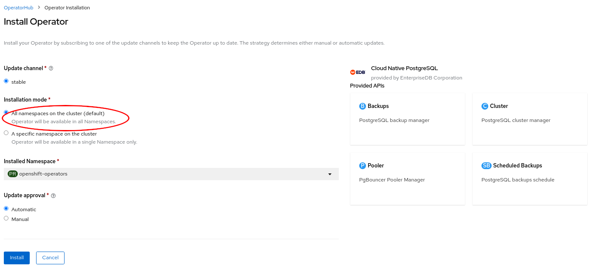

# Red Hat OpenShift

Cloud Native PostgreSQL is certified to run on
[Red Hat OpenShift Container Platform (OCP) version 4.x](https://www.openshift.com/products/container-platform)
and is available directly from the
[Red Hat Catalog](https://catalog.redhat.com/software/operators/detail/5fb41c88abd2a6f7dbe1b37b).

The goal of this section is to help you decide the best installation method for
Cloud Native PostgreSQL based on your organizations' security and access
control policies.

Cloud Native PostgreSQL can be installed and managed via:

- [OpenShift web console](#installation-via-web-console)
- [OpenShift command-line interface (CLI)](#installation-via-the-oc-cli) called `oc`, for full control

Cloud Native PostgreSQL supports all available install modes defined by
OpenShift:

- cluster-wide, in all namespaces
- local, in a single namespace
- local, watching multiple namespaces (only available using `oc`)

!!! Note
    A project is a Kubernetes namespace with additional annotations, and is the
    central vehicle by which access to resources for regular users is managed.

In most cases, the default cluster-wide installation of Cloud Native PostgreSQL
is the recommended one, with either central management of PostgreSQL clusters
or delegated management (limited to specific users/projects according to RBAC
definitions - see ["Important OpenShift concepts"](#important-openshift-concepts)
and ["Users and Permissions"](#users-and-permissions) below).

!!! Important
    Both the installation and upgrade processes require access to an OpenShift
    Container Platform cluster using an account with `cluster-admin` permissions.
    From ["Default cluster roles"](https://docs.openshift.com/container-platform/4.9/authentication/using-rbac.html#default-roles_using-rbac),
    a `cluster-admin` is *"a super-user that can perform any action in any
    project. When bound to a user with a local binding, they have full control over
    quota and every action on every resource in the project*".

## Important OpenShift concepts

To understand how the Cloud Native PostgreSQL operator fits in an OpenShift environment,
you must familiarize yourself with the following Kubernetes-related topics:

- Operators
- Authentication
- Authorization via Role-based Access Control (RBAC)
- Service Accounts and Users
- Rules, Roles and Bindings
- Cluster RBAC vs local RBAC through projects

This is especially true in case you are not comfortable with the elevated
permissions required by the default cluster-wide installation of the operator.

We have also selected the diagram below from the OpenShift documentation, as it
clearly illustrates the relationships between cluster roles, local roles,
cluster role bindings, local role bindings, users, groups and service accounts.


The ["Predefined RBAC objects" section](#predefined-rbac-objects)
below contains important information about how Cloud Native PostgreSQL adheres
to Kubernetes and OpenShift RBAC implementation, covering default installed
cluster roles, roles, service accounts.

If you are familiar with the above concepts, you can proceed directly to the
selected installation method.  Otherwise, we recommend that you read the
following resources taken from the OpenShift documentation and the Red Hat
blog:

- ["Operator Lifecycle Manager (OLM) concepts and resources"](https://docs.openshift.com/container-platform/4.9/operators/understanding/olm/olm-understanding-olm.html)
- ["Understanding authentication"](https://docs.openshift.com/container-platform/4.9/authentication/understanding-authentication.html)
- ["Role-based access control (RBAC)"](https://docs.openshift.com/container-platform/4.9/authentication/using-rbac.html),
  covering rules, roles and bindings for authorization, as well as cluster RBAC vs local RBAC through projects
- ["Default project service accounts and roles"](https://docs.openshift.com/container-platform/4.9/authentication/using-service-accounts-in-applications.html#default-service-accounts-and-roles_using-service-accounts)
- ["With Kubernetes Operators comes great responsibility" blog article](https://www.redhat.com/en/blog/kubernetes-operators-comes-great-responsibility)

### Cluster Service Version (CSV)

Technically, the operator is designed to run in OpenShift via the Operator
Lifecycle Manager (OLM), according to the Cluster Service Version (CSV) defined
by EDB.

The CSV is a YAML manifest that defines not only the user interfaces (available
through the web dashboard), but also the RBAC rules required by the operator
and the custom resources defined and owned by the operator (such as the
`Cluster` one, for example). The CSV defines also the available `installModes`
for the operator, namely: `AllNamespaces` (cluster-wide), `SingleNamespace`
(single project), `MultiNamespace` (multi-project), and `OwnNamespace`.

!!! Seealso "There's more ..."
    You can find out more about CSVs and install modes by reading
    ["Operator group membership"](https://docs.openshift.com/container-platform/4.9/operators/understanding/olm/olm-understanding-operatorgroups.html#olm-operatorgroups-membership_olm-understanding-operatorgroups)
    and ["Defining cluster service versions (CSVs)"](https://docs.openshift.com/container-platform/4.9/operators/operator_sdk/osdk-generating-csvs.html)
    from the OpenShift documentation.

### Limitations for multi-tenant management

Red Hat OpenShift Container Platform provides limited support for
simultaneously installing different variations of an operator on a single
cluster. Like any other operator, Cloud Native PostgreSQL becomes an extension
of the control plane. As the control plane is shared among all tenants
(projects) of an OpenShift cluster, operators too become shared resources in a
multi-tenant environment.

Operator Lifecycle Manager (OLM) can install operators multiple times in
different namespaces, with one important limitation: they all need to share the
same API version of the operator.

For more information, please refer to
["Operator groups"](https://docs.openshift.com/container-platform/4.9/operators/understanding/olm/olm-understanding-operatorgroups.html)
in OpenShift documentation.

## Installation via web console

The Cloud Native PostgreSQL operator can be found in the Red Hat OperatorHub
directly from your OpenShift dashboard.

1. Navigate in the web console to the `Operators -> OperatorHub` page:

    

2. Scroll in the `Database` section or type a keyword into the `Filter by keyword`
   box (in this case, "PostgreSQL") to find the Cloud Native PostgreSQL
   Operator, then select it:

    

3. Read the information about the Operator and select `Install`.

4. The following `Operator installation` page expects you to choose:

    - the installation mode: [cluster-wide](#cluster-wide-installation) or
      [single namespace](#single-project-installation) installation
    - the update channel: currently only stable is available
    - the approval strategy, following the availability on the market place of
      a new release of the operator, certified by Red Hat:
	- `Automatic`: OLM automatically upgrades the running operator with the
	  new version
	- `Manual`:  OpenShift waits for human intervention, by requiring an
	  approval in the `Installed Operators` section

    !!! Important
        The process of the operator upgrade is described in the
        ["Upgrades" section](installation_upgrade.md#upgrades).

!!! Important
    It is possible to install the operator in a single project
    (technically speaking: `OwnNamespace` install mode) multiple times
    in the same cluster. There will be an operator installation in every namespace,
    with different upgrade policies as long as the API is the same (see
    ["Limitations for multi-tenant management"](#limitations-for-multi-tenant-management)).

Choosing cluster-wide vs local installation of the operator is a critical
turning point. Trying to install the operator globally with an existing local
installation is blocked, by throwing the error below. If you want to proceed
you need to remove every local installation of the operator first.


### Cluster-wide installation

With cluster-wide installation, you are asking OpenShift to install the
Operator in the default `openshift-operators` namespace and to make it
available to all the projects in the cluster. This is the default and normally
recommended approach to install Cloud Native PostgreSQL.

!!! Warning
    This doesn't mean that every user in the OpenShift cluster can use the Cloud Native
    PostgreSQL Operator, deploy a `Cluster` object or even see the `Cluster` objects that
    are running in their own namespaces. There are some special roles that users must
    have in the namespace in order to interact with Cloud Native PostgreSQL's managed
    custom resources - primarily the `Cluster` one. Please refer to the
    ["Users and Permissions" section below](#users-and-permissions) for details.

From the web console, select `All namespaces on the cluster (default)` as
`Installation mode`:



As a result, the operator will be visible in every namespaces. Otherwise, as with any
other OpenShift operator, check the logs in any pods in the `openshift-operators`
project on the `Workloads → Pods` page that are reporting issues to troubleshoot further.

!!! Important "Beware"
    By choosing the cluster-wide installation you cannot easily move to a
    single project installation at a later time.

### Single project installation

With single project installation, you are asking OpenShift to install the
Operator in a given namespace, and to make it available to that project only.

!!! Warning
    This doesn't mean that every user in the namespace can use the Cloud Native
    PostgreSQL Operator, deploy a `Cluster` object or even see the `Cluster` objects that
    are running in the namespace. Similarly to the cluster-wide installation mode,
    There are some special roles that users must have in the namespace in order to
    interact with Cloud Native PostgreSQL's managed custom resources - primarily the `Cluster`
    one. Please refer to the ["Users and Permissions" section below](#users-and-permissions)
    for details.

From the web console, select `A specific namespace on the cluster` as
`Installation mode`, then pick the target namespace (in our example
`proj-dev`):


As a result, the operator will be visible in the selected namespace only. You
can verify this from the `Installed operators` page:


In case of a problem, from the `Workloads → Pods` page check the logs in any
pods in the selected installation namespace that are reporting issues to
troubleshoot further.

!!! Important "Beware"
    By choosing the single project installation you cannot easily move to a
    cluster-wide installation at a later time.

This installation process can be repeated in multiple namespaces in the same
OpenShift cluster, enabling independent installations of the operator in
different projects. In this case, make sure you read
["Limitations for multi-tenant management"](#limitations-for-multi-tenant-management).

## Installation via the `oc` CLI

!!! Important
    Please refer to the ["Installing the OpenShift CLI" section below](#installing-the-openshift-cli-oc)
    for information on how to install the `oc` command-line interface.

Instead of using the OpenShift Container Platform web console, you can install
the Cloud Native PostgreSQL Operator from the OperatorHub and create a
subscription using the `oc` command-line interface. Through the `oc` CLI you
can install the operator in all namespaces, a single namespace or multiple
namespaces.

!!! Warning
    Multiple namespace installation is currently supported by OpenShift.
    However, [definition of multiple target namespaces for an operator may be removed in future versions of OpenShift](https://docs.openshift.com/container-platform/4.9/operators/understanding/olm/olm-understanding-operatorgroups.html#olm-operatorgroups-target-namespace_olm-understanding-operatorgroups).

This section primarily covers the installation of the operator in multiple
projects with a simple example, by creating an `OperatorGroup` and a
`Subscription` objects.

!!! Info
    In our example, we will install the operator in the `my-operators`
    namespace and make it only available in the `web-staging`, `web-prod`,
    `bi-staging`, and `bi-prod` namespaces. Feel free to change the names of the
    projects as you like or add/remove some namespaces.

1. Check that the `cloud-native-postgresql` operator is available from the
   OperatorHub:

        oc get packagemanifests -n openshift-marketplace cloud-native-postgresql

2. Inspect the operator to verify the installation modes (`MultiNamespace` in
   particular) and the available channels:

        oc describe packagemanifests -n openshift-marketplace cloud-native-postgresql

3. Create an `OperatorGroup` object in the `my-operators` namespace so that it
   targets the `web-staging`, `web-prod`, `bi-staging`, and `bi-prod` namespaces:

        apiVersion: operators.coreos.com/v1
        kind: OperatorGroup
        metadata:
          name: cloud-native-postgresql
          namespace: my-operators
        spec:
          targetNamespaces:
          - web-staging
          - web-prod
          - bi-staging
          - bi-prod

    !!! Important
        Alternatively, you can list namespaces using a label selector, as explained in
        ["Target namespace selection"](https://docs.openshift.com/container-platform/4.9/operators/understanding/olm/olm-understanding-operatorgroups.html#olm-operatorgroups-target-namespace_olm-understanding-operatorgroups).

4. Create a `Subscription` object in the `my-operators` namespace to subscribe
   to the `stable` channel of the `cloud-native-postgresql` operator that is
   available in the `certified-operators` source of the `openshift-marketplace`
   (as previously located in steps 1 and 2):

        apiVersion: operators.coreos.com/v1alpha1
        kind: Subscription
        metadata:
          name: cloud-native-postgresql
          namespace: my-operators
        spec:
          channel: stable
          name: cloud-native-postgresql
          source: certified-operators
          sourceNamespace: openshift-marketplace

5. Use `oc apply -f` with the above YAML file definitions for the
   `OperatorGroup` and `Subscription` objects.

The method described in this section can be very powerful in conjunction with
proper `RoleBinding` objects, as it enables mapping Cloud Native PostgreSQL's
predefined `ClusterRole`s to specific users in selected namespaces.

!!! Info
    The above instructions can also be used for single project binding. The
    only difference is the number of specified target namespaces (one) and,
    possibly, the namespace of the operator group (ideally, the same as the target
    namespace).

The result of the above operation can also be verified from the webconsole, as
shown in the image below.


### Cluster-wide installation with `oc`

If you prefer, you can also use `oc` to install the operator globally, by
taking advantage of the default `OperatorGroup` called `global-operators` in
the `openshift-operators` namespace, and create a new `Subscription` object for
the `cloud-native-postgresql` operator in the same namespace:

```yaml
apiVersion: operators.coreos.com/v1alpha1
kind: Subscription
metadata:
  name: cloud-native-postgresql
  namespace: openshift-operators
spec:
  channel: stable
  name: cloud-native-postgresql
  source: certified-operators
  sourceNamespace: openshift-marketplace
```

Once you run `oc apply -f` with the above YAML file, the operator will be available in all namespaces.

### Installing the OpenShift CLI (`oc`)

The `oc` command represents the OpenShift command-line interface (CLI). It is
highly recommended to install it on your system. Below you find a basic set of
instructions to install `oc` from your OpenShift dashboard.

First, select the question mark at the top right corner of the dashboard:


Then follow the instructions you are given, by downloading the binary that
suits your needs in terms of operating system and architecture:


!!! Seealso "OpenShift CLI"
    For more detailed and updated information, please refer to the official
    [OpenShift CLI documentation](https://docs.openshift.com/container-platform/4.9/cli_reference/openshift_cli/getting-started-cli.html)
    directly maintained by Red Hat.

## Predefined RBAC objects

Cloud Native PostgreSQL comes with a predefined set of resources that play an
important role when it comes to RBAC policy configuration.

### Custom Resource Definitions (CRD)

The Cloud Native PostgreSQL operator owns the following custom resource
definitions (CRD):

* `Backup`
* `Cluster`
* `Pooler`
* `ScheduledBackup`

You can verify this by running:

```sh
oc get customresourcedefinitions.apiextensions.k8s.io | grep postgresql
```

which returns something similar to:

```console
backups.postgresql.k8s.enterprisedb.io                            20YY-MM-DDTHH:MM:SSZ
clusters.postgresql.k8s.enterprisedb.io                           20YY-MM-DDTHH:MM:SSZ
poolers.postgresql.k8s.enterprisedb.io                            20YY-MM-DDTHH:MM:SSZ
scheduledbackups.postgresql.k8s.enterprisedb.io                   20YY-MM-DDTHH:MM:SSZ
```

### Service accounts

The namespace where the operator has been installed (by default
`openshift-operators`) contains the following predefined service accounts:
`builder`, `default`, `deployer`, and most importantly
`postgresql-operator-manager` (managed by the CSV).

!!! Important
    Service accounts in Kubernetes are namespaced resources. Unless explicitly
    authorized, a service account cannot be accessed outside the defined namespace.

You can verify this by running:

```sh
oc get serviceaccounts -n openshift-operators
```

which returns something similar to:

```console
NAME                          SECRETS   AGE
builder                       2         ...
default                       2         ...
deployer                      2         ...
postgresql-operator-manager   2         ...
```

The `default` service account is automatically created by Kubernetes and
present in every namespace. The `builder` and `deployer` service accounts are
automatically created by OpenShift (see ["Default project service accounts and roles"](https://docs.openshift.com/container-platform/4.9/authentication/using-service-accounts-in-applications.html#default-service-accounts-and-roles_using-service-accounts)).

The `postgresql-operator-manager` service account is the one used by the Cloud
Native PostgreSQL operator to work as part of the Kubernetes/OpenShift control
plane in managing PostgreSQL clusters.

!!! Important
    Do not delete the `postgresql-operator-manager` ServiceAccount as it can
    stop the operator from working.

### Cluster roles

The Operator Licecycle Manager (OLM) automatically creates a set of cluster
role objects to facilitate role binding definitions and granular implementation
of RBAC policies. Some cluster roles have rules that apply to Custom Resource
Definitions that are part of Cloud Native PostgreSQL, while others that are
part of the broader Kubernetes/OpenShift realm.

#### Cluster roles on Cloud Native PostgreSQL CRDs

For [every CRD owned by Cloud Native PostgreSQL's CSV](#custom-resource-definitions-crd),
OLM deploys some predefined cluster roles that can be used by customer facing
users and service accounts. In particular:

- a role for the full administration of the resource (`admin` suffix)
- a role to edit the resource (`edit` suffix)
- a role to view the resource (`view` suffix)
- a role to view the actual CRD (`crdview` suffix)

!!! Important
    Cluster roles per se are no security threat. They are the recommended way
    in OpenShift to define templates for roles to be later "bound" to actual users
    in a specific project or globally. Indeed, cluster roles can be used in
    conjunction with `ClusterRoleBinding` objects for global permissions or with
    `RoleBinding` objects for local permissions. This makes it possible to reuse
    cluster roles across multiple projects while enabling customization within
    individual projects through local roles.

You can verify the list of predefined cluster roles by running:

```sh
oc get clusterroles | grep postgresql
```

which returns something similar to:

```console
backups.postgresql.k8s.enterprisedb.io-v1-admin                  YYYY-MM-DDTHH:MM:SSZ
backups.postgresql.k8s.enterprisedb.io-v1-crdview                YYYY-MM-DDTHH:MM:SSZ
backups.postgresql.k8s.enterprisedb.io-v1-edit                   YYYY-MM-DDTHH:MM:SSZ
backups.postgresql.k8s.enterprisedb.io-v1-view                   YYYY-MM-DDTHH:MM:SSZ
cloud-native-postgresql.VERSION-HASH                             YYYY-MM-DDTHH:MM:SSZ
clusters.postgresql.k8s.enterprisedb.io-v1-admin                 YYYY-MM-DDTHH:MM:SSZ
clusters.postgresql.k8s.enterprisedb.io-v1-crdview               YYYY-MM-DDTHH:MM:SSZ
clusters.postgresql.k8s.enterprisedb.io-v1-edit                  YYYY-MM-DDTHH:MM:SSZ
clusters.postgresql.k8s.enterprisedb.io-v1-view                  YYYY-MM-DDTHH:MM:SSZ
poolers.postgresql.k8s.enterprisedb.io-v1-admin                  YYYY-MM-DDTHH:MM:SSZ
poolers.postgresql.k8s.enterprisedb.io-v1-crdview                YYYY-MM-DDTHH:MM:SSZ
poolers.postgresql.k8s.enterprisedb.io-v1-edit                   YYYY-MM-DDTHH:MM:SSZ
poolers.postgresql.k8s.enterprisedb.io-v1-view                   YYYY-MM-DDTHH:MM:SSZ
scheduledbackups.postgresql.k8s.enterprisedb.io-v1-admin         YYYY-MM-DDTHH:MM:SSZ
scheduledbackups.postgresql.k8s.enterprisedb.io-v1-crdview       YYYY-MM-DDTHH:MM:SSZ
scheduledbackups.postgresql.k8s.enterprisedb.io-v1-edit          YYYY-MM-DDTHH:MM:SSZ
scheduledbackups.postgresql.k8s.enterprisedb.io-v1-view          YYYY-MM-DDTHH:MM:SSZ
```

You can inspect an actual role as any other Kubernetes resource with the `get`
command. For example:

```sh
oc get -o yaml clusterrole clusters.postgresql.k8s.enterprisedb.io-v1-admin
```

By looking at the relevant skimmed output below, you can notice that the
`clusters.postgresql.k8s.enterprisedb.io-v1-admin` cluster role enables
everything on the `cluster` resource defined by the
`postgresql.k8s.enterprisedb.io` API group:

```yaml
apiVersion: rbac.authorization.k8s.io/v1
kind: ClusterRole
metadata:
  name: clusters.postgresql.k8s.enterprisedb.io-v1-admin
rules:
- apiGroups:
  - postgresql.k8s.enterprisedb.io
  resources:
  - clusters
  verbs:
  - '*'
```

!!! Seealso "There's more ..."
    If you are interested in the actual implementation of RBAC by an
    OperatorGroup, please refer to the
    ["OperatorGroup: RBAC" section from the Operator Lifecycle Manager documentation](https://olm.operatorframework.io/docs/concepts/crds/operatorgroup/#rbac).

#### Cluster roles on Kubernetes CRDs

When installing a `Subscription` object in a given namespace (e.g.
`openshift-operators` for cluster-wide installation of the operator), OLM also
creates a cluster role that is used to grant permissions to the
`postgresql-operator-manager` service account that the operator uses. The name
of this cluster role varies, as it depends on the installed version of the
operator and the time of installation.

You can retrieve it by running the following command:

```sh
oc get clusterrole --selector=olm.owner.kind=ClusterServiceVersion
```

You can then use the name returned by the above query (which should have the
form of `cloud-native-postgresql.VERSION-HASH`) to look at the rules, resources
and verbs via the `describe` command:

```sh
oc describe clusterrole cloud-native-postgresql.VERSION-HASH
```

```console
Name:         cloud-native-postgresql.VERSION.HASH
Labels:       olm.owner=cloud-native-postgresql.VERSION
              olm.owner.kind=ClusterServiceVersion
              olm.owner.namespace=openshift-operators
              operators.coreos.com/cloud-native-postgresql.openshift-operators=
Annotations:  <none>
PolicyRule:
  Resources                                                     Non-Resource URLs  Resource Names  Verbs
  ---------                                                     -----------------  --------------  -----
  configmaps                                                    []                 []              [create delete get list patch update watch]
  secrets                                                       []                 []              [create delete get list patch update watch]
  services                                                      []                 []              [create delete get list patch update watch]
  deployments.apps                                              []                 []              [create delete get list patch update watch]
  poddisruptionbudgets.policy                                   []                 []              [create delete get list patch update watch]
  backups.postgresql.k8s.enterprisedb.io                        []                 []              [create delete get list patch update watch]
  clusters.postgresql.k8s.enterprisedb.io                       []                 []              [create delete get list patch update watch]
  poolers.postgresql.k8s.enterprisedb.io                        []                 []              [create delete get list patch update watch]
  scheduledbackups.postgresql.k8s.enterprisedb.io               []                 []              [create delete get list patch update watch]
  persistentvolumeclaims                                        []                 []              [create delete get list patch watch]
  pods/exec                                                     []                 []              [create delete get list patch watch]
  pods                                                          []                 []              [create delete get list patch watch]
  jobs.batch                                                    []                 []              [create delete get list patch watch]
  podmonitors.monitoring.coreos.com                             []                 []              [create delete get list patch watch]
  serviceaccounts                                               []                 []              [create get list patch update watch]
  rolebindings.rbac.authorization.k8s.io                        []                 []              [create get list patch update watch]
  roles.rbac.authorization.k8s.io                               []                 []              [create get list patch update watch]
  leases.coordination.k8s.io                                    []                 []              [create get update]
  events                                                        []                 []              [create patch]
  mutatingwebhookconfigurations.admissionregistration.k8s.io    []                 []              [get list update]
  validatingwebhookconfigurations.admissionregistration.k8s.io  []                 []              [get list update]
  customresourcedefinitions.apiextensions.k8s.io                []                 []              [get list update]
  namespaces                                                    []                 []              [get list watch]
  nodes                                                         []                 []              [get list watch]
  clusters.postgresql.k8s.enterprisedb.io/status                []                 []              [get patch update watch]
  poolers.postgresql.k8s.enterprisedb.io/status                 []                 []              [get patch update watch]
  configmaps/status                                             []                 []              [get patch update]
  secrets/status                                                []                 []              [get patch update]
  backups.postgresql.k8s.enterprisedb.io/status                 []                 []              [get patch update]
  scheduledbackups.postgresql.k8s.enterprisedb.io/status        []                 []              [get patch update]
  pods/status                                                   []                 []              [get]
  clusters.postgresql.k8s.enterprisedb.io/finalizers            []                 []              [update]
  poolers.postgresql.k8s.enterprisedb.io/finalizers             []                 []              [update]
```

!!! Important
    The above permissions are exclusively reserved for the operator's service
    account to interact with the Kubernetes API server.  They are not directly
    accessible by the users of the operator that interact only with `Cluster`,
    `Pooler`, `Backup`, and `ScheduledBackup` resources (see
    ["Cluster roles on Cloud Native PostgreSQL CRDs"](#cluster-roles-on-cloud-native-postgresql-crds)).

The operator automates in a declarative way a lot of operations related to
PostgreSQL management that otherwise would require manual and imperative
interventions. Such operations also include security related matters at RBAC
(e.g. service accounts), pod (e.g. security context constraints) and Postgres
levels (e.g. TLS certificates).

Below we provide some examples and, most importantly, the reasons why Cloud
Native PostgreSQL requires full or partial management of the most relevant
resources listed above.

`configmaps`
: The operator needs to create and manage default config maps for
  the Prometheus exporter monitoring metrics.

`deployments`
: The operator needs to manage a PgBouncer connection pooler
  using a standard Kubernetes `Deployment` resource.

`persistentvolumeclaims`
: The volume where the `PGDATA` resides is the
  central element of a PostgreSQL `Cluster` resource; the operator needs
  to interact with the selected storage class to dynamically provision
  the requested volumes, based on the defined scheduling policies.

`secrets`
: Unless you provide certificates and passwords to your `Cluster`
  objects, the operator adopts the "convention over configuration" paradigm by
  self-provisioning random generated passwords and TLS certificates, and by
  storing them in secrets.

`serviceaccounts`
: The operator needs to create a service account that
  enables the instance manager (which is the *PID 1* process of the container
  that controls the PostgreSQL server) to safely communicate with the
  Kubernetes API server to coordinate actions and continuously provide
  a reliable status of the `Cluster`.

`services`
: The operator needs to control network access to the PostgreSQL cluster
  (or the connection pooler) from applications, and properly manage
  failover/switchover operations in an automated way (by assigning, for example,
  the correct end-point of a service to the proper primary PostgreSQL instance).

## Users and Permissions

A very common way to use the Cloud Native PostgreSQL operator is to rely on the
`cluster-admin` role and manage resources centrally.

Alternatively, you can use the RBAC framework made available by
Kubernetes/OpenShift, as with any other operator or resources.

For example, you might be interested in binding the
`clusters.postgresql.k8s.enterprisedb.io-v1-admin` cluster role to specific
groups or users in a specific namespace, as any other cloud native application.
The following example binds that cluster role to a specific user in the
`web-prod` project:

```yaml
kind: RoleBinding
apiVersion: rbac.authorization.k8s.io/v1
metadata:
  name: web-prod-admin
  namespace: web-prod
subjects:
  - kind: User
    apiGroup: rbac.authorization.k8s.io
    name: mario@cioni.org
roleRef:
  apiGroup: rbac.authorization.k8s.io
  kind: ClusterRole
  name: clusters.postgresql.k8s.enterprisedb.io-v1-admin
```

The same process can be repeated with any other predefined `ClusterRole`.

If, on the other hand, you prefer not to use cluster roles, you can create
specific namespaced roles like in this example:

```yaml
apiVersion: rbac.authorization.k8s.io/v1
kind: Role
metadata:
  name: web-prod-view
  namespace: web-prod
rules:
- apiGroups:
  - postgresql.k8s.enterprisedb.io
  resources:
  - clusters
  verbs:
  - get
  - list
  - watch
```

Then, assign this role to a given user:

```yaml
apiVersion: rbac.authorization.k8s.io/v1
kind: RoleBinding
metadata:
  name: web-prod-view
  namespace: web-prod
roleRef:
  apiGroup: rbac.authorization.k8s.io
  kind: Role
  name: web-prod-view
subjects:
- apiGroup: rbac.authorization.k8s.io
  kind: User
  name: web-prod-developer1
```

This final example creates a role with administration permissions (`verbs` is
equal to `*`) to all the resources managed by the operator in that namespace
(`web-prod`):

```yaml
apiVersion: rbac.authorization.k8s.io/v1
kind: Role
metadata:
  name: web-prod-admin
  namespace: web-prod
rules:
- apiGroups:
  - postgresql.k8s.enterprisedb.io
  resources:
  - clusters
  - backups
  - scheduledbackups
  - poolers
  verbs:
  - '*'
```
