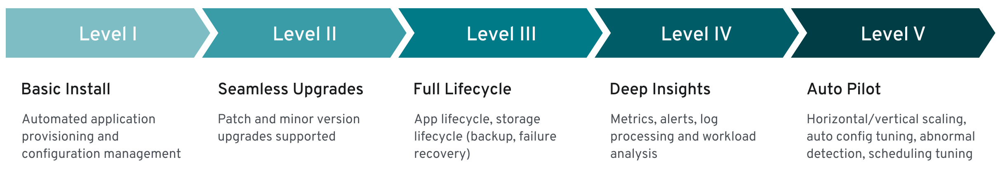

# Operator Capability Levels

This section provides a summary of the capabilities implemented by CloudNativePG,
classified using the
["Operator SDK definition of Capability Levels"](https://operatorframework.io/operator-capabilities/)
framework.



!!! Important
    Based on the [Operator Capability Levels model](operator_capability_levels.md),
    You can expect a **"Level V - Auto Pilot"** set of capabilities from the
    CloudNativePG Operator.

Each capability level is associated with a certain set of management features the operator offers:

1. Basic Install
2. Seamless Upgrades
3. Full Lifecycle
4. Deep Insights
5. Auto Pilot

!!! Note
    We consider this framework as a guide for future work and implementations in the operator.

## Level 1: Basic Install

Capability level 1 involves **installation** and **configuration** of the
operator. This category includes usability and user experience
enhancements, such as improvements in how you interact with the
operator and a PostgreSQL cluster configuration.

!!! Important
    We consider **Information Security** part of this level.

### Operator deployment via declarative configuration

The operator is installed in a declarative way using a Kubernetes manifest
which defines 4 major `CustomResourceDefinition` objects: `Cluster`, `Pooler`,
`Backup`, and `ScheduledBackup`.

### PostgreSQL cluster deployment via declarative configuration

A PostgreSQL cluster (operand) is defined using the `Cluster` custom resource
in a fully declarative way. The PostgreSQL version is determined by the
operand container image defined in the CR, which is automatically fetched
from the requested registry. When deploying an operand, the operator also
automatically creates the following resources: `Pod`, `Service`, `Secret`,
`ConfigMap`,`PersistentVolumeClaim`, `PodDisruptionBudget`, `ServiceAccount`,
`RoleBinding`, `Role`.

### Override of operand images through the CRD

The operator is designed to support any operand container image with
PostgreSQL inside.
By default, the operator uses the latest available minor
version of the latest stable major version supported by the PostgreSQL
Community and published on ghcr.io.
You can use any compatible image of PostgreSQL supporting the
primary/standby architecture directly by setting the `imageName`
attribute in the CR. The operator also supports `imagePullSecrets`
to access private container registries, as well as digests in addition to
tags for finer control of container image immutability.

### Labels and annotations

The operator can be configured to support inheritance of labels and annotations
that are defined in a cluster's metadata, with the goal to improve organizations
of CloudNativePG deployment in your Kubernetes infrastructure.

### Self-contained instance manager

Instead of relying on an external tool such as Patroni or Stolon to
coordinate PostgreSQL instances in the Kubernetes cluster pods, the operator
injects the operator executable inside each pod, in a file named
`/controller/manager`. The application is used to control the underlying
PostgreSQL instance and to reconcile the pod status with the instance itself
based on the PostgreSQL cluster topology. The instance manager also starts a
web server that is invoked by the `kubelet` for probes. Unix signals invoked
by the `kubelet` are filtered by the instance manager and, where appropriate,
forwarded to the `postgres` process for fast and controlled reactions to
external events. The instance manager is written in Go and has no external
dependencies.

### Storage configuration

Storage is a critical component in a database workload. Taking advantage of
Kubernetes native capabilities and resources in terms of storage, the
operator gives you enough flexibility to choose the right storage for your
workload requirements, based on what the underlying Kubernetes environment
can offer. This implies choosing a particular storage class in
a public cloud environment or fine-tuning the generated PVC through a
PVC template in the CR's `storage` parameter.
For better performance and finer control, you can also choose to host your
cluster's Write-Ahead Log (WAL, also known as `pg_wal`) on a separate volume,
preferably on different storage.
The [`cnp-bench`](https://github.com/EnterpriseDB/cnp-bench) open source
project can be used to benchmark both the storage and the database prior to
production.

### Replica configuration

The operator automatically detects replicas in a cluster
through a single parameter called `instances`. If set to `1`, the cluster
comprises a single primary PostgreSQL instance with no replica. If higher
than `1`, the operator manages `instances -1` replicas, including High
Availability (HA) through automated failover and rolling updates through
switchover operations.
CloudNativePG automatically manages replication slots for all the replicas
in the HA cluster, with an implementation that is inspired by the previously
proposed patch for PostgreSQL called
["Failover slots"](https://wiki.postgresql.org/wiki/Failover_slots).

### Database configuration

The operator is designed to manage a PostgreSQL cluster with a single
database. The operator transparently manages access to the database through
three Kubernetes services automatically provisioned and managed for read-write,
read, and read-only workloads.
Using the convention over configuration approach, the operator creates a
database called `app`, by default owned by a regular Postgres user with the
same name. Both the database name and the user name can be specified if
required.
Although no configuration is required to run the cluster, you can customize
both PostgreSQL run-time configuration and PostgreSQL Host-Based
Authentication rules in the `postgresql` section of the CR.

### Configuration of Postgres roles, users and groups

CloudNativePG supports
[management of PostgreSQL roles, users, and groups through declarative configuration](declarative_role_management.md)
using the `.spec.managed.roles` stanza.

### Pod Security Policies

For InfoSec requirements, the operator does not require privileged mode for
any container and enforces read only root filesystem to guarantee containers
immutability for both the operator and the operand pods. It also explicitly
sets the required security contexts.

### Affinity

The cluster's `affinity` section enables fine-tuning of how pods and related
resources such as persistent volumes are scheduled across the nodes of a
Kubernetes cluster. In particular, the operator supports:

- pod affinity and anti-affinity
- node selector
- taints and tolerations

### Command line interface

CloudNativePG does not have its own command line interface.
It simply relies on the best command line interface for Kubernetes, `kubectl`,
by providing a plugin called `cnpg` to enhance and simplify your PostgreSQL
cluster management experience.

### Current status of the cluster

The operator continuously updates the status section of the CR with the
observed status of the cluster. The entire PostgreSQL cluster status is
continuously monitored by the instance manager running in each pod: the
instance manager is responsible for applying the required changes to the
controlled PostgreSQL instance to converge to the required status of
the cluster (for example: if the cluster status reports that pod `-1` is the
primary, pod `-1` needs to promote itself while the other pods need to follow
pod `-1`). The same status is used by the `cnpg` plugin for `kubectl` to provide
details.

### Operator's certification authority

The operator automatically creates a certification authority for itself.
It creates and signs with the operator certification authority a leaf certificate
to be used by the webhook server, to ensure safe communication between the
Kubernetes API Server and the operator itself.

### Cluster's certification authority

The operator automatically creates a certification authority for every PostgreSQL
cluster, which is used to issue and renew TLS certificates for clients' authentication,
including streaming replication standby servers (instead of passwords).
Support for a custom certification authority for client certificates is
available through secrets: this also includes integration with cert-manager.
Certificates can be issued with the `cnpg` plugin for `kubectl`.

### TLS connections

The operator transparently and natively supports TLS/SSL connections
to encrypt client/server communications for increased security using the
cluster's certification authority.
Support for custom server certificates is available through secrets: this also
includes integration with cert-manager.

### Certificate authentication for streaming replication

The operator relies on TLS client certificate authentication to authorize streaming
replication connections from the standby servers, instead of relying on a password
(and therefore a secret).

### Continuous configuration management

The operator enables you to apply changes to the `Cluster` resource YAML
section of the PostgreSQL configuration and makes sure that all instances
are properly reloaded or restarted, depending on the configuration option.
*Current limitation:* changes with `ALTER SYSTEM` are not detected, meaning
that the cluster state is not enforced.

### Import of existing PostgreSQL databases

Since version 1.16, the operator provides a declarative way to import existing
Postgres databases in a new CloudNativePG `Cluster` in Kubernetes, using
offline migrations.
The same feature covers also offline major upgrades of PostgreSQL databases.
Offline means that applications must stop their write operations at the source
until the database is imported.
The feature extends the `initdb` bootstrap method to create a new PostgreSQL
cluster using a logical snapshot of the data available in another PostgreSQL
database - which can be accessed via the network through a superuser
connection. Import is from any supported version of Postgres and relies on
`pg_dump` and `pg_restore` to be executed from the new cluster primary
for all databases part of the operation and, if requested, for roles.

### PostGIS clusters

CloudNativePG supports the installation of clusters with the [PostGIS](postgis.md)
open source extension for geographical databases, one of the most popular
extensions for PostgreSQL.

### Basic LDAP authentication for PostgreSQL

The operator allows you to configure LDAP authentication for your PostgreSQL
clients, using either the *simple bind* or *search+bind* mode, as described in
the ["PostgreSQL documentation: LDAP authentication" section](https://www.postgresql.org/docs/current/auth-ldap.html).

### Multiple installation methods

The operator can be installed through a Kubernetes manifest via `kubectl
apply`, to be used in a traditional Kubernetes installation in public
and private cloud environments. Additionally, a Helm Chart for the operator is
also available.

### Convention over configuration

The operator supports the convention over configuration paradigm, deciding
standard default values while allowing you to override them and customize
them. You can specify a deployment of a PostgreSQL cluster using
the `Cluster` CRD in a couple of YAML code lines.

## Level 2: Seamless Upgrades

Capability level 2 is about enabling **updates of the operator and the actual
workload**, in our case PostgreSQL servers. This includes **PostgreSQL minor
release updates** (security and bug fixes normally) as well as **major online
upgrades**.

### Upgrade of the operator

You can upgrade the operator seamlessly as a new deployment. A change in the
operator does not require a change in the operand - thanks to the instance
manager's injection. The operator can manage older versions of the operand.

CloudNativePG also supports [in-place updates of the instance manager](installation_upgrade.md#in-place-updates-of-the-instance-manager)
following an upgrade of the operator: in-place updates do not require a rolling
update - and subsequent switchover - of the cluster.

### Upgrade of the managed workload

The operand can be upgraded using a declarative configuration approach as
part of changing the CR and, in particular, the `imageName` parameter. The
operator prevents major upgrades of PostgreSQL while making it possible to go
in both directions in terms of minor PostgreSQL releases within a major
version (enabling updates and rollbacks).

In the presence of standby servers, the operator performs rolling updates
starting from the replicas by dropping the existing pod and creating a new
one with the new requested operand image that reuses the underlying storage.
Depending on the value of the `primaryUpdateStrategy`, the operator proceeds
with a switchover before updating the former primary (`unsupervised`) or waits
for the user to manually issue the switchover procedure (`supervised`) via the
`cnpg` plugin for `kubectl`.
Which setting to use depends on the business requirements as the operation
might generate some downtime for the applications, from a few seconds to
minutes based on the actual database workload.

### Display cluster availability status during upgrade

At any time, convey the cluster's high availability status, for example,
`Setting up primary`, `Creating a new replica`, `Cluster in healthy state`,
`Switchover in progress`, `Failing over`, `Upgrading cluster`, etc.

## Level 3: Full Lifecycle

Capability level 3 requires the operator to manage aspects of **business
continuity** and **scalability**.
**Disaster recovery** is a business continuity component that requires
that both backup and recovery of a database work correctly. While as a
starting point, the goal is to achieve RPO < 5 minutes, the long term goal is
to implement RPO=0 backup solutions. **High Availability** is the other
important component of business continuity that, through PostgreSQL native
physical replication and hot standby replicas, allows the operator to perform
failover and switchover operations. This area includes enhancements in:

- control of PostgreSQL physical replication, such as synchronous replication,
  (cascading) replication clusters, and so on;
- connection pooling, to improve performance and control through a
  connection pooling layer with pgBouncer.

### PostgreSQL Hot Backups

The operator has been designed to provide application-level backups using
PostgreSQL’s native continuous hot backup technology based on
physical base backups and continuous WAL archiving. Specifically,
the operator currently supports only backups on object stores (AWS S3 and
S3-compatible, Azure Blob Storage, Google Cloud Storage, and gateways like
MinIO).

WAL archiving and base backups are defined at the cluster level, declaratively,
through the `backup` parameter in the cluster definition, by specifying
an S3 protocol destination URL (for example, to point to a specific folder in
an AWS S3 bucket) and, optionally, a generic endpoint URL. WAL archiving,
a prerequisite for continuous backup, does not require any further
action from the user: the operator will automatically and transparently set
the `archive_command` to rely on `barman-cloud-wal-archive` to ship WAL
files to the defined endpoint. Users can decide the compression algorithm,
as well as the number of parallel jobs to concurrently upload WAL files
in the archive. In addition to that `Instance Manager` automatically checks 
the correctness of the archive destination, by performing `barman-cloud-check-wal-archive` 
command before beginning to ship the very first set of WAL files.

You can define base backups in two ways: on-demand (through the `Backup`
custom resource definition) or scheduled (through the `ScheduledBackup`
customer resource definition, using a cron-like syntax). They both rely on
`barman-cloud-backup` for the job (distributed as part of the application
container image) to relay backups in the same endpoint, alongside WAL files.

Both `barman-cloud-wal-restore` and `barman-cloud-backup` are distributed in
the application container image under GNU GPL 3 terms.

### Backups from a standby

The operator supports offloading base backups onto a standby without impacting
the RPO of the database. This allows to preserve resources on the primary, in
particular I/O, for standard database operations.

### Full restore from a backup

The operator enables you to bootstrap a new cluster (with its settings)
starting from an existing and accessible backup taken using
`barman-cloud-backup`. Once the bootstrap process is completed, the operator
initiates the instance in recovery mode and replays all available WAL files
from the specified archive, exiting recovery and starting as a primary.
Subsequently, the operator will clone the requested number of standby instances
from the primary.
CloudNativePG supports parallel WAL fetching from the archive.

### Point-In-Time Recovery (PITR) from a backup

The operator enables you to create a new PostgreSQL cluster by recovering
an existing backup to a specific point-in-time, defined with a timestamp, a
label or a transaction ID. This capability is built on top of the full restore
one and supports all the options available in
[PostgreSQL for PITR](https://www.postgresql.org/docs/13/runtime-config-wal.html#RUNTIME-CONFIG-WAL-RECOVERY-TARGET).

### Zero Data Loss clusters through synchronous replication

Achieve  *Zero Data Loss* (RPO=0) in your local High Availability CloudNativePG
cluster through quorum based synchronous replication support. The operator provides
two configuration options that control the minimum and maximum number of
expected synchronous standby replicas available at any time. The operator will
react accordingly, based on the number of available and ready PostgreSQL
instances in the cluster, through the following formula for the quorum (`q`):

```
1 <= minSyncReplicas <= q <= maxSyncReplicas <= readyReplicas
```

### Replica clusters

Define a cross Kubernetes cluster topology of PostgreSQL clusters, by taking
advantage of PostgreSQL native streaming and cascading replication.
Through the `replica` option, you can setup an independent cluster to be
continuously replicating data from another PostgreSQL source of the same major
version: such a source can be anywhere, as long as a direct streaming
connection via TLS is allowed from the two endpoints.
Moreover, the source can be even outside Kubernetes, running in a physical or
virtual environment.
Replica clusters can be created from a recovery object store (backup in Barman
Cloud format) or via streaming through `pg_basebackup`. Both WAL file shipping
and WAL streaming are allowed.
Replica clusters dramatically improve the business continuity posture of your
PostgreSQL databases in Kubernetes, spanning over multiple datacenters and
opening up for hybrid and multi-cloud setups (currently, manual switchover
across data centers is required, while waiting for Kubernetes federation
native capabilities).

### Liveness and readiness probes

The operator defines liveness and readiness probes for the Postgres
Containers that are then invoked by the kubelet. They are mapped respectively
to the `/healthz` and `/readyz` endpoints of the web server managed
directly by the instance manager.
The liveness probe is based on the `pg_isready` executable, and the pod is
considered healthy with exit codes 0  (server accepting connections normally)
and 1 (server is rejecting connections, for example during startup).  The
readiness probe issues a simple query (`;`) to verify that the server is
ready to accept connections.

### Rolling deployments

The operator supports rolling deployments to minimize the downtime and, if a
PostgreSQL cluster is exposed publicly, the Service will load-balance the
read-only traffic only to available pods during the initialization or the
update.

### Scale up and down of replicas

The operator allows you to scale up and down the number of instances in a
PostgreSQL cluster. New replicas are automatically started up from the
primary server and will participate in the cluster's HA infrastructure.
The CRD declares a "scale" subresource that allows the user to use the
`kubectl scale` command.

### Maintenance window and PodDisruptionBudget for Kubernetes nodes

The operator creates a `PodDisruptionBudget` resource to limit the number of
concurrent disruptions to one primary instance. This configuration prevents the
maintenance operation from deleting all the pods in a cluster, allowing the
specified number of instances to be created. The PodDisruptionBudget will be
applied during the node draining operation, preventing any disruption of the
cluster service.

While this strategy is correct for Kubernetes Clusters where
storage is shared among all the worker nodes, it may not be the best solution
for clusters using Local Storage or for clusters installed in a private
cloud. The operator allows you to specify a Maintenance Window and
configure the reaction to any underlying node eviction. The `ReusePVC` option
in the maintenance window section enables to specify the strategy to be used:
allocate new storage in a different PVC for the evicted instance or wait
for the underlying node to be available again.

### Fencing

Fencing is the process of protecting the data in one, more, or even all
instances of a PostgreSQL cluster when they appear to be malfunctioning.
When an instance is fenced, the PostgreSQL server process is
guaranteed to be shut down, while the pod is kept running. This makes sure
that, until the fence is lifted, data on the pod is not modified by PostgreSQL
and that the file system can be investigated for debugging and troubleshooting
purposes.

### Hibernation (declarative)

CloudNativePG supports [hibernation of a running PostgreSQL cluster](declarative_hibernation.md)
in a declarative manner, through the `cnpg.io/hibernation` annotation.
Hibernation enables saving CPU power by removing the database Pods, while
keeping the database PVCs. This feature simulates scaling to 0 instances.

### Hibernation (imperative)

CloudNativePG supports [hibernation of a running PostgreSQL cluster](cnpg-plugin.md#cluster-hibernation)
via the `cnpg` plugin. Hibernation shuts down all Postgres instances in the
High Availability cluster, and keeps a static copy of the PVC group of the
primary, containing `PGDATA` and WALs. The plugin enables to exit the
hibernation phase, by resuming the primary and then recreating all the
replicas - if they exist.

### Reuse of Persistent Volumes storage in Pods

When the operator needs to create a pod that has been deleted by the user or
has been evicted by a Kubernetes maintenance operation, it reuses the
`PersistentVolumeClaim` if available, avoiding the need
to re-clone the data from the primary.

### CPU and memory requests and limits

The operator allows administrators to control and manage resource usage by
the cluster's pods, through the `resources` section of the manifest. In
particular `requests` and `limits` values can be set for both CPU and RAM.

### Connection pooling with PgBouncer

CloudNativePG provides native support for connection pooling with
[PgBouncer](connection_pooling.md), one of the most popular open source
connection poolers for PostgreSQL. From an architectural point of view, the
native implementation of a PgBouncer connection pooler introduces a new layer
to access the database which optimizes the query flow towards the instances
and makes the usage of the underlying PostgreSQL resources more efficient.
Instead of connecting directly to a PostgreSQL service, applications can now
connect to the PgBouncer service and start reusing any existing connection.

## Level 4: Deep Insights

Capability level 4 is about **observability**: in particular, monitoring,
alerting, trending, log processing. This might involve the use of external tools
such as Prometheus, Grafana, Fluent Bit, as well as extensions in the
PostgreSQL engine for the output of error logs directly in JSON format.

CloudNativePG has been designed to provide everything that is needed
to easily integrate with industry-standard and community accepted tools for
flexible monitoring and logging.

### Prometheus exporter with configurable queries

The instance manager provides a pluggable framework and, via its own web server
listening on the `metrics` port (9187), exposes an endpoint to export metrics
for the [Prometheus](https://prometheus.io/) monitoring and alerting tool.
The operator supports custom monitoring queries defined as `ConfigMap`
and/or `Secret` objects using a syntax that is compatible with the
[`postgres_exporter` for Prometheus](https://github.com/prometheus-community/postgres_exporter).
CloudNativePG provides a set of basic monitoring queries for
PostgreSQL that can be integrated and adapted to your context.

### Standard output logging of PostgreSQL error messages in JSON format

Every log message is delivered to standard output in JSON format, with the first level
definition of the timestamp, the log level and the type of log entry, such as
`postgres` for the canonical PostgreSQL error message channel.
As a result, every Pod managed by CloudNativePG can be easily and directly
integrated with any downstream log processing stack that supports JSON as source
data type.

### Real-time query monitoring

CloudNativePG transparently and natively supports:

- the essential [`pg_stat_statements` extension](https://www.postgresql.org/docs/current/pgstatstatements.html),
  which enables tracking of planning and execution statistics of all SQL
  statements executed by a PostgreSQL server;
- the [`auto_explain` extension](https://www.postgresql.org/docs/current/auto-explain.html),
  which provides a means for logging execution plans of slow statements
  automatically, without having to manually run `EXPLAIN` (helpful for tracking
  down un-optimized queries);
- the [`pg_failover_slots` extension](https://github.com/EnterpriseDB/pg_failover_slots),
  which makes logical replication slots usable across a physical failover,
  ensuring resilience in change data capture (CDC) contexts based on PostgreSQL's
  native logical replication;

### Audit

CloudNativePG allows database and security administrators, auditors,
and operators to track and analyze database activities using PGAudit (for
PostgreSQL).
Such activities flow directly in the JSON log and can be properly routed to the
correct downstream target using common log brokers like Fluentd.

### Kubernetes events

Record major events as expected by the Kubernetes API, such as creating resources,
removing nodes, upgrading, and so on. Events can be displayed through
the `kubectl describe` and `kubectl get events` command.

## Level 5: Auto Pilot

Capability level 5 is focused on **automated scaling**, **healing** and
**tuning** - through the discovery of anomalies and insights that emerged
from the observability layer.

### Automated Failover for self-healing

In case of detected failure on the primary, the operator will change the
status of the cluster by setting the most aligned replica as the new target
primary. As a consequence, the instance manager in each alive pod will
initiate the required procedures to align itself with the requested status of
the cluster, by either becoming the new primary or by following it.
In case the former primary comes back up, the same mechanism will avoid a
split-brain by preventing applications from reaching it, running `pg_rewind` on
the server and restarting it as a standby.

### Automated recreation of a standby

In case the pod hosting a standby has been removed, the operator initiates
the procedure to recreate a standby server.
