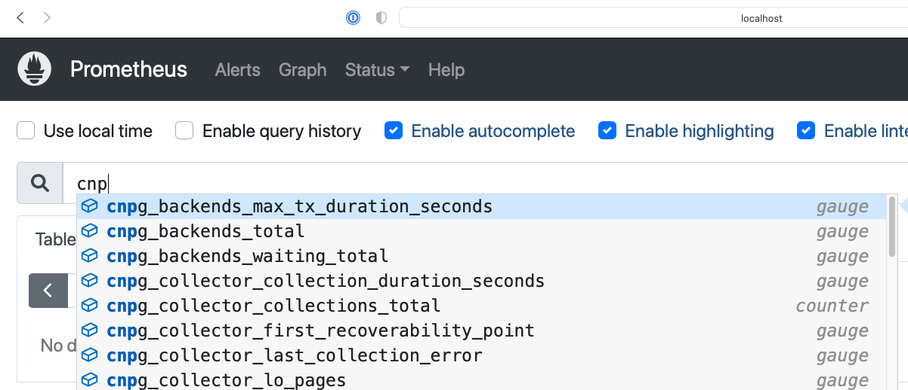
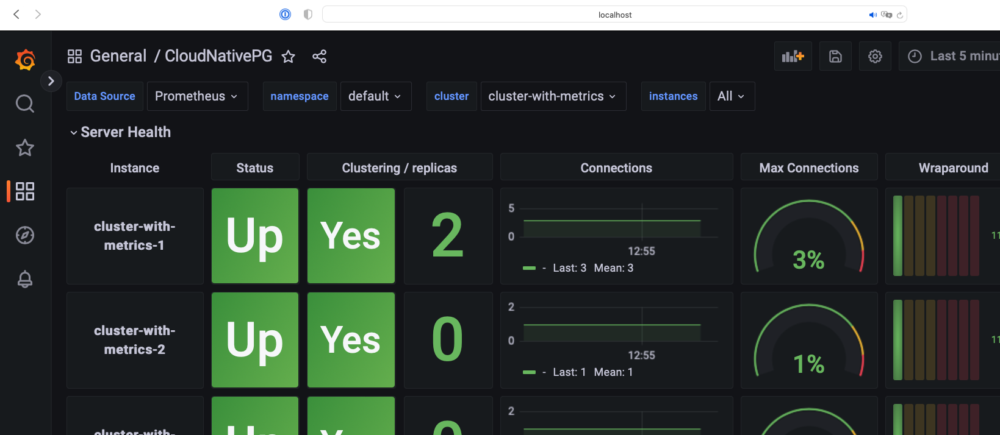

# Quick start

You can test a PostgreSQL cluster on your laptop/computer
using CloudNativePG on a local Kubernetes cluster in [Kind](https://kind.sigs.k8s.io/) or
[Minikube](https://kubernetes.io/docs/setup/learning-environment/minikube/).

!!! Warning
    These instructions contained are for demonstration,
    testing, and practice purposes only. Do not use them in production.

Like any other Kubernetes application, CloudNativePG is deployed using
regular manifests written in YAML.

This quick start enables you to start a PostgreSQL
cluster on your local Kubernetes installation and experiment with it.

!!! Important
    To connect to the Kubernetes cluster, make sure that you have `kubectl` installed on your machine.
    Follow the Kubernetes documentation
    on [how to install `kubectl`](https://kubernetes.io/docs/tasks/tools/install-kubectl/).

## Part 1: Set up the local Kubernetes playground

The first part is about installing Minikube or Kind. Spend some time
reading about the systems and decide which one to proceed with.
After setting up one of them, proceed with part 2.

We also provide instructions for setting up monitoring with Prometheus and
Grafana for local testing/evaluation, in [part 4](#part-4-monitor-clusters-with-prometheus-and-grafana).

### Minikube

Minikube is a tool that makes it easy to run Kubernetes locally. Minikube runs a
single-node Kubernetes cluster inside a virtual machine (VM) on your laptop for
users looking to try out Kubernetes or develop with it day-to-day. Normally, it's
used with VirtualBox.

You can find more information in the [Kubernetes documentation on how to
install Minikube](https://kubernetes.io/docs/tasks/tools/install-minikube) in your local personal environment.
After you install it, run the following command to create a minikube cluster:

```sh
minikube start
```

This creates the Kubernetes cluster, and you're ready to use it.
Verify that it works:

```sh
kubectl get nodes
```

You'll see one node called `minikube`.

### Kind

If you don't want to use a virtual machine hypervisor, then Kind is a tool for running
local Kubernetes clusters using Docker container "nodes." (Kind stands for "Kubernetes IN Docker.")

Install Kind on your environment following the instructions in [Quick Start](https://kind.sigs.k8s.io/docs/user/quick-start).
Then create a Kubernetes cluster:

```sh
kind create cluster --name pg
```

## Part 2: Install CloudNativePG

Now that you have a Kubernetes installation up and running
on your laptop, you can proceed with CloudNativePG installation.

See [Installation](installation_upgrade.md), and then proceed
with deploying a PostgreSQL cluster.

## Part 3: Deploy a PostgreSQL cluster

As with any other deployment in Kubernetes, to deploy a PostgreSQL cluster
you need to apply a configuration file that defines your desired `Cluster`.

The [`cluster-example.yaml`](samples/cluster-example.yaml) sample file
defines a simple `Cluster` using the default storage class to allocate
disk space:

```yaml
# Example of PostgreSQL cluster
apiVersion: postgresql.cnpg.io/v1
kind: Cluster
metadata:
  name: cluster-example
spec:
  instances: 3

  # Example of rolling update strategy:
  # - unsupervised: automated update of the primary once all
  #                 replicas have been upgraded (default)
  # - supervised: requires manual supervision to perform
  #               the switchover of the primary
  primaryUpdateStrategy: unsupervised

  # Require 1Gi of space
  storage:
    size: 1Gi
```

!!! Note "There's more"
    For more detailed information about the available options, see
    the [API reference](cloudnative-pg.v1.md).

To create the 3-node PostgreSQL cluster, run:

```sh
kubectl apply -f cluster-example.yaml
```

You can check that the pods are being created with the `get pods` command:

```sh
kubectl get pods
```

That command looks for pods in the default namespace. To separate your cluster
from other workloads on your Kubernetes installation, you can always create
a new namespace to deploy clusters on.

Alternatively, you can use labels. The operator applies the `cnpg.io/cluster`
label on all objects relevant to a particular cluster. For example:

``` sh
kubectl get pods -l cnpg.io/cluster=<CLUSTER>
```

!!! Important
    We're using `cnpg.io/cluster` as the label. In the past, you might
    have seen or used `postgresql`. This label is being deprecated and
    will be dropped in the future. Use `cngp.io/cluster`.

By default, the operator installs the latest available minor version
of the latest major version of PostgreSQL when the operator was released.
You can override this behavior by setting the `imageName` key in the `spec` section of
the `Cluster` definition. For example, to install PostgreSQL 13.6:

```yaml
apiVersion: postgresql.cnpg.io/v1
kind: Cluster
metadata:
   # [...]
spec:
   # [...]
   imageName: ghcr.io/cloudnative-pg/postgresql:13.6
   #[...]
```

!!! Important
    The immutable infrastructure paradigm requires that you always
    point to a specific version of the container image.
    Never use tags like `latest` or `13` in a production environment,
    as it might lead to unpredictable scenarios in terms of update
    policies and version consistency in the cluster.
    For strict deterministic and repeatable deployments, you can add the digests
    to the image name, through the `<image>:<tag>@sha256:<digestValue>` format.

!!! Note "There's more"
    Some examples cluster configurations are bundled with the operator.
    See [Examples](samples.md).

## Part 4: Monitor clusters with Prometheus and Grafana

!!! Important
    Installing Prometheus and Grafana is beyond the scope of this project.
    These instructions are provided for experimentation and
    illustration only.

You can deploy Prometheus and Grafana for observability
and create a Grafana dashboard to monitor CloudNativePG clusters and a
set of Prometheus rules defining alert conditions.

We leverage the [Kube-Prometheus stack](https://github.com/prometheus-community/helm-charts/tree/main/charts/kube-prometheus-stack),
Helm chart, which is maintained by the [Prometheus Community](https://github.com/prometheus-community).
See the project website for additional documentation and background.

The Kube-Prometheus-stack Helm chart installs the [Prometheus Operator](https://prometheus-operator.dev),
including the [Alert Manager](https://prometheus.io/docs/alerting/latest/alertmanager/),
and a [Grafana](https://grafana.com) deployment.

We include a configuration file for deploying this Helm chart that
provides useful initial settings for observability of CloudNativePG clusters.

### Installation

If you don't have [Helm](https://helm.sh) installed yet, follow the
[instructions](https://helm.sh/docs/intro/quickstart/) to install it in your
system.

You need to add the `prometheus-community` Helm chart repository and then
install the Kube Prometheus stack using the sample configuration we provide.

You can accomplish this with the following commands:

``` sh
helm repo add prometheus-community \
  https://prometheus-community.github.io/helm-charts

helm upgrade --install \
  -f https://raw.githubusercontent.com/cloudnative-pg/cloudnative-pg/main/docs/src/samples/monitoring/kube-stack-config.yaml \
  prometheus-community \
  prometheus-community/kube-prometheus-stack
```

After completion, Prometheus, Grafana, and Alert Manager are installed with values from the
`kube-stack-config.yaml` file:

- From the Prometheus installation, you have the Prometheus Operator watching for any `PodMonitor`
  (see [Monitoring](monitoring.md)).
- The Grafana installation is watching for a Grafana dashboard `ConfigMap`.

!!! Seealso
    For more information about the command, see the [Helm install](https://helm.sh/docs/helm/helm_install/) 
    documentation. 

You can see several custom resources were created:

``` sh
% kubectl get crds
NAME                                        CREATED AT
…
alertmanagers.monitoring.coreos.com         <timestamp>
…
prometheuses.monitoring.coreos.com          <timestamp>
prometheusrules.monitoring.coreos.com       <timestamp>
…
```

A series of services were also created:

``` sh
% kubectl get svc     
NAME                                      TYPE        PORT(S)
…                                         …           …
prometheus-community-grafana              ClusterIP   80/TCP
prometheus-community-kube-alertmanager    ClusterIP   9093/TCP
prometheus-community-kube-operator        ClusterIP   443/TCP
prometheus-community-kube-prometheus      ClusterIP   9090/TCP
```

### Viewing with Prometheus

At this point, a CloudNativePG cluster deployed with monitoring activated
is observable by way of Prometheus.

For example, you can deploy a simple cluster with `PodMonitor` enabled:

``` sh
kubectl apply -f - <<EOF
---
apiVersion: postgresql.cnpg.io/v1
kind: Cluster
metadata:
  name: cluster-with-metrics
spec:
  instances: 3

  storage:
    size: 1Gi

  monitoring:
    enablePodMonitor: true
EOF
```

To access Prometheus, port-forward the Prometheus service:

``` sh
kubectl port-forward svc/prometheus-community-kube-prometheus 9090
```

Then access the Prometheus console locally at: [`http://localhost:9090/`](http://localhost:9090/)

Assuming that the monitoring stack was successfully deployed and you have a cluster with `enablePodMonitor: true`,
you'll find a series of metrics relating to CloudNativePG clusters. 
See [Monitoring](monitoring.md) for more information.



You can now define some alerts by creating a `prometheusRule`:

``` sh
kubectl apply -f \
  https://raw.githubusercontent.com/cloudnative-pg/cloudnative-pg/main/docs/src/samples/monitoring/prometheusrule.yaml
```

You'll see the default alerts now:

``` sh
% kubectl get prometheusrules                      
NAME                                                       AGE
cnpg-default-alerts                                        3m27s
```

In the Prometheus console, you can select the **Alerts** menu to see the alerts
you just installed.

### Grafana dashboard

In the "plain" installation, Grafana is deployed with no predefined dashboards.

You can port-forward:

``` sh
kubectl port-forward svc/prometheus-community-grafana 3000:80
```

Access Grafana locally at [`http://localhost:3000/`](http://localhost:3000/),
providing the credentials `admin` as username and `prom-operator` as password (defined in `kube-stack-config.yaml`).

You can now install the sample Grafana dashboard:

``` sh
kubectl apply -f \
  https://raw.githubusercontent.com/cloudnative-pg/cloudnative-pg/main/docs/src/samples/monitoring/grafana-configmap.yaml
```

The dashboard will be picked up by the Grafana page in a few seconds. You now
see the `CloudNativePG` dashboard.

!!! Warning
    Some graphs in the previous dashboard make use of metrics that are in alpha stage by the time
    this was created, like `kubelet_volume_stats_available_bytes` and `kubelet_volume_stats_capacity_bytes`,
    causing some graphs to show `No data`.



In the example setup, both Prometheus and Grafana will pick up
any other CloudNativePG clusters deployed with monitoring activated.
