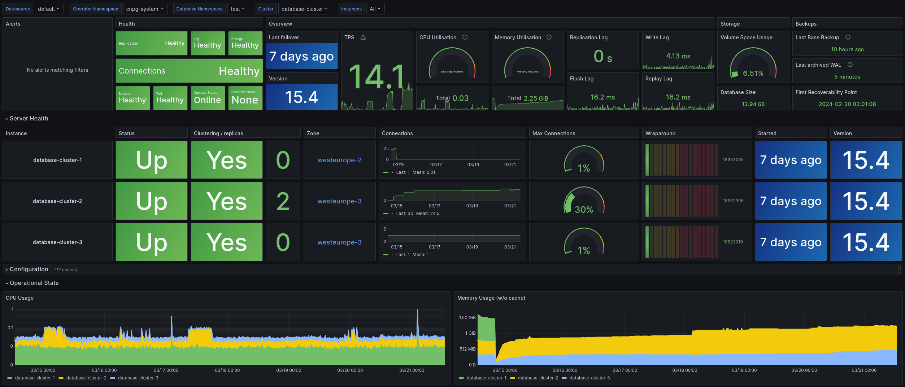

# Quickstart

This section describes how to test a PostgreSQL cluster on your laptop/computer
using CloudNativePG on a local Kubernetes cluster in [Kind](https://kind.sigs.k8s.io/) or
[Minikube](https://kubernetes.io/docs/setup/learning-environment/minikube/).

!!! Warning
    The instructions contained in this section are for demonstration,
    testing, and practice purposes only and must not be used in production.

Like any other Kubernetes application, CloudNativePG is deployed using
regular manifests written in YAML.

By following the instructions on this page you should be able to start a PostgreSQL
cluster on your local Kubernetes installation and experiment with it.

!!! Important
    Make sure that you have `kubectl` installed on your machine in order
    to connect to the Kubernetes cluster. Please follow the Kubernetes documentation
    on [how to install `kubectl`](https://kubernetes.io/docs/tasks/tools/install-kubectl/).

## Part 1: Setup the local Kubernetes playground

The first part is about installing Minikube or Kind. Please spend some time
reading about the systems and decide which one to proceed with.
After setting up one of them, please proceed with part 2.

We also provide instructions for setting up monitoring with Prometheus and
Grafana for local testing/evaluation, in [part 4](#part-4-monitor-clusters-with-prometheus-and-grafana)

### Minikube

Minikube is a tool that makes it easy to run Kubernetes locally. Minikube runs a
single-node Kubernetes cluster inside a Virtual Machine (VM) on your laptop for
users looking to try out Kubernetes or develop with it day-to-day. Normally, it
is used in conjunction with VirtualBox.

You can find more information in the official [Kubernetes documentation on how to
install Minikube](https://kubernetes.io/docs/tasks/tools/install-minikube) in your local personal environment.
When you installed it, run the following command to create a minikube cluster:

```sh
minikube start
```

This will create the Kubernetes cluster, and you will be ready to use it.
Verify that it works with the following command:

```sh
kubectl get nodes
```

You will see one node called `minikube`.

### Kind

If you do not want to use a virtual machine hypervisor, then Kind is a tool for running
local Kubernetes clusters using Docker container "nodes" (Kind stands for "Kubernetes IN Docker" indeed).

Install `kind` on your environment following the instructions in the [Quickstart](https://kind.sigs.k8s.io/docs/user/quick-start),
then create a Kubernetes cluster with:

```sh
kind create cluster --name pg
```

## Part 2: Install CloudNativePG

Now that you have a Kubernetes installation up and running
on your laptop, you can proceed with CloudNativePG installation.

Please refer to the ["Installation"](installation_upgrade.md) section and then proceed
with the deployment of a PostgreSQL cluster.

## Part 3: Deploy a PostgreSQL cluster

As with any other deployment in Kubernetes, to deploy a PostgreSQL cluster
you need to apply a configuration file that defines your desired `Cluster`.

The [`cluster-example.yaml`](samples/cluster-example.yaml) sample file
defines a simple `Cluster` using the default storage class to allocate
disk space:

```yaml
# Example of PostgreSQL cluster
apiVersion: postgresql.cnpg.io/v1
kind: Cluster
metadata:
  name: cluster-example
spec:
  instances: 3

  # Example of rolling update strategy:
  # - unsupervised: automated update of the primary once all
  #                 replicas have been upgraded (default)
  # - supervised: requires manual supervision to perform
  #               the switchover of the primary
  primaryUpdateStrategy: unsupervised

  # Require 1Gi of space
  storage:
    size: 1Gi
```

!!! Note "There's more"
    For more detailed information about the available options, please refer
    to the ["API Reference" section](api_reference.md).

In order to create the 3-node PostgreSQL cluster, you need to run the following command:

```sh
kubectl apply -f cluster-example.yaml
```

You can check that the pods are being created with the `get pods` command:

```sh
kubectl get pods
```

That will look for pods in the default namespace. To separate your cluster
from other workloads on your Kubernetes installation, you could always create
a new namespace to deploy clusters on.
Alternatively, you can use labels. The operator will apply the `cnpg.io/cluster`
label on all objects relevant to a particular cluster. For example:

``` sh
kubectl get pods -l cnpg.io/cluster=<CLUSTER>
```

!!! Important
    Note that we are using `cnpg.io/cluster` as the label. In the past you may
    have seen or used `postgresql`. This label is being deprecated, and
    will be dropped in the future. Please use `cngp.io/cluster`.

By default, the operator will install the latest available minor version
of the latest major version of PostgreSQL when the operator was released.
You can override this by setting the `imageName` key in the `spec` section of
the `Cluster` definition. For example, to install PostgreSQL 13.6:

```yaml
apiVersion: postgresql.cnpg.io/v1
kind: Cluster
metadata:
   # [...]
spec:
   # [...]
   imageName: ghcr.io/cloudnative-pg/postgresql:13.6
   #[...]
```

!!! Important
    The immutable infrastructure paradigm requires that you always
    point to a specific version of the container image.
    Never use tags like `latest` or `13` in a production environment
    as it might lead to unpredictable scenarios in terms of update
    policies and version consistency in the cluster.
    For strict deterministic and repeatable deployments, you can add the digests
    to the image name, through the `<image>:<tag>@sha256:<digestValue>` format.

!!! Note "There's more"
    There are some examples cluster configurations bundled with the operator.
    Please refer to the ["Examples" section](samples.md).

## Part 4: Monitor clusters with Prometheus and Grafana

!!! Important
    Installing Prometheus and Grafana is beyond the scope of this project.
    The instructions in this section are provided for experimentation and
    illustration only.

In this section we show how to deploy Prometheus and Grafana for observability,
and how to create a Grafana Dashboard to monitor CloudNativePG clusters, and a
set of Prometheus Rules defining alert conditions.

We leverage the [Kube-Prometheus stack](https://github.com/prometheus-community/helm-charts/tree/main/charts/kube-prometheus-stack),
Helm chart, which is maintained by the [Prometheus Community](https://github.com/prometheus-community).
Please refer to the project website for additional documentation and background.

The Kube-Prometheus-stack Helm chart installs the [Prometheus Operator](https://prometheus-operator.dev),
including the [Alert Manager](https://prometheus.io/docs/alerting/latest/alertmanager/),
and a [Grafana](https://grafana.com) deployment.

We include a configuration file for the deployment of this Helm chart that will
provide useful initial settings for observability of CloudNativePG clusters.

### Installation

If you don't have [Helm](https://helm.sh) installed yet, please follow the
[instructions](https://helm.sh/docs/intro/quickstart/) to install it in your
system.

We need to add the `prometheus-community` helm chart repository, and then
install the *Kube Prometheus stack* using the sample configuration we provide:

We can accomplish this with the following commands:

``` sh
helm repo add prometheus-community \
  https://prometheus-community.github.io/helm-charts

helm upgrade --install \
  -f https://raw.githubusercontent.com/cloudnative-pg/cloudnative-pg/main/docs/src/samples/monitoring/kube-stack-config.yaml \
  prometheus-community \
  prometheus-community/kube-prometheus-stack
```

After completion, you will have Prometheus, Grafana and Alert Manager installed with values from the
`kube-stack-config.yaml` file:

- From the Prometheus installation, you will have the Prometheus Operator watching for **any** `PodMonitor`
  (see [*monitoring*](monitoring.md)).
- The Grafana installation will be watching for a Grafana dashboard `ConfigMap`.

!!! Seealso
    For further information about the above command see the [helm install](https://helm.sh/docs/helm/helm_install/) 
    documentation. 

You can see several Custom Resources have been created:

``` sh
% kubectl get crds
NAME                                        CREATED AT
…
alertmanagers.monitoring.coreos.com         <timestamp>
…
prometheuses.monitoring.coreos.com          <timestamp>
prometheusrules.monitoring.coreos.com       <timestamp>
…
```

as well as a series of Services:

``` sh
% kubectl get svc     
NAME                                      TYPE        PORT(S)
…                                         …           …
prometheus-community-grafana              ClusterIP   80/TCP
prometheus-community-kube-alertmanager    ClusterIP   9093/TCP
prometheus-community-kube-operator        ClusterIP   443/TCP
prometheus-community-kube-prometheus      ClusterIP   9090/TCP
```

### Viewing with Prometheus

At this point, a CloudNativePG cluster deployed with Monitoring activated
would be observable via Prometheus.

For example, you could deploy a simple cluster with `PodMonitor` enabled:

``` sh
kubectl apply -f - <<EOF
---
apiVersion: postgresql.cnpg.io/v1
kind: Cluster
metadata:
  name: cluster-with-metrics
spec:
  instances: 3

  storage:
    size: 1Gi

  monitoring:
    enablePodMonitor: true
EOF
```

To access Prometheus, port-forward the Prometheus service:

``` sh
kubectl port-forward svc/prometheus-community-kube-prometheus 9090
```

Then access the Prometheus console locally at: [`http://localhost:9090/`](http://localhost:9090/)

Assuming that the monitoring stack was successfully deployed, and you have a Cluster with `enablePodMonitor: true`
you should find a series of metrics relating to CloudNativePG clusters. Again, please
refer to the [*monitoring section*](monitoring.md) for more information.


You can now define some alerts by creating a `prometheusRule`:

``` sh
kubectl apply -f \
  https://raw.githubusercontent.com/cloudnative-pg/cloudnative-pg/main/docs/src/samples/monitoring/cnpg-prometheusrule.yaml
```

You should see the default alerts now:

``` sh
% kubectl get prometheusrules                      
NAME                                                       AGE
cnpg-default-alerts                                        3m27s
```

In the Prometheus console, you can click on the *Alerts* menu to see the alerts
we just installed.

### Grafana Dashboard

In our "plain" installation, Grafana is deployed with no predefined dashboards.

You can port-forward:

``` sh
kubectl port-forward svc/prometheus-community-grafana 3000:80
```

And access Grafana locally at [`http://localhost:3000/`](http://localhost:3000/)
providing the credentials `admin` as username, `prom-operator` as password (defined in `kube-stack-config.yaml`).

We can now install our sample Grafana dashboard:

``` sh
kubectl apply -f \
  https://raw.githubusercontent.com/cloudnative-pg/cloudnative-pg/main/docs/src/samples/monitoring/grafana-configmap.yaml
```

Which will be picked up by the Grafana page in a few seconds. You should now
see the `CloudNativePG` dashboard.

!!! Warning
    Some graphs in the previous dashboard make use of metrics that are in alpha stage by the time
    this was created, like `kubelet_volume_stats_available_bytes` and `kubelet_volume_stats_capacity_bytes`
    producing some graphs to show `No data`.



Note that in our example setup, both Prometheus and Grafana will pick up
any other CloudNativePG clusters deployed with Monitoring activated.
