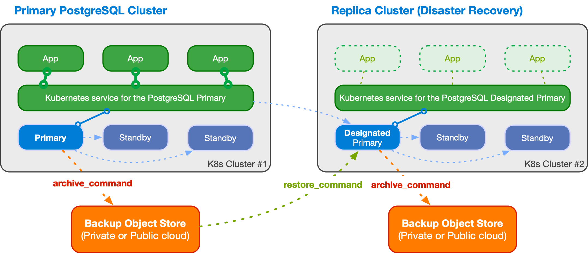

# Replica clusters
<!-- SPDX-License-Identifier: CC-BY-4.0 -->

A replica cluster is a CloudNativePG `Cluster` resource designed to
replicate data from another PostgreSQL instance, ideally also managed by
CloudNativePG.

Typically, a replica cluster is deployed in a different Kubernetes cluster in
another region. These clusters can be configured to perform cascading
replication and can rely on object stores for data replication from the source,
as detailed further down.

There are primarily two use cases for replica clusters:

1. **Disaster Recovery and High Availability**: Enhance disaster recovery and,
   to some extent, high availability of a CloudNativePG cluster across different
   Kubernetes clusters, typically located in different regions. In CloudNativePG
   terms, this is known as a ["Distributed Topology"](replica_cluster.md#distributed-topology).

2. **Read-Only Workloads**: Create standalone replicas of a PostgreSQL cluster
   for purposes such as reporting or Online Analytical Processing (OLAP). These
   replicas are primarily for read-only workloads. In CloudNativePG terms, this
   is referred to as a ["Standalone Replica Cluster"](replica_cluster.md#standalone-replica-clusters).

For example, the diagram below — taken from the ["Architecture" section](architecture.md#deployments-across-kubernetes-clusters)
— illustrates a distributed PostgreSQL topology spanning two Kubernetes
clusters, with a symmetric replica cluster primarily serving disaster recovery
purposes.



## Basic Concepts

CloudNativePG builds on the PostgreSQL replication framework, allowing you to
create and synchronize a PostgreSQL cluster from an existing source cluster
using the replica cluster feature — described in this section. The source can
be a primary cluster or another replica cluster (cascading replication).

### About PostgreSQL Roles

A replica cluster operates in continuous recovery mode, meaning no changes to
the database, including the catalog and global objects like roles or databases,
are permitted. These changes are deferred until the `Cluster` transitions to
primary. During this phase, global objects such as roles remain as defined in
the source cluster. CloudNativePG applies any local redefinitions once the
cluster is promoted.

If you are not planning to promote the cluster (e.g., for read-only workloads)
or if you intend to detach completely from the source cluster
once the replica cluster is promoted, you don't need to take any action.
This is normally the case of the ["Standalone Replica Cluster"](replica_cluster.md#standalone-replica-clusters).

If you are planning to promote the cluster at some point, CloudNativePG will
manage the following roles and passwords when transitioning from replica
cluster to primary:

- the application user
- the superuser (if you are using it)
- any role defined using the [declarative interface](declarative_role_management.md)


If your intention is to seamlessly ensure that the above roles and passwords
don't change, you need to define the necessary secrets for the above in each
`Cluster`.
This is normally the case of the ["Distributed Topology"](replica_cluster.md#distributed-topology).

### Bootstrapping a Replica Cluster

The first step is to bootstrap the replica cluster using one of the following
methods:

- **Streaming replication** via `pg_basebackup`
- **Recovery from a volume snapshot**
- **Recovery from a Barman Cloud backup** in an object store

For detailed instructions on cloning a PostgreSQL server using `pg_basebackup`
(streaming) or recovery (volume snapshot or object store), refer to the
["Bootstrap" section](bootstrap.md#bootstrap-from-another-cluster).

### Configuring Replication

Once the base backup for the replica cluster is available, you need to define
how changes will be replicated from the origin using PostgreSQL continuous
recovery. There are three main options:

1. **Streaming Replication**: Set up streaming replication between the replica
   cluster and the source. This method requires configuring network connections
   and implementing appropriate administrative and security measures to ensure
   seamless data transfer.
2. **WAL Archive**: Use the WAL (Write-Ahead Logging) archive stored in an
   object store. WAL files are regularly transferred from the source cluster to
   the object store, from where a CNPG-I plugin like [Barman Cloud](https://cloudnative-pg.io/plugin-barman-cloud/)
   retrieves them for the replica cluster via the `restore_command`.
3. **Hybrid Approach**: Combine both streaming replication and WAL archive
   methods. PostgreSQL can manage and switch between these two approaches as
   needed to ensure data consistency and availability.

### Defining an External Cluster

When configuring the external cluster, you have the following options:

- **`plugin` section**:
    - Enables bootstrapping the replica cluster using a [CNPG-I](https://github.com/cloudnative-pg/cnpg-i)
      plugin that support the
      [`restore_job`](https://github.com/cloudnative-pg/cnpg-i/blob/main/docs/protocol.md#restore_job-proto)
      and the [`wal`](https://github.com/cloudnative-pg/cnpg-i/blob/main/docs/protocol.md#wal-proto) protocols.
    - CloudNativePG supports the [Barman Cloud Plugin](https://cloudnative-pg.io/plugin-barman-cloud/docs/usage/#restoring-a-cluster)
      to allow bootstrapping the replica cluster from an object store.

- **`connectionParameters` section**:
    - Enables bootstrapping the replica cluster via streaming replication using
      the `pg_basebackup` section.
    - CloudNativePG automatically sets the `primary_conninfo` option in the
      designated primary instance, initiating a WAL receiver process to connect
      to the source cluster and receive data.

You still have access to the **`barmanObjectStore` section**, although deprecated:

- Enables use of the WAL archive, with CloudNativePG automatically setting
  the `restore_command` in the designated primary instance.
- Allows bootstrapping the replica cluster from an object store using the
 `recovery` section if volume snapshots are not feasible.

### Backup and Symmetric Architectures

The replica cluster can perform backups to a reserved object store from the
designated primary, supporting symmetric architectures in a distributed
environment. This architectural choice is crucial as it ensures the cluster is
prepared for promotion during a controlled data center switchover or a failover
following an unexpected event.

### Distributed Architecture Flexibility

You have the flexibility to design your preferred distributed architecture for
a PostgreSQL database, choosing from:

- **Private Cloud**: Spanning multiple Kubernetes clusters in different data
  centers.
- **Public Cloud**: Spanning multiple Kubernetes clusters in different regions.
- **Hybrid Cloud**: Combining private and public clouds.
- **Multi-Cloud**: Spanning multiple Kubernetes clusters across different
  regions and Cloud Service Providers.

## Setting Up a Replica Cluster

To set up a replica cluster from a source cluster, follow these steps to create
a cluster YAML file and configure it accordingly:

1. **Define External Clusters**:
    - In the `externalClusters` section, specify the replica cluster.
    - For a distributed PostgreSQL topology aimed at disaster recovery (DR) and
      high availability (HA), this section should be defined for every
      PostgreSQL cluster in the distributed database.

2. **Bootstrap the Replica Cluster**:
    - **Streaming Bootstrap**: Use the `pg_basebackup` section for bootstrapping
      via streaming replication.
    - **Snapshot/Object Store Bootstrap**: Use the `recovery` section to
      bootstrap from a volume snapshot or an object store.
3. **Continuous Recovery Strategy**: Define this in the `.spec.replica` stanza:
    - **Distributed Topology**: Configure using the `primary`, `source`, and
      `self` fields along with the distributed topology defined in
      `externalClusters`. This allows CloudNativePG to declaratively control the
      demotion of a primary cluster and the subsequent promotion of a replica cluster
      using a promotion token.
    - **Standalone Replica Cluster**: Enable continuous recovery using the
      `enabled` option and set the `source` field to point to an
      `externalClusters` name. This configuration is suitable for creating replicas
      primarily intended for read-only workloads.

Both the Distributed Topology and the Standalone Replica Cluster strategies for
continuous recovery are thoroughly explained below.

## Distributed Topology

### Planning for a Distributed PostgreSQL Database

As Dwight Eisenhower famously said, "Planning is everything", and this holds
true for designing PostgreSQL architectures in Kubernetes.

First, conceptualize your distributed topology on paper, and then translate it
into a CloudNativePG API configuration. This configuration primarily involves:

- The `externalClusters` section, which must be included in every `Cluster`
  definition within your distributed PostgreSQL setup.
- The `.spec.replica` stanza, specifically the `primary`, `source`, and
  (optionally) `self` fields.

For example, suppose you want to deploy a PostgreSQL cluster distributed across
two Kubernetes clusters located in Southern Europe and Central Europe.

In this scenario, assume you have CloudNativePG installed in the Southern
Europe Kubernetes cluster, with a PostgreSQL `Cluster` named `cluster-eu-south`
acting as the primary. This cluster has continuous backup configured with a
local object store. This object store is also accessible by the PostgreSQL
`Cluster` named `cluster-eu-central`, installed in the Central European
Kubernetes cluster. Initially, `cluster-eu-central` functions as a replica
cluster. Following a symmetric approach, it also has a local object store for
continuous backup, which needs to be read by `cluster-eu-south`.

In this example, recovery is performed solely through WAL shipping, without any
streaming replication between the two clusters. However, you can configure the
setup to use streaming replication alone or adopt a hybrid approach—streaming
replication with WAL shipping as a fallback—as described in the
[“Configuring replication”](replica_cluster.md#defining-an-external-cluster)
section.

Here’s how you would configure the `externalClusters` section for both
`Cluster` resources, relying on Barman Cloud Plugin for the object store:

```yaml
# Distributed topology configuration
externalClusters:
  - name: cluster-eu-south
    plugin:
      name: barman-cloud.cloudnative-pg.io
      parameters:
        barmanObjectName: cluster-eu-south
        serverName: cluster-eu-south
  - name: cluster-eu-central
    plugin:
      name: barman-cloud.cloudnative-pg.io
      parameters:
        barmanObjectName: cluster-eu-central
        serverName: cluster-eu-central
```

The `.spec.replica` stanza for the `cluster-eu-south` PostgreSQL primary
`Cluster` should be configured as follows:

```yaml
replica:
  primary: cluster-eu-south
  source: cluster-eu-central
```

Meanwhile, the `.spec.replica` stanza for the `cluster-eu-central` PostgreSQL
replica `Cluster` should be configured as:

```yaml
replica:
  primary: cluster-eu-south
  source: cluster-eu-south
```

In this configuration, when the `primary` field matches the name of the
`Cluster` resource (or `.spec.replica.self` if a different one is used), the
current cluster is considered the primary in the distributed topology.
Otherwise, it is set as a replica from the `source` (in this case, using the
Barman object store).

This setup allows you to efficiently manage a distributed PostgreSQL
architecture across multiple Kubernetes clusters, ensuring both high
availability and disaster recovery through controlled switchover of a primary
PostgreSQL cluster using declarative configuration.

Controlled switchover in a distributed topology is a two-step process
involving:

- Demotion of a primary cluster to a replica cluster
- Promotion of a replica cluster to a primary cluster

These processes are described in the next sections.

:::info[Important]
    Before you proceed, ensure you review the ["About PostgreSQL Roles" section](#about-postgresql-roles)
    above and use identical role definitions, including secrets, in all
    `Cluster` objects participating in the distributed topology.
:::

### Demoting a Primary to a Replica Cluster

CloudNativePG provides the functionality to demote a primary cluster to a
replica cluster. This action is typically planned when transitioning the
primary role from one data center to another. The process involves demoting the
current primary cluster (e.g., `cluster-eu-south`) to a replica cluster and
subsequently promoting the designated replica cluster (e.g.,
`cluster-eu-central`) to primary when fully synchronized.

Provided you have defined an external cluster in the current primary `Cluster`
resource that points to the replica cluster that's been selected to become the
new primary, all you need to do is change the `primary` field as follows:

```yaml
replica:
  primary: cluster-eu-central
  source: cluster-eu-central
```

When the primary PostgreSQL cluster is demoted, write operations are no
longer possible. CloudNativePG then:

1. Archives the WAL file containing the shutdown checkpoint as a `.partial`
   file in the WAL archive.

2. Generates a `demotionToken` in the status, a base64-encoded JSON structure
   containing relevant information from `pg_controldata` such as the system
   identifier, the timestamp, timeline ID, REDO location, and REDO WAL file of the
   latest checkpoint.

The first step is necessary to demote/promote using solely the WAL archive to
feed the continuous recovery process (without streaming replication).

The second step, generation of the `.status.demotionToken`, will ensure a
smooth demotion/promotion process, without any data loss and without rebuilding
the former primary.

At this stage, the former primary has transitioned to a replica cluster,
awaiting WAL data from the new global primary: `cluster-eu-central`.

To proceed with promoting the other cluster, you need to retrieve the
`demotionToken` from `cluster-eu-south` using the following command:

```sh
kubectl get cluster cluster-eu-south \
  -o jsonpath='{.status.demotionToken}'
```

You can obtain the `demotionToken` using the `cnpg` plugin by checking the
cluster's status. The token is listed under the `Demotion token` section.

:::note
    The `demotionToken` obtained from `cluster-eu-south` will serve as the
    `promotionToken` for `cluster-eu-central`.
:::

You can verify the role change using the `cnpg` plugin, checking the status of
the cluster:

```shell
kubectl cnpg status cluster-eu-south
```

### Promoting a Replica to a Primary Cluster

To promote a PostgreSQL replica cluster (e.g., `cluster-eu-central`) to a
primary cluster and make the designated primary an actual primary instance,
you need to perform the following steps simultaneously:

1. Set the `.spec.replica.primary` to the name of the current replica cluster
   to be promoted (e.g., `cluster-eu-central`).
2. Set the `.spec.replica.promotionToken` with the value obtained from the
   former primary cluster (refer to ["Demoting a Primary to a Replica Cluster"](replica_cluster.md#demoting-a-primary-to-a-replica-cluster)).

The updated `replica` section in `cluster-eu-central`'s spec should look like
this:

```yaml
replica:
  primary: cluster-eu-central
  promotionToken: <PROMOTION_TOKEN>
  source: cluster-eu-south
```

:::warning
    It is crucial to apply the changes to the `primary` and `promotionToken`
    fields simultaneously. If the promotion token is omitted, a failover will be
    triggered, necessitating a rebuild of the former primary.
:::

After making these adjustments, CloudNativePG will initiate the promotion of
the replica cluster to a primary cluster. Initially, CloudNativePG will wait
for the designated primary cluster to replicate all Write-Ahead Logging (WAL)
information up to the specified Log Sequence Number (LSN) contained in the
token. Once this target is achieved, the promotion process will commence. The
new primary cluster will switch timelines, archive the history file and new
WAL, thereby unblocking the replication process in the `cluster-eu-south`
cluster, which will then operate as a replica.

To verify the role change, use the `cnpg` plugin to check the status of the
cluster:

```shell
kubectl cnpg status cluster-eu-central
```

This command will provide you with the current status of `cluster-eu-central`,
confirming its promotion to primary.

By following these steps, you ensure a smooth and controlled promotion process,
minimizing disruption and maintaining data integrity across your PostgreSQL
clusters.

## Standalone Replica Clusters

:::info[Important]
    Standalone Replica Clusters were previously known as Replica Clusters
    before the introduction of the Distributed Topology strategy in CloudNativePG
    1.24.
:::

In CloudNativePG, a Standalone Replica Cluster is a PostgreSQL cluster in
continuous recovery with the following configurations:

- `.spec.replica.enabled` set to `true`
- A physical replication source defined via the `.spec.replica.source` field,
  pointing to an `externalClusters` name

When `.spec.replica.enabled` is set to `false`, the replica cluster exits
continuous recovery mode and becomes a primary cluster, completely detached
from the original source.

:::warning
    Disabling replication is an **irreversible** operation. Once replication is
    disabled and the designated primary is promoted to primary, the replica cluster
    and the source cluster become two independent clusters definitively.
:::

:::info[Important]
    Standalone replica clusters are suitable for several use cases, primarily
    involving read-only workloads. If you are planning to setup a disaster
    recovery solution, look into "Distributed Topology" above.
:::

### Main Differences with Distributed Topology

Although Standalone Replica Clusters can be used for disaster recovery
purposes, they differ from the "Distributed Topology" strategy in several key
ways:

- **Lack of Distributed Database Concept**: Standalone Replica Clusters do not
  support the concept of a distributed database, whether in simple forms (two
  clusters) or more complex configurations (e.g., three clusters in a circular
  topology).
- **No Global Primary Cluster**: There is no notion of a global primary cluster
  in Standalone Replica Clusters.
- **No Controlled Switchover**: A Standalone Replica Cluster can only be
  promoted to primary. The former primary cluster must be re-cloned, as
  controlled switchover is not possible.

Failover is identical in both strategies, requiring the former primary to be
re-cloned if it ever comes back up.

### Example of Standalone Replica Cluster using `pg_basebackup`

This **first example** defines a standalone replica cluster using streaming
replication in both bootstrap and continuous recovery. The replica cluster
connects to the source cluster using TLS authentication.

You can check the [sample YAML](samples/cluster-example-replica-streaming.yaml)
in the `samples/` subdirectory.

Note the `bootstrap` and `replica` sections pointing to the source cluster.

```yaml
  bootstrap:
    pg_basebackup:
      source: cluster-example

  replica:
    enabled: true
    source: cluster-example
```

The previous configuration assumes that the application database and its owning
user are set to the default, `app`. If the PostgreSQL cluster being restored
uses different names, you must specify them as documented in [Configure the application database](bootstrap.md#configure-the-application-database).
You should also consider copying over the application user secret from
the original cluster and keep it synchronized with the source.
See ["About PostgreSQL Roles"](#about-postgresql-roles) for more details.

In the `externalClusters` section, remember to use the right namespace for the
host in the `connectionParameters` sub-section.
The `-replication` and `-ca` secrets should have been copied over if necessary,
in case the replica cluster is in a separate namespace.

```yaml
  externalClusters:
  - name: <MAIN-CLUSTER>
    connectionParameters:
      host: <MAIN-CLUSTER>-rw.<NAMESPACE>.svc
      user: streaming_replica
      sslmode: verify-full
      dbname: postgres
    sslKey:
      name: <MAIN-CLUSTER>-replication
      key: tls.key
    sslCert:
      name: <MAIN-CLUSTER>-replication
      key: tls.crt
    sslRootCert:
      name: <MAIN-CLUSTER>-ca
      key: ca.crt
```

### Example of Standalone Replica Cluster from an object store

The **second example** defines a replica cluster that bootstraps from an object
store using the `recovery` section and continuous recovery using both streaming
replication and the given object store. For streaming replication, the replica
cluster connects to the source cluster using basic authentication.

You can check the [sample YAML](samples/cluster-example-replica-from-backup-simple.yaml)
for it in the `samples/` subdirectory.

Note the `bootstrap` and `replica` sections pointing to the source cluster.

```yaml
  bootstrap:
    recovery:
      source: cluster-example

  replica:
    enabled: true
    source: cluster-example
```

The previous configuration assumes that the application database and its owning
user are set to the default, `app`. If the PostgreSQL cluster being restored
uses different names, you must specify them as documented in [Configure the application database](recovery.md#configure-the-application-database).
You should also consider copying over the application user secret from
the original cluster and keep it synchronized with the source.
See ["About PostgreSQL Roles"](#about-postgresql-roles) for more details.

In the `externalClusters` section, take care to use the right namespace in the
`endpointURL` and the `connectionParameters.host`.
And do ensure that the necessary secrets have been copied if necessary, and that
a backup of the source cluster has been created already.

```yaml
  externalClusters:
  - name: <MAIN-CLUSTER>
    # Example with Barman Cloud Plugin
    plugin:
      name: barman-cloud.cloudnative-pg.io
      parameters:
        barmanObjectName: <MAIN-CLUSTER>
        serverName: <MAIN-CLUSTER>
        …
    connectionParameters:
      host: <MAIN-CLUSTER>-rw.default.svc
      user: postgres
      dbname: postgres
    password:
      name: <MAIN-CLUSTER>-superuser
      key: password
```

:::note
    To use streaming replication between the source cluster and the replica
    cluster, we need to make sure there is network connectivity between the two
    clusters, and that all the necessary secrets which hold passwords or
    certificates are properly created in advance.
:::

### Example using a Volume Snapshot

If you use volume snapshots and your storage class provides
snapshots cross-cluster availability, you can leverage that to
bootstrap a replica cluster through a volume snapshot of the
source cluster.

The **third example** defines a replica cluster that bootstraps
from a volume snapshot using the `recovery` section. It uses
streaming replication (via basic authentication) and the object
store to fetch the WAL files.

You can check the [sample YAML](samples/cluster-example-replica-from-volume-snapshot.yaml)
for it in the `samples/` subdirectory.

The example assumes that the application database and its owning
user are set to the default, `app`. If the PostgreSQL cluster being restored
uses different names, you must specify them as documented in [Configure the
application database](recovery.md#configure-the-application-database).
You should also consider copying over the application user secret from
the original cluster and keep it synchronized with the source.
See ["About PostgreSQL Roles"](#about-postgresql-roles) for more details.

## Delayed replicas

CloudNativePG supports the creation of **delayed replicas** through the
[`.spec.replica.minApplyDelay` option](cloudnative-pg.v1.md#postgresql-cnpg-io-v1-ReplicaClusterConfiguration),
leveraging PostgreSQL's
[`recovery_min_apply_delay`](https://www.postgresql.org/docs/current/runtime-config-replication.html#GUC-RECOVERY-MIN-APPLY-DELAY).

Delayed replicas are designed to intentionally lag behind the primary database
by a specified amount of time. This delay is configurable using the
`.spec.replica.minApplyDelay` option, which maps to the underlying
`recovery_min_apply_delay` parameter in PostgreSQL.

The primary objective of delayed replicas is to mitigate the impact of
unintended SQL statement executions on the primary database. This is especially
useful in scenarios where operations such as `UPDATE` or `DELETE` are performed
without a proper `WHERE` clause.

To configure a delay in a replica cluster, adjust the
`.spec.replica.minApplyDelay` option. This parameter determines how much time
the replicas will lag behind the primary. For example:

```yaml
  # ...
  replica:
    enabled: true
    source: cluster-example
    # Enforce a delay of 8 hours
    minApplyDelay: '8h'
  # ...
```

The above example helps safeguard against accidental data modifications by
providing a buffer period of 8 hours to detect and correct issues before they
propagate to the replicas.

Monitor and adjust the delay as needed based on your recovery time objectives
and the potential impact of unintended primary database operations.

The main use cases of delayed replicas can be summarized into:

1. mitigating human errors: reduce the risk of data corruption or loss
   resulting from unintentional SQL operations on the primary database

2. recovery time optimization: facilitate quicker recovery from unintended
   changes by having a delayed replica that allows you to identify and rectify
   issues before changes are applied to other replicas.

3. enhanced data protection: safeguard critical data by introducing a time
   buffer that provides an opportunity to intervene and prevent the propagation of
   undesirable changes.

:::warning
    The `minApplyDelay` option of delayed replicas cannot be used in
    conjunction with `promotionToken`.
:::

By integrating delayed replicas into your replication strategy, you can enhance
the resilience and data protection capabilities of your PostgreSQL environment.
Adjust the delay duration based on your specific needs and the criticality of
your data.

:::info[Important]
    Always measure your goals. Depending on your environment, it might be more
    efficient to rely on volume snapshot-based recovery for faster outcomes.
    Evaluate and choose the approach that best aligns with your unique requirements
    and infrastructure.
:::