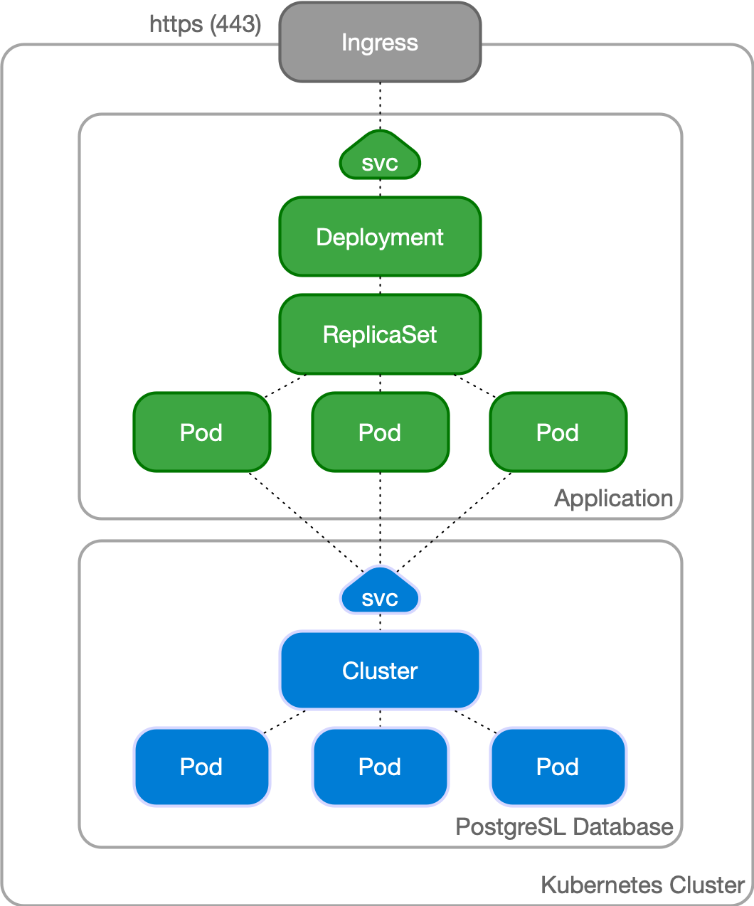
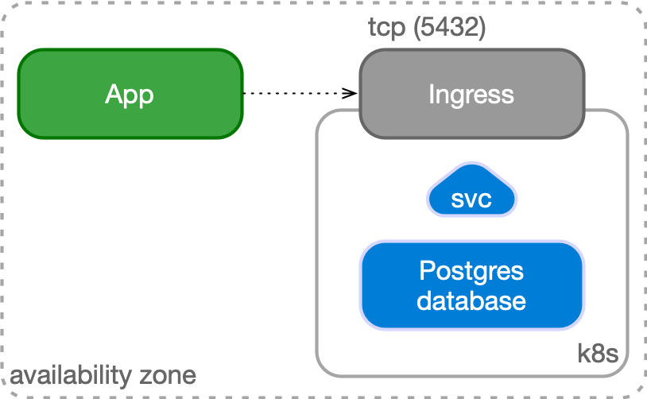

# Use cases
<!-- SPDX-License-Identifier: CC-BY-4.0 -->

CloudNativePG has been designed to work with applications
that reside in the same Kubernetes cluster, for a full cloud native
experience.

However, it might happen that, while the database can be hosted
inside a Kubernetes cluster, applications cannot be containerized
at the same time and need to run in a *traditional environment* such 
as a VM.

## Case 1: Applications inside Kubernetes

In a typical situation, the application and the database run in the same
namespace inside a Kubernetes cluster.

The application, normally stateless, is managed as a standard `Deployment`,
with multiple replicas spread over different Kubernetes node, and internally
exposed through a `ClusterIP` service.

The service is exposed externally to the end user through an `Ingress` and the
provider's load balancer facility, via HTTPS.

The application uses the backend PostgreSQL database to keep track of the state
in a reliable and persistent way. The application refers to the read-write
service exposed by the `Cluster` resource defined by CloudNativePG,
which points to the current primary instance, through a TLS connection.  The
`Cluster` resource embeds the logic of single primary and multiple standby
architecture, hiding the complexity of managing a high availability cluster in
Postgres.

## Case 2: Applications outside Kubernetes

Another possible use case is to manage your PostgreSQL database inside
Kubernetes, while having your applications outside of it (for example in a
virtualized environment). In this case, PostgreSQL is represented by an IP
address (or host name) and a TCP port, corresponding to the defined Ingress
resource in Kubernetes (normally a `LoadBalancer` service type as explained
in the ["Service Management"](service_management.md) page).

The application can still benefit from a TLS connection to PostgreSQL.

